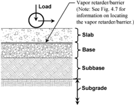
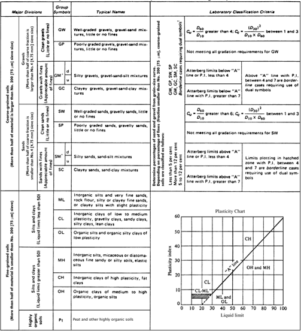
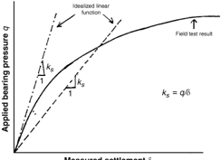
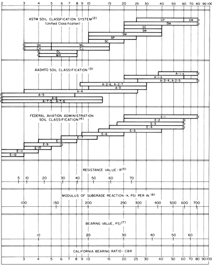
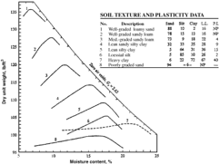
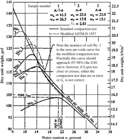
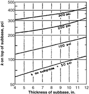
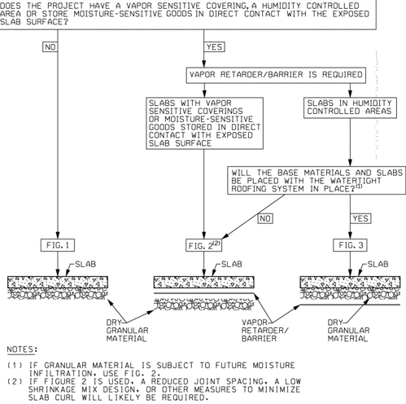

# CHAPTER 4-SOIL SUPPORT SYSTEMS FOR SLABS-ON-GROUND

- Source: ACI 360R-10.pdf
- Generated: 2026-03-04T22:38:09+00:00
- Chunk: 19/31
- Estimated tokens: ~13,993
- Total pages: 76
- Type: chapter

## CHAPTER 4-SOIL SUPPORT SYSTEMS FOR SLABS-ON-GROUND

## 4.1-Introduction

The  design  of  slabs-on-ground  to  resist  moments  and shears caused by applied loads depends on the interaction between  the  concrete  slab  and  the  supporting  materials. Properties  and  dimensions  of  the  slab  and  the  supporting materials are important in the design of a slab-on-ground. The support system should be of acceptable uniform strength and not easily susceptible to the effects of climatic changes. Slab-on-ground failures can occur because of an improper support system. Issues related to the support system of the slab-on-ground include:

- Geotechnical engineering reports providing soil properties;
- Subgrade classification;
- Modulus of subgrade reaction;
- Design of the slab support system;
- Site preparation; and
- Inspection and testing of the slab support system.

This chapter is limited to aspects of the support system necessary for proper slab-on-ground performance.

The slab support system consists of a subgrade, usually a base,  and  sometimes  a  subbase,  as  illustrated  in  Fig.  4.1. Crushed rock, gravels, or coarse sands have high strength, low compressibility, and high permeability, are commonly used as base courses. Crushed rock, gravels, sands, select soils,  and  stabilized  soils  are  commonly  used  as  subbases and may be used as base materials. Soils in the subgrade are generally  the  ultimate  supporting  materials,  but  bedrock, competent or weathered, may also be encountered. When the existing soil has uniform strength and other necessary properties to support the slab, the slab may be placed directly on the  existing  subgrade.  The  existing  grade,  however,  is frequently not at the desired elevation or slope and some cut and fill is required. To improve surface drainage or to elevate the floor level, controlled fill using on-site or imported soils is required on some sites.

## 4.2-Geotechnical engineering reports

4.2.1 IntroductionGeotechnical engineering investigations supply subsurface site information primarily for design and construction of the building foundation elements and to meet building  code  requirements.  Within  the  geotechnical engineering  report,  slab-on-ground  support  is  frequently discussed, and subgrade drainage and preparation recommendations are given. Even when slab support is not discussed in detail, information given within these reports, such as boring or test pit logs, field and laboratory test results, and discussions of  subsurface  conditions,  are  useful  in  evaluating  subgrade conditions relative to slab-on-ground design and construction.

4.2.2 Boring or test pit logsDescriptions given on boring or test pit logs provide information on the texture of the soils and  their  moisture  condition  and  relative  density,  when noncohesive;  or  consistency,  when  cohesive.  These  logs present field test results, such as the standard penetration test (ASTM D1586) in blows per 6 in. (150 mm) interval values. The log notes the location of the water table at the time of boring and depths to shallow bedrock. The Atterberg limits,

Fig. 4.1-Slab support system terminology.

and laboratory test results, such as the moisture content and dry  density  of  cohesive  soils,  are  often  included  on  the boring logs or in the geotechnical report. Also, the soil is classified as discussed in Section 4.3.

4.2.3 Report  evaluations  and  recommendationsEvaluations and recommendations relative to the existing subgrade material,  its  compaction,  and  supporting  capability  can  be included in the report and should be evaluated against the design requirements. The geotechnical engineer may provide suggestions for subbase and base course materials. In some cases, local materials that are peculiar to that area, such as crushed sea shells, mine tailings, bottom ash, and other waste products, can be economically used. The local geotechnical  engineer  is  generally  knowledgeable  about using  these  materials  in  the  project  area.  The  expected performance characteristics of the slab-on-ground should be made known to the geotechnical engineer before the subsurface investigation to obtain the best evaluation and recommendations. For  example,  some  of  the  information  that  should  be provided to the geotechnical engineer includes:

- Facility use and proposed floor elevation;
- Type and magnitude of anticipated loads;
- Environmental conditions of the building space;
- Floor levelness and flatness criteria; and
- Floor-covering requirements.

It may be beneficial for the geotechnical engineer to visit local  buildings  or  other  facilities  of  the  client  that  have similar  use.  Coordination  between  the  geotechnical  engineer and  the  slab-on-ground  designer  from  the  beginning  of  the project can lead to an adequate and economical slabs-on-ground.

## 4.3-Subgrade classification

Soil supporting the slab-on-ground may meet the criteria for a subbase or even a base material, but should be identified and classified to estimate its suitability as a subgrade. The Unified Soil Classification System is predominantly used in the U.S. and is referred to in this guide. Table 4.1 provides information  on  classification  groups  of  this  system  and important  criteria  for  each  soil  group.  Visual  procedures (ASTM  D2488)  can  be  used,  but  laboratory  test  results (ASTM D2487) provide classifications that are more reliable.

Table 4.1-Unified soil classification system (Winterkorn and Fang 1975)

| Field identification procedures (excluding particles larger than 3 in. [75 mm], and basing fractions on estimated weights)   | Field identification procedures (excluding particles larger than 3 in. [75 mm], and basing fractions on estimated weights)   | Field identification procedures (excluding particles larger than 3 in. [75 mm], and basing fractions on estimated weights)   | Group symbol   | Typical names                                                                                                           |
|------------------------------------------------------------------------------------------------------------------------------|------------------------------------------------------------------------------------------------------------------------------|------------------------------------------------------------------------------------------------------------------------------|----------------|-------------------------------------------------------------------------------------------------------------------------|
| Coarse-grained soils (more than half of material is larger than No. 200 sieve* [75 µ m])                                     | Clean gravels (little or no fines)                                                                                           | Wide range in grain size and substantial amounts of all intermediate particle sizes                                          | GW             | Well-graded gravel, gravel-sand mixtures, little or no fines                                                            |
| Coarse-grained soils (more than half of material is larger than No. 200 sieve* [75 µ m])                                     | Clean gravels (little or no fines)                                                                                           | Predominantly one size or a range of sizes with some intermediate sizes missing                                              | GP             | Poorly graded gravels, gravel-sand mixtures, little or no fines --''',,'',',',,''',,'''',',,,'''-'',,',,,,-'',,',,,,--- |
| Coarse-grained soils (more than half of material is larger than No. 200 sieve* [75 µ m])                                     | Gravels with fines (appreciable amount of fines)                                                                             | Nonplastic fines (for identification procedures, refer to CL below)                                                          | GM             | Silty gravels, poorly graded gravel-sand-silt mixtures                                                                  |
| Coarse-grained soils (more than half of material is larger than No. 200 sieve* [75 µ m])                                     | Gravels with fines (appreciable amount of fines)                                                                             | Plastic fines (for identification procedures, refer to ML below)                                                             | GC             | Clayey gravels, poorly graded gravel-sand-clay mixtures                                                                 |
| Coarse-grained soils (more than half of material is larger than No. 200 sieve* [75 µ m])                                     | Clean sands (little or no fines)                                                                                             | Wide range in grain sizes and substantial amounts of all intermediate particle sizes                                         | SW             | Well-grades sands, gravelly sands, little or no fines                                                                   |
| Coarse-grained soils (more than half of material is larger than No. 200 sieve* [75 µ m])                                     | Clean sands (little or no fines)                                                                                             | Predominantly one size or range of sizes with some intermediate sizes missing                                                | SP             | Poorly graded sands, gravelly sands, little or no fines                                                                 |
| Coarse-grained soils (more than half of material is larger than No. 200 sieve* [75 µ m])                                     | Sands with fines (appreciable amount of fines)                                                                               | Nonplastic fines (for identification procedures, refer to ML below)                                                          | SM             | Silty sands, poorly graded sand-silt mixtures                                                                           |
| Coarse-grained soils (more than half of material is larger than No. 200 sieve* [75 µ m])                                     | Sands with fines (appreciable amount of fines)                                                                               | Plastic fines (for identification procedures, refer to CL below)                                                             | SC             | Clayey sands, poorly graded sand-clay mixtures                                                                          |

## Identification procedures on fraction smaller than No. 40 (4.25 µ m) sieve

|                                                                                         |                                                | Dry strength (crushing characteristics)                                       | Dilatancy (reaction to shaking)                                               | Toughness (consistency near plastic limit)                                    | Group symbol   | Typical names                                                                                      |
|-----------------------------------------------------------------------------------------|------------------------------------------------|-------------------------------------------------------------------------------|-------------------------------------------------------------------------------|-------------------------------------------------------------------------------|----------------|----------------------------------------------------------------------------------------------------|
| Fine-grained soils (more than half of material is smaller than No. 200 sieve* [75 µ m]) | Silts and clays (liquid limit less than 50)    | None to slight                                                                | Quick to slow                                                                 | None                                                                          | ML             | Inorganic silts and very fine sands, rock flour, silty or clayey fine sands with slight plasticity |
| Fine-grained soils (more than half of material is smaller than No. 200 sieve* [75 µ m]) |                                                | Medium to high                                                                | None to very slow                                                             | Medium                                                                        | CL             | Inorganic clays of low to medium plasticity, gravelly clays, sandy clays, silty clays, lean clays  |
| Fine-grained soils (more than half of material is smaller than No. 200 sieve* [75 µ m]) |                                                | Slight to medium                                                              | Slow                                                                          | Slight                                                                        | OL             | Organic silts and organic-silt clays of low plasticity                                             |
| Fine-grained soils (more than half of material is smaller than No. 200 sieve* [75 µ m]) | Silts and clays (liquid limit greater than 50) | Slight to medium                                                              | Slow to none                                                                  | Slight to medium                                                              | MH             | Inorganic silts, micaceous or diatomaceous fine sandy or silty soils, elastic silts                |
| Fine-grained soils (more than half of material is smaller than No. 200 sieve* [75 µ m]) |                                                | High to very high                                                             | None                                                                          | High                                                                          | CH             | Inorganic clays of high plasticity, fat clays                                                      |
| Fine-grained soils (more than half of material is smaller than No. 200 sieve* [75 µ m]) |                                                | Medium to high                                                                | None to very slow                                                             | Slight to medium                                                              | OH             | Organic clays of medium to high plasticity                                                         |
| Highly organic soils                                                                    | Highly organic soils                           | Readily identified by color, odor, spongy feel; frequently by fibrous texture | Readily identified by color, odor, spongy feel; frequently by fibrous texture | Readily identified by color, odor, spongy feel; frequently by fibrous texture | PT             | Peat or other highly organic soils                                                                 |

* All sieve sizes herein are U.S. standard. The No. 200 sieve (75 µ m) is approximately the smallest particle visible to the naked eye. For visual classifications, the 1/4 in. (6.3 mm) size may be used as equivalent for the No. 4 (4.75 mm) sieve size. Boundary classifications: soil possessing characteristics of two groups are designated by combinations of group symbols.

For example, use the plasticity chart of Table 4.2 to classify the fine-grained soils.

The following tests and test methods are useful for soil classification:

- Moisture content: ASTM D2216;
- Specific gravity: ASTM D854;
- Liquid and plastic limits: ASTM D4318; and
- Expansion Index: ASTM D4829.

The standard Proctor compaction test (ASTM D698) and modified  Proctor  compaction  test  (ASTM  D1557)  are  not strictly classification tests. Their moisture-density relationships are  useful  in  assessing  a  soil  subgrade  or  subbase.  A  more detailed listing of the ASTM standards appears in Chapter 15.

## 4.4-Modulus of subgrade reaction

4.4.1 IntroductionDesign methods listed in Chapter 3, including Westergaard's pioneering work on rigid pavement analysis (Westergaard 1923, 1926), employ the modulus of subgrade reaction as a single property to represent the design support strength. This modulus, also called the modulus of soil reaction or Winkler foundation, is a spring constant that assumes  a  linear  response  between  load  and  deformation from the subgrade.

Actually, there is no single k value for a subgrade because the relationship  between  load  and  soil  deformation  is nonlinear and is not a fundamental soil property. Figure 4.2 depicts  a  typical  nonlinear  relationship  between  a  normal compressive load and the resulting deformation for an area. The  type  of  soil  structure,  density,  moisture  content,  and prior  loading  determine  the  load-deformation  relationship. The relationship also depends on the width and shape of the loaded area, depth of the subgrade, and position under the slab. In addition, time may be a significant factor because any deeper compressible soils may settle due to consolidation, and  near-surface  soils  may  settle  due  to  shrinkage  from alternate wetting and drying. Nevertheless, the procedures for  static  nonrepetitive  plate  load  tests  outlined  in  ASTM D1196 have been used to estimate the subgrade modulus.

Table 4.2-Laboratory classification criteria for soils (Winterkorn and Fang 1975)

4.4.2 Plate load field testsDetermining the modulus of subgrade reaction on representative subgrade in place with a 30 in. (760 mm) diameter bearing plate, which is recommended by ASTM D1196, is time-consuming and expensive. It takes several  days  to  plan  and  execute  a  load-testing  program. Large loads may be needed to obtain significant settlement of the plates. Adjustments should be made for nonrecoverable deformation and any plate deflections. Because the loaddeformation results are nonlinear, either an arbitrary load or deformation should be assumed to calculate k (Fig. 4.2).

Several tests over the project area are required to obtain representative k values, which generally result in a range of k values. A correction is generally necessary to account for future saturation of cohesive soil subgrades, and this requires

sampling  and  laboratory  tests.  It  is  usually  impractical  to conduct field tests on subgrade soils at their expected range of densities and moisture contents. It is also impractical to test  the  various  possible  types  and  thicknesses  of  base courses and subbases on a representative subgrade. It is difficult to  test  during  adverse  climatic  conditions.  Smaller  plates, such as 12 in. (300 mm) diameter, have been used, but the diameter of the plate influences the results, and this is difficult to take into account when reporting a k value.

Typically, these tests are made directly on an unconfined natural or compacted subgrade or on a layer of compacted subbase or base course over a subgrade. The physical characteristics of the base course and subgrade material are necessary to  properly  interpret  the  plate  bearing  test  results.  At  a minimum, data should include gradations, moisture contents, densities, and Atterberg limit of the materials in the supporting system. Before initiating a plate load field test, it is advisable to consult a geotechnical engineer familiar with site conditions to estimate price and time required and the probable results.

4.4.3 American Association of State Highway Transportation Officials (AASHTO) approachFor rigid pavements, AASHTO developed a design procedure using the following theoretical relationship between k values from plate bearing tests and MR , the resilient modulus of the subgrade

<!-- formula-not-decoded -->

Fig. 4.2-Plate load-deformation diagram.

high values. It is recommended that the nomograph relationships contained in Fig. 4.3 be used to validate the results of correlated k values derived from AASHTO correlations.

4.4.4 Other  approachesThe  Corps  of  Engineers  (COE) developed empirical relations between soil classification type, CBR, and k values, as illustrated by Fig. 4.3. These relationships are usually quite conservative. All of these test methods and procedures have been developed for pavements, not for slabon-ground  floors  for  buildings.  Nevertheless,  correlations such as these are widely used to approximate the subgrade support values for slab-on-ground design and construction.

The resilient modulus is a measure of the assumed elastic property of soil considering its nonlinear characteristics. It is defined as the ratio of the repeated axial deviator stress to the recoverable axial strain and is widely recognized as a method for characterizing pavement materials. The AASHTO Test Method T 307 describes the methods for determining MR . The value of MR can be evaluated using a correlation with the older and more common California bearing ratio (CBR) test value (ASTM D1883) by the following empirical relationship (Heukelom and Klomp 1962)

<!-- formula-not-decoded -->

4.4.5 Influence of moisture contentThe moisture content of a fine-grained soil affects the modulus of subgrade reaction k at  the  time  of  testing  and  throughout  the  slab  service  life. Nearly all soils exhibit a decrease in k with an increase in saturation, but the amount of reduction depends chiefly on the texture of the soil, its density, and the activity of clay minerals present. In general, the higher the moisture content, the  lower  the  supporting  strength,  but  the  relationship  is unique for each type of soil. The more uniform the moisture content  and  dry  density,  the  more  uniform  the  support. Therefore,  good  site  surface  drainage  and  drainage  of  the subgrade  is  very  important.  Experience  demonstrates  that high water tables and broken water or drain lines cause slabon-ground failures. --''',,'',',',,''',,'''',',,,'''-'',,',,,,-'',,',,,,---

This approximate relationship has been used extensively for  fine-grained  soils  having  a  soaked,  saturated  96-hour CBR  value  of  10  or  less  (Heukelom  and  Klomp  1962). Correlations of MR with clay content, Atterberg limits, and moisture content have also been developed.

To  evaluate  the  influence  of  moisture,  test  procedures (such as CBR), unconfined compression, and triaxial shear can be followed. Moisture and dry density ranges chosen for testing should match those anticipated in the field. Laboratory tests are more practical than field tests.

The effective k value used for design, as recommended by AASHTO for rigid pavements, depends on several different factors besides the soil resilient modulus, including subbase types and thicknesses, loss of support due to voids, and depth to a rigid foundation. Tables and graphs in the 'Guide for the Design of Pavement Structures' (AASHTO 1993) may be used to obtain an effective k for design of slabs-on-ground. The k values  obtained  from  measured  CBR  and MR data using  the  AASHTO  relationships  can  yield  unrealistically

4.4.6 Influence of soil material on modulus of subgrade reactionSoils  found  at  a  building  site  are  capable  of providing a range of subgrade support, as illustrated in Fig. 4.3. Clay soils, such as CL and CH materials, provide the lowest subgrade support. Well-graded, noncohesive soils, such as SW  and  GW  material,  provide  the  greatest  support.  An increase  in  density  by  compaction  can  improve  a  soil's strength, but to a limited extent. Using stabilization methods will  also  have  a  limited  range  of  effectiveness.  Drainage conditions can change the support strength of most soils, but

Fig. 4.3-Approximate interrelationships of soil classifications and bearing values (PCA 1988). (Note: 1 psi/in. = 0.271 kPa/mm; 1 psi = 6.90 kPa.)

this can be most significant for clays and silts. Frost action can also reduce the support strength of soils containing silt. Thus, the correlation between soil classification and supporting strength is useful for estimating the range of capability, but should be adjusted for expected site conditions.

4.4.7 Uniformity of supportThe design charts of PCA, WRI, and COE indicate the influence that the modulus of subgrade reaction has on the required slab thickness. These design aids assume continuous slab contact with the base and a uniform subgrade modulus. Continuous intimate contact is not achieved in practice because of differences in composition, thickness,  moisture  content,  slab  curling,  and  subgrade density. By following the joint recommendations in Fig. 6.6, the  curling  stresses  will  be  sufficiently  low  that  the  PCA, WRI, and COE methods will provide reasonable solutions. Cycles  of  load  and  climatic  fluctuations  of  moisture  may increase  or  decrease k ,  but  such  change  is  usually  not uniform.  Differences  in  subgrade  support  due  to  cuts  and fills  or  irregular  depths  to  shallow  bedrock  are  common. Poor compaction control or variations in borrow material can cause  fills  to  provide  nonuniform  support.  Attempts  to produce high subgrade moduli by compaction or stabilization may yield nonuniform support unless strict quality-control standards are implemented. Uniform high k values are difficult to achieve. After slab installation, densification of noncohesive soils,  sand,  and  silts  by  vibration  may  yield  nonuniform support. The shrinking and swelling action of cohesive soils (GC, SC, CL, and CH) causes cracks in concrete slabs, even when design and construction precautions are taken. Lack of uniform support can cause slab cracks. On some projects, a well-constructed subgrade has been compromised by utility trenches  that  were  poorly  backfilled.  The  importance  of providing uniform support cannot be overemphasized. Inspection and testing of controlled fills should be mandatory.

4.4.8 Influence of size of loaded areaThe k value, when derived from the plate load test, only provides information relative to the upper 30 to 60 in. (760 to 1520 mm) of the subsurface profile. This may be sufficient for the analyses of floor slabs subjected to relatively small concentrated loads, but it is not sufficient for floor slabs subjected to large, heavy loads. For example, a fully loaded warehouse bay measuring 25 x 25 ft (7.6 x 7.6 m) can load and consolidate soils 30 ft (9.1 m) or more when fills were used to develop the site. Slab settlement  is  not  uncommon  where  fills  were  used  to produce dock height floors or promote area drainage. The degree of settlement under such loading conditions typically indicates  an  equivalent k value  of  only  20  to  30%  of  that measured by a plate load test.

To properly consider the effect of heavy distributed loads on slab performance, a more comprehensive evaluation of subsurface conditions should be conducted. Such an evaluation may include the performance of soil test borings, laboratory tests  of  subgrade  materials,  or  one  of  a  variety  of  in-place testing techniques. Such information can be used to develop soil-support values that account for long-term consolidation settlements under sustained heavy distributed loads.

4.4.9 Influence  of  timeTime  of  load  application  and elapsed time are important. Short, transient loads such as lift trucks, produce smaller deformations than sustained loads; therefore, a higher k value can be used for rolling loads. With the passage of time, the subgrade and subbase is subject to load cycling. Applications of surface loads may increase the stiffness of the subgrade and subbase, and a higher k value will result. Unfortunately, this may also produce nonuniform support because the areas of load application will not usually be uniform.

Subgrade moisture change over time may also affect the soil-support  system.  Stability  through  changes  of  climate, such as protracted dry or wet weather conditions or cycles of freezing and thawing, should be considered.

## 4.5-Design of slab-support system

4.5.1 GeneralAfter the subgrade soils have been classified, the general range of their k values can be approximated from Fig. 4.3. Adjustments may be made on the basis of local experience,  expected  seasonal  changes,  and  expected construction conditions.

With this information, a decision can be made whether to use the existing subgrade, improve it by compaction or stabilization, use a subbase and a base course, or vary the thickness of these layers. Initially, a wide range of subgrade conditions may exist across the site. The soil-support system is rarely uniform and some soil work is generally required to produce a more uniform surface to support the slab. The extent of this work, such as the degree of compaction or the addition of a base course, is generally limited by economics. Selection of crushed rock or soils in the well-graded gravel (GW) and poorly-graded gravel (GP) groups may appear costly as a base material, but the selection  of  these  materials  has  distinct  advantages.  They improve  the  modulus  of  subgrade  reaction,  produce  more uniform support, and provide an all-weather working surface to speed construction during inclement weather. --''',,'',',',,''',,'''',',,,'''-'',,',,,,-'',,',,,,---

4.5.2 Economics and simplified designDesigning a slabsupport system requires identification of the subgrade material and the conditions to which it will be exposed. This knowledge is  essential  to  estimate  the  modulus  of  subgrade  and  the potential volume change. With knowledge of soil classification and  some  local  experience,  the  engineer  can  select  an appropriate k value and design for the specific soil conditions. The slab thickness calculation is insensitive to small changes in k , therefore the exact k value need not be known. Significant variations do not significantly change the design thickness.

For small projects, it may be advantageous to assume a relatively low k factor and add an appropriate thickness of subbase and base course material to enhance performance of the slab rather than performing an expensive plate load test. Basing design on assumed conditions increases the risk of slab failure, but there are occasions when a simplified design approach  is  justified.  These  decisions  are  a  matter  of engineering judgment and economics.

4.5.3 Bearing supportCalculated bearing pressures under loaded slabs-on-ground are typically significantly lower and are not critical to typical designs as compared with the allowable foundation contact pressures for building elements controlled by ACI 318. Providing uniform support conditions is extremely important for serviceable slab performance.

## 4.6-Site preparation

4.6.1 IntroductionInitially, the top layer of soil should be stripped of all organic material, debris, and frozen material. Normally, to produce a uniform support, strip and till the surface, and recompact it before placing the subbase. Hard and soft pockets of soil should be located by proof-rolling or other means. Remove them and replace with compacted soil to provide a uniform subgrade for the base, subbase, or concrete slab. Refer to ACI 302.1R for additional information.

The site should be graded to provide good surface drainage throughout the construction period and for the lifetime of the structure.  Groundwater  may  have  to  be  intercepted  and routed around the site.

Combinations  of  base  and  subbase  materials  and  thicknesses can be used to increase the subgrade strength. Carefully examine  sinkholes,  expansive  soils,  highly  compressible materials, or other subgrade problems, as they can influence slab performance.

4.6.2 Proof-rollingAs discussed in ACI 302.1R, proofrolling usually refers to driving a loaded vehicle in a grid pattern  over  the  subgrade  in  an  effort  to  locate  soft  and compressible areas at or near the surface. This should be a part  of  the  quality  assurance  process  for  the  soil-support system and should be documented in the project specifications. The wheel load should be sized to avoid bearing failure, but be large enough to stress at least the upper foot of subgrade. Three  cycles  of  the  wheel  load  over  the  same  track  are usually specified. These repeated applications may expose weak areas by rutting or pumping behavior of the surface soils.  Rutting  normally  indicates  excess  moisture  at  the surface. Pumping of the soils under the wheels of the loaded vehicle  indicates  the  subgrade  soils  are  likely  wet  of  the optimum  moisture  and  unable  to  achieve  and  maintain compaction. Areas of poor support should be removed and replaced with compacted material to provide a more uniform subgrade. After repairs, proof-rolling can be repeated. There are no standards for proof-rolling, and quantitative assessment cannot be made from its use. Guidelines for proof-rolling are given in ACI 302.1R. When a thick layer of dry and dense material, such as a base or subbase course, exists over the surface,  or  the  subgrade  surface  has  become  hard  due  to drying and construction traffic, proof-rolling may not detect any soft or compressible areas under the surface. Some projects employ proof-rolling three times after:

- Stripping (before any fill is placed);
- Installing the fill; and
- Placing the base course.

Locating suspected deeper soft areas or buried debris may require  borings,  test  pits,  resistivity,  or  other  procedures. Proof-rolling should be scheduled so remedial work does not interfere with the construction schedule.

4.6.3 Subgrade stabilizationA number of methods can improve the performance of a soil subgrade. Generally, for slabs-on-ground, the soil is densified by using compaction equipment  such  as  a  sheepsfoot,  rubber  tire,  or  vibratory rollers. Chemical stabilization may also be appropriate.

Weak  subgrade  material  can  be  stabilized  by  adding chemicals that combine with the soil, as shown in Table 4.3.

Generally, portland cement, lime, or fly ash is mixed into the soil  substrata  with  water  and  the  mixture  is  recompacted. Lime and fly ash are also used to lower the plasticity index of subgrade and subbase materials. For silty soils, portland cement  may  be  effective.  A  geotechnical  engineer  should plan, supervise, and analyze the soil conditions before chemical stabilization is used.

Depending  on  the  situation  and  soil  conditions,  certain compactors are more effective than others. Generally, granular soils are most responsive to vibratory equipment, and cohesive soils respond best to sheepsfoot and rubber-tired rollers, but there  are  exceptions.  The  depth  of  compacted  lifts  varies with soil type and compaction equipment, but in most cases, the depth of compacted lifts should be 6 to 9 in. (150 to 230 mm). The  dry  density  achieved  after  compaction  is  normally measured and compared with maximum dry density values obtained  from  laboratory  compaction  tests.  Maximum  dry density  and  optimum  moisture  content  values  vary  with texture  and  plasticity.  Refer  to  Fig.  4.4,  which  illustrates standard Proctor tests (ASTM D698) on eight different soils.

Because the modified Proctor test (ASTM D1557) uses a higher  level  of  energy,  the  maximum  dry  density  will  be higher and the optimum moisture content will be lower than the standard Proctor test values. Furthermore, the difference will vary with the texture and plasticity of the soil (Fig. 4.5).

Specifications  frequently  limit  only  the  minimum  field density,  such  as  95%  of  the  standard  Proctor  maximum density  or  90%  of  the  modified  Proctor  maximum  dry density.  To  achieve  a  more  uniform  subgrade  modulus,  a range of density should be specified. For example, 100 - 5% of the standard Proctor maximum density, or 95 - 5% of the modified Proctor maximum dry density. The range specified, however,  should  be  compatible  with  the  soil  type,  soil uniformity,  contractor's  operation,  and  project  needs. Specifying  a  lower  density  range  for  clay  soils  having  a plasticity index of 20 or higher, for example, 92 - 4% of the standard  Proctor  maximum  dry  density  is  often  used  to control volume changes. Frequently, moisture content within - 3% of the optimum moisture content of the appropriate test is  also specified. Higher moisture contents, from optimum moisture  content  to  4%  above  it,  are  frequently  used  to minimize volume changes.

4.6.4 Subbase  and  base  materialsFor  many  slabs-onground,  the  existing  subgrade  provides  adequate  support. Generally, the materials listed in Fig. 4.3 that yield a standard modulus of subgrade reaction above 100 lb/in. 3 (3000 kN/m 3 ) can be used (Fig. 4.3). Highly compressible organic materials (OL) should be avoided, as well as high-plasticity clays (CH), as they may cause heave or swell problems. Much of the variation in support strength is the result of compaction and moisture content; for example, the k value for lean clay (CL) ranged from 70 to 250 lb/in. 3 (2000 to 7000 kN/m 3 ).

The subbase material has better qualities than the subgrade, and may serve as a construction working surface and part of the floor support system. The subbase is generally omitted where the subgrades are of high quality. The use of a subbase with a base course usually represents an economical alternative  for  construction  on  a  poor  subgrade  with  an

Table 4.3-Soil stabilization with chemical admixtures

| Admixture       | Quantity, percent by weight of stabilized soil                                                                                                                                                                                                                       | Process                                                                                                                                                                                                                                                                         | Applicability                                                                                                                                                                                                                     | Effect on soil properties                                                                                                                                                                                       |
|-----------------|----------------------------------------------------------------------------------------------------------------------------------------------------------------------------------------------------------------------------------------------------------------------|---------------------------------------------------------------------------------------------------------------------------------------------------------------------------------------------------------------------------------------------------------------------------------|-----------------------------------------------------------------------------------------------------------------------------------------------------------------------------------------------------------------------------------|-----------------------------------------------------------------------------------------------------------------------------------------------------------------------------------------------------------------|
| Portland cement | Varies from approximately 2-1/2 to 4% for cement treatment to 6 to 12% for soil cements.                                                                                                                                                                             | Pulverize cohesive soil so that at least 80% will pass No. 4 (4.75 mm) sieve, mix with cement, moisten to between optimum and 2% wet, compact to at least 95% maximum density and cure for 7 or 8 days while moistening with light sprin- kling or protecting by surface cover. | Forms stabilized subgrade or base course. Wearing surfaces should be added to provide abrasion resistance. Not applicable to plastic clays.                                                                                       | Unconfined compressive strength increased up to approximately 1000 psi (6.9 MPa). Decreases soil plasticity. Increases resistance to freezing and thawing, but remains vulnerable to frost.                     |
| Bitumen         | Three to 5% bitumen in the form of cutback asphalt emulsion, or liquid tars for sandy soils. Six to 8% asphalt emulsions and light tars for fine-grained materials. For coarse-grained soils, anti-strip compounds are added to promote particle coating by bitumen. | Pulverize soil, mix with bitumen, aerate solvent, and compact mixture. Before mixing, coarse-grained soils should have moisture content as low as 2 to 4%. Water content of fine-grained soils should be several percent below optimum.                                         | Forms wearing surface or construction stage, for emergency conditions, or for low-cost roads. Used to form working base in cohesionless sand subgrades, or for improving quality of base course. Not applicable to plastic clays. | Provides a binder to improve strength and to waterproof stabilized mixture.                                                                                                                                     |
| Lime            | Four to 8%. Fly ash, between 10 and 20%, may be added to increase pozzolanic reaction.                                                                                                                                                                               | Spread dry lime, mix with soil by pulvi- mixers or discs, compact at optimum moisture to ordinary compaction densities.                                                                                                                                                         | Used for base course and subbase stabilization. Generally restricted to warm or moderate climates because the mixture is susceptible to breakup under freezing and thawing.                                                       | Decreases plasticity of soil, producing a grainy structure. Greatest effect in sodium clays with capacity for base exchange. Increases compressive strength up to a maximum of approximately 500 psi (3.4 MPa). |

Fig. 4.4-Standard Proctor curves for various soils. (Note: 1 lb/ft 3 = 0.1571 kN/m 3 .)

expensive  base course  material.  The  subbase  may  be composed of:

- Stabilized subgrade soil;
- A fill of higher quality soil;
- Sand;
- Crushed rock;
- Reclaimed crushed concrete or asphalt pavement; or
- Local  material with properties that satisfy project requirements.

Base  material  should  be  a  clean,  densely-graded,  granular material  with  a  balanced  fine  content.  It  should  produce  an easily constructed, low-friction surface  while  minimizing wicking of moisture from below. These densely-graded crushed products are commonly referred to as 'crusher-run' materials. The following material sources have proven to be adequate:

1. The local Department of Transportation  (DOT) approved road base material with 100% passing the 1-1/2 in.
2. (37.5 mm) sieve, 15% to 55% passing the No. 4 (4.75 mm) sieve, and less than 12% passing the No. 200 sieve (75 µ m).
2. Material satisfying the requirements of ASTM D1241, Gradation 'A,' 'C,' or 'D' (with the modified allowance of less than 12% passing the No. 200 sieve [75 µ m]).

Fig. 4.5-Standard and modified Proctor curves.

Material  passing  the  No.  200  sieve  (75 µ m)  should  be clean, granular fill with less than 3% clay or friable particles.

These  materials  are  easily  compacted  and  have  high strengths and low compressibilities. When they have little or no fines (material passing a 200 mesh [75 µ m] sieve), they are easily drained and act as a capillary break. Their effect on

Fig. 4.6-Effect of subbase thickness on design modulus of subgrade reaction. (Note: 1 pci = 0.2714 MN/m 3 ; 1 in. = 25.4 mm.)

the slab support and the overall k value depends on the type and thickness of the base material (Fig. 4.6). Data for specific designs should be based on laboratory analysis and site-testing results. When using an open-graded, crushed rock, the surface may  have  to  be  filled  in,  'choked  off'  with  sand  or  fine gravels, and compacted to provide a smooth, planar surface to reduce the restraint due to linear concrete shrinkage.

4.6.5 Stabilization of base and subbase -Base and subbase materials are often densified by mechanical compaction to improve the k value. Consider the relative price of alternatives such as chemical stabilization of the subgrade, use of high-quality base courses, or using a thicker slab.

Measure the mechanical compaction of clay and silt as a percent of standard Proctor density (ASTM D698) or modified Proctor  density  (ASTM  D1557).  Minimum  dry  densities typically specified for these materials range from 90 to 95% of the maximum dry densities of the standard and modified tests, respectively.

4.6.6 Grading  toleranceUsually,  compliance  with  the initial rough and fine grading tolerance is based on a rod and level survey using a grid pattern of no more than 20 ft (6.1 m). Grading tolerances specified for a project should be consistent  with  the  recommendations  of  ACI  117.  When  a minimum slab thickness has been specified, however, then the slab designer will need to take exception to ACI 117 slab and base tolerances requirements in the construction documents. Specifying a minimum acceptable slab thickness significantly increases the effort to minimize the base and slab tolerances. It may also increase the concrete thickness overages needed to ensure a slab minimum thickness.

4.6.7 Vapor retarder/barrierAll concrete is permeable to some degree. Water and water vapor can move through slabs-on-ground  (Brewer  1965;  Neville  1996).  This  can adversely affect the storage of moisture-sensitive products on  the  slab,  humidity  control  within  the  building,  and  a variety of flooring materials from coatings to carpets. For storage facilities, anticipated stored goods, and methods of storage should be discussed with the owner. Emitting vapor can become trapped and condensed beneath products such as cardboard stored in direct contact with the slab. Because this moisture can damage stored products, the slab designer should consider positive moisture protection such as a vapor retarder. Products that are not stored in direct contact with the slab, but are sensitive to moisture, may require humidity control. For slabs  to  receive  moisture-sensitive  floor  coverings,  product manufacturers  specify  a  maximum  moisture  emission  rate from the slab surface, generally in the range of 3 to 5 lb/1000 ft 2 (12  to  21  N/100  m 2 )/24  hours  or  a  maximum  relative humidity, generally 75 to 80% at a depth of 40% of the slab thickness. The use and the location of vapor retarders/barriers require careful consideration. Figure 4.7 provides guidance.

Excess water in the slab not taken up by chemical action evaporates through the slab top until reaching equilibrium with ambient humidity. Additionally, moisture can transpire from the subgrade and through the slab. When the base material under  the  slab  is  saturated  and  subjected  to  a  hydrostatic head, as for a basement slab below a water table, liquid water may  flow  through  cracks  or  joints  in  the  concrete.  When hydrostatic forces can occur, include them in the slab design considerations. The amount of flow depends on the amount of  head  and  width,  length,  and  spacing  of  the  joints  and cracks in the concrete. When the base material is saturated or near saturation and there is no head, moisture may transmit into the slab by capillary action of the interconnected voids in  the  concrete.  Positive  subgrade  drainage  is  necessary where water would otherwise reach the slab base. Further, an open-graded stone is frequently used as a base course to form a  break  against  capillary  rise  of  moisture  in  the  subgrade. Vapor  retarders/barriers can substantially  reduce  vapor transmission  through  slabs,  but  some  water  vapor  will transpire through the slab when the vapor pressure above the slab is less than that below the slab.

Climate-control systems may lower the relative humidity above the slab and result in water vapor movement through the slab. The vapor pressure is a function of temperature and relative humidity. The vapor drive is from high to low vapor pressure. The temperature of the soil base is usually lower than that of the space above the slab. The relative humidity of the subgrade is typically 100%.

Water in the subgrade under slabs-on-ground can change due to seasonal fluctuations of shallow water tables, capillary rise in the subgrade soils, poor subsurface drainage, ponding of storm water adjacent to the slab-on-ground, overwatering plants  and  lawns  adjacent  to  the  slab-on-ground,  or  from broken pipes in the subgrade. Because there are a variety of moisture sources, there is likely a nonuniform distribution of moisture beneath the slab-on-ground. Tests can be made to try  to  ascertain  the  moisture  problem  before  a  covering  is placed. ASTM D4263 may detect moisture coming from the slab but does not yield a rate of moisture movement. A quantitative test method, ASTM F1869, uses a desiccant calcium chloride  beneath  an  impermeable  dome  over  a  small  slab area  to  calculate  the  moisture  emission  rate.  These  test results may be misleading when the ambient air conditions do not represent in-service conditions. ASTM F1869 requires

Fig. 4.7-Decision flowchart to determine when a vapor retarder/barrier is required and where it is to be placed.

an ambient air temperature of 75°F - 10°F (24°C - 6°C) and a relative humidity of 50% - 10% for 48 hours before and during the test. This test measures moisture in the top 1/2 in. (13 mm) of the slab, and cannot detect moisture below 3/4 in. (19 mm). To better quantify moisture in slabs, ASTM F2170 was developed for the use of relative humidity probes.

Subgrade drainage and selecting subgrade materials have a  great  influence  on  vapor  retarders/barriers  performance. Protecting  vapor  retarders/barriers  from  damage  during construction can significantly influence their effectiveness. Vapor  retarders/barriers  have  been  reported  to  affect  the concrete behavior in the slab by increasing finishing time, promoting  cracking,  increasing  slab  curling,  and  reducing strength. These problems, however, may be less costly than performance failures related to excessive moisture transmission through the slab.

## 4.7-Inspection and site testing of slab support

Inspection and testing are required to control the quality of the subgrade and subbase construction and determine conformance to project specifications. Before construction begins,  the  subgrade  soils  and  subbase  or  base-course materials should be sampled, tested in the laboratory, and the results evaluated.

In general, perform the following tests for soils and soilaggregate mixtures:

- Particle size (ASTM D422);

- Plasticity (ASTM D4318); and
- Laboratory compaction tests (ASTM D698 or D1557). For  cohesionless  and  free-draining  soils  and  aggregates gradation, perform the following:
- Maximum relative density (ASTM D4253);
- Minimum relative density (ASTM D4254); and

After compaction, the in-place density can be determined

- Calculation of relative density. in the field by:
- Drive cylinder (ASTM D2937);
- Sand cone (ASTM D1556);
- Water balloon (ASTM D2167); and
- Nuclear densometer (ASTM D2922 and D3017).

The sand cone test is the most accepted method, but the nondestructive  nuclear  density  method  is  advantageous because it takes minutes to conduct, the results are available at the end of the field test, and it is widely used and accepted. This allows field density and moisture contents to be used to control  construction.  To  check  questionable  results  or  to confirm  calibrations,  however,  the  sand  cone  method  is generally specified. To check the nuclear gauge against the sand cone and provide an adjustment factor, conduct a series of calibration tests. Check the moisture readings against field moisture tests (ASTM D566). Testing frequency is relative to  the  uniformity  of  the  materials  used  and  the  quality  of compaction  required.  Work  that  does  not  conform  to  the project specifications should be corrected and retested. The subgrade  should  be  tested  in  advance  of  installing  the remainder of the slab-on-ground system. Minimum testing requirements should be established for each project. These should provide a reasonable test interval for each lift. These tests are relatively inexpensive and easy to perform.

## 4.8-Special slab-on-ground support problems

Because of their low shear strength and high compressibility, avoid placing slabs on topsoil. Project specifications generally require stripping topsoil from the building site.

Expansive soils are defined as fine-grained soils, as shown in Tables 4.1 and 4.2. Soils with a plasticity index of 15 or higher may have a potential for volume change that should be considered. A geotechnical engineer should examine the soil  data  and  recommend  appropriate  options.  Potential problems can be minimized by proper slab designs, stabilizing  the  soil,  and  preventing  moisture  migration  through the  slab.  Failure  to  manage  problems  can,  and  often  will, result in slab failure.

Frost  action  may  be  critical  to  silts,  clays,  and  some  fine sands. These soils can experience large volume changes and consequently  heave  due  to  the  growth  of  ice  lenses  during freezing cycles and lose support due to saturation upon thawing. Three conditions are present when this problem occurs:

1. Freezing temperature in the soil;
2. Water table close to the frost level providing water for the formation of ice lenses; and
3. A soil that will transmit water from the water table into the frost zone by capillary action.

Possible remedies  include lowering the water table, providing a barrier, or using a subbase or subgrade soil that is not frost-susceptible. Properly designed insulation can be beneficial.  Volume  changes  due  to  frost  action  occur  at building perimeters, under freezer areas, and under ice-skating rink floors (NCHRP 1974).
