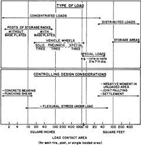
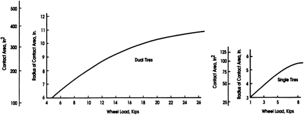

# CHAPTER 5-LOADS

- Source: ACI 360R-10.pdf
- Generated: 2026-03-04T22:38:09+00:00
- Chunk: 20/31
- Estimated tokens: ~6,377
- Total pages: 76
- Type: chapter

## CHAPTER 5-LOADS

## 5.1-Introduction

Chapter 5 describes loadings, the variables that control load effects, and provides guidance for factors of safety for concrete slabs-on-ground.  Concrete  slabs  are  typically  subjected  to some combinations of the following loads and effects:

- Vehicle wheel loads;
- Concentrated loads;
- Distributed loads;
- Line and strip loads;
- Unusual loads;
- Construction loads; and
- Environmental effects.

Slabs should be designed for the most critical combination of these loadings, considering variables that produce the maximum  stress.  Figure  5.1  presents  the  PCA  guide  for selecting the most critical or controlling design considerations for various loads (Packard 1976). Because a number of factors, such as slab thickness, concrete strength, subgrade stiffness, and loading are relevant, cases where several design considerations that may control should be investigated thoroughly.

Other  potential  load  conditions,  such  as  loadings  that change during the life of the structure and those encountered during construction (Wray 1986), should also be considered. For example, material-handling systems today make improved use of the building's volume. Stacked pallets, once considered  uniform  loads,  may  now  be  stored  in  narrowaisle pallet racks that produce concentrated loads. The environmental exposure of the slab-on-ground is also a concern. These effects include subgrade volume changes (shrink and swell soils), buildings with equipment to reduce humidity, and temperature changes. Thermal effects may be minimized by constructing the slab after the building is enclosed, but many slabs are placed before building enclosure. Therefore, construction sequence is important in determining whether transient environmental factors should be considered in the design. Finally, thermal effects due to in-service conditions should be considered.

## 5.2-Vehicular loads

Most vehicular traffic on industrial floors consists of lift trucks and distribution trucks with payload capacities as high as 70,000 lb (310 kN). The payload and much of a truck's weight are generally carried by the wheels of the loaded axle for the standard (counterbalanced) lift truck. The Industrial Truck Association (ITA) (1985) has compiled representative load and geometry data for lift truck capacities up to 20,000 lb (89 kN) (Table 5.1). Vehicle variables affecting the thickness selection and design of slabs-on-ground include:

- Maximum axle load;
- Distance between loaded wheels;
- Tire contact area; and
- Load repetitions during service life.

The axle load, wheel spacing, and contact area are functions of  the  lift  truck  or  vehicle  specifications.  When  vehicle details  are  unknown  or  when  the  lift  truck  strength  is expected to change in the future, the values in Table 5.1 may be used for design. The number of load repetitions, which may be used to help establish a factor of safety, is a function of  the  facility's  usage.  Knowledge  of  load  repetitions  and traffic patterns helps the designer  to quantify fatigue. Consider  whether  these  values  are  predictable  or  constant during the slab's service life. Often, the slab is designed for an unlimited number of repetitions.

The contact area between tire and slab is used in the analysis for  lift  truck  with  pneumatic  or  composition  tires  (Wray 1986). The contact area of a single tire can be approximated by dividing the tire load by the tire pressure (Packard 1976). This calculation is somewhat conservative because the effect of tension in the tire wall is not included. Assumed pressures are variable; however, pneumatic non-steel-cord tire pressures range from 85 to 100 psi (0.6 to 0.7 MPa), whereas steel-cord tire pressures range from 90 to 120 psi (0.6 to 0.8 MPa). The ITA found that the standard solid and cushion solid rubber tires  have  floor  contact  areas  based  on  internal  pressures between 180 and 250 psi (1.2 to 1.7 MPa) (Goodyear Tire and Rubber Co. 1983). Polyurethane tire pressures exceeding 1000 psi (6.9 MPa) have been measured.

Dual tires have an effective contact area greater than the actual  contact  area  of  the  two  individual  tires.  Charts  are available to determine this effective contact area (Packard 1976). A conservative estimate of this effective contact area can be made by using the contact area of the two tires and the areas  between  the  contact  area.  When  it  is  not  known whether  the  vehicle  has  dual  wheels  or  what  the  wheel spacings are, then a single equivalent wheel load and contact area can be used conservatively.

An important consideration for the serviceability of a slab subject to vehicular loads is the design of construction and sawcut contraction joints. Joints should be stiff enough and have  sufficient  shear  transferability  to  limit  differential movement such that the joint filler can perform properly and resists  edge  spalling  as  a  vehicle  travels  across  the  joint. Refer to Chapter 6 for more information and joint details.

## 5.3-Concentrated loads

Warehousing  improvements  in  efficiency  and  storage densities  have  trended  toward  increased  rack  post  loads. These  changes  include  narrower  aisles,  higher  pallet  or material stacking, and using automated stacking equipment. Pallet storage racks may be higher than 80 ft (24 m) and may produce concentrated post loads of 40,000 lb (180 kN) or more. For the higher rack loads, racks that cover a large plan area (which affects deeper soil layers), and racks with longterm loading, consider the effect of the long-term soil settlement in  the  design  of  the  slab.  Cracking  can  also  be  caused  by early installation of rack systems that may restrain the slab's shrinkage and thermal movement and prevent joint activation. The racks may restrain the slab with the rack system bracing or by the increase in base friction from additional storage loads.

Fig.  5.1-Controlling  design  considerations  for  various types of slabs-on-ground loading (Packard 1976). (Note: 1 in. 2 = 645.2 mm 2 ; 1 ft 2 = 0.09290 m 2 .)

Table 5.1-Representative axle loads and wheel spacings for various lift truck capacities

| Truck rated capacity, lb   | Total axle load static reaction, lb   | Center-to-center of opposite wheel tire, in.   |
|----------------------------|---------------------------------------|------------------------------------------------|
| 2000                       | 5600 to 7200                          | 24 to 32                                       |
| 3000                       | 7800 to 9400                          | 26 to 34                                       |
| 4000                       | 9800 to 11,600                        | 30 to 36                                       |
| 5000                       | 11,600 to 13,800                      | 30 to 36                                       |
| 6000                       | 13,600 to 15,500                      | 30 to 36                                       |
| 7000                       | 15,300 to 18,100                      | 34 to 37                                       |
| 8000                       | 16,700 to 20,400                      | 34 to 38                                       |
| 10,000                     | 20,200 to 23,800                      | 37 to 45                                       |
| 12,000                     | 23,800 to 27,500                      | 38 to 40                                       |
| 15,000                     | 30,000 to 35,300                      | 34 to 43                                       |
| 20,000                     | 39,700 to 43,700                      | 36 to 53                                       |

Notes:  Calculate  concentrated  reaction  per  tire  by  dividing  the  total  axle  load reaction by the number of tires on that axle. Figures given are for standard trucks. The application of attachments and extended high lifts may increase these values. In such cases, consult the manufacturer. Weights given are for trucks handling the rated loads at 24 in. from load center to face of fork with mast vertical. 1 lb = 0.004448 kN; 1 in. = 25.4 mm.

The concentrated load variables that affect slab-on-ground design include:

- Maximum or representative post load;
- Duration of load;
- Spacings between posts and aisle width;
- Location of the concentrated load relative to slab joint location  and  the  amount  of  shear  transfer  across  the slab joint; and
- Area of contact between post base plate and slab.

Material-handling systems are major parts of the building layout and should be well defined early in the project. Rack data  can  be  obtained  from  the  manufacturer.  It  is  not uncommon to specify a larger base plate than is normally

supplied to reduce the flexural stress caused by the concentrated load. The base plate should be sized to distribute the load nearly uniformly over the plate area.

## 5.4-Distributed loads

In many warehouse and industrial buildings, materials are stored directly on the slab-on-ground. Flexural stresses in the slab  are  usually  less  than  those  produced  by  concentrated loads. The design should prevent negative moment cracks or limit crack widths for the reinforced slabs in the aisles and prevent  excessive  settlement.  For  higher  load  intensities, distributed loads that cover a large plan area (which affect deeper soil layers) and long-term uniform loads, consider the effect of the differential soil settlement in the slab design. The  effect  of  a  lift  truck  operating  in  aisles  between uniformly loaded areas is not normally combined with the uniform  load into one  loading case,  as  the  moments produced generally offset one another. The individual cases are always considered in the design.

For distributed loads, the variables affecting the design of slabs-on-ground are:

- Maximum load intensity;
- Load duration;
- Width and length of loaded area;
- Aisle width; and
- Presence of a joint located in and parallel to an aisle.

Load intensity and layout may not be constant during the service life of a slab. Therefore, the slab should be designed for the most critical case. For a given modulus of subgrade reaction and slab thickness, there is a critical aisle width that maximizes the center aisle moment (Packard 1976).

## 5.5-Line and strip loads

A line or strip load is a uniform load distributed over a relatively narrow area. Consider a load to be a line or strip load when its width is less than 1/3 of the radius of relative slab  stiffness  (Section  7.2).  When  the  width  approximates this limit, review the slab for stresses produced by line loading and uniform load. When the results are within 15% of one another, consider the load as uniform. Partition loads, bearing walls,  and  roll  storage  are  examples  of  this  load  type.  For higher  load  intensities  and  long-term  loading,  consider  the effect of differential soil settlement in the design of the slab.

The variables for line and strip loads are similar to those for distributed loadings and include:

- Maximum load intensity;
- Load duration;
- Width, length of loaded area, and when the line or strip loads intersect;
- Aisle width;
- Presence of a joint in and parallel to an aisle;
- Presence of parallel joints on each side of an aisle; and
- The  amount  of  shear  transfer  across  the  slab  joint, which is especially important when the line load crosses perpendicular  to  a  joint  or  is  directly  adjacent  and parallel to a joint.

## 5.6-Unusual loads

Loading conditions that do not conform to the previously discussed load types may also occur. They may differ in the following manner:

- Configuration of loaded area;

· Load distributed to more than one axle; and · More than two or four wheels per axle. The load variables are similar to those for the load types previously discussed in Chapter 5. 5.7-Construction loads During the building construction, various equipment types may be  located  on  the  newly  placed  slab-on-ground.  The most common construction loads are: · Pickup trucks; · Scissor lifts; --''',,'',',',,''',,'''',',,,'''-'',,',,,,-'',,',,,,---

- Concrete trucks;
- Dump trucks;
- Hoisting equipment and cranes used for steel erection;
- Tilt wall erection and bracing loads; and
- Setting equipment.

In addition, the slab may be subjected to loads such as scaffolding  and  material  pallets.  Because  these  loads  can exceed  design  limits,  anticipate  the  construction  load  case, particularly  relative  to  early-age  concrete  strength.  Also, consider limiting construction loads near the free edges or slab corners. The controlling load variables for construction loads are  the  same  as  for  vehicle  loads,  concentrated  loads,  and uniform loads.

For construction trucks, the maximum axle load and other variables can usually be determined by referencing to local transportation laws or AASHTO standards. Off-road construction equipment may exceed these limits, but in most cases, construction equipment will not exceed the local DOT legal limits. For design, reference the values shown in Fig. 5.2.

Design codes are mostly silent on the subject of temporary construction loads during erection (Subrizi et al. 2004). In tilt-up construction, the slab-on-ground is often used as part of the temporary construction bracing. The Tilt-Up Concrete Association  (TCA)  has  developed  a  temporary  bracing guideline (TCA 2005) that provides some guidance for the slab's design. When the slab designer considers these tilt-up wall bracing loads during the initial design of the slab, then often a more economical bracing solution is achieved for the project  (Kelly  2007).  Kelly  (2007)  also  provides  some solutions  when  the  bracing  loads  are  considered  after  the slab has been constructed along with some design guidance for the slab's flexural strength.

## 5.8-Environmental factors

Overall  slab  design  should  consider  flexural  stresses produced by thermal changes, reduction in humidity, expansive soils,  and  moisture  changes  in  the  slab,  which  will  affect curling due to the different shrinkage rates between the top and bottom of the slab. These effects are of particular importance for exterior slabs and for slabs constructed before the building  is  enclosed.  Curling  caused  by  these  changes produces  flexural  stresses  due  to  the  slab  lifting  off  the

Fig. 5.2-Tire contact area for various wheel loads. (Note: 1 in. = 25.4 mm; 1 in. 2 = 645.2 mm 2 ; 1 kip = 4.448 kN.)

--''',,'',',',,''',,'''',',,,'''-'',,',,,,-''

- Concrete mixture proportion and its shrinkage characteristics  (test  and  minimize shrinkage to reduce linear drying shrinkage and curling);
- Humidity-controlled environment that increases linear drying shrinkage and slab curling;
- Subgrade smoothness and planeness to minimize restraint during linear drying shrinkage;
- Spacing and joint types;
- Geotechnical  investigation  to  determine  the  shallow and deep properties of the soil;
- Number of load repetitions and traffic patterns to allow consideration of fatigue cracking;
- Impact effects;
- Storage racks installed at an early stage, which restrain linear drying shrinkage; and
- Compounding  factors  of  safety  that  may  produce  an overly  conservative  design.  Inclusion  of  cumulative factors of safety in the modulus of subgrade reaction, applied  loads,  compressive  or  flexural  strength  of  the concrete, or number of load repetitions, may produce a very conservative and, consequently, expensive construction. The factor of safety is normally accounted for only in the allowable flexural stress in the concrete slab.

Table 5.2 shows some commonly used factors of safety for various types of slab loadings. Most range from 1.7 to 2.0, but some loading conditions use factors as low as 1.4.

A moving vehicle subjects the slab-on-ground to the effect of fatigue. Fatigue strength is expressed as the percentage of the static tensile strength that can be supported for a given number of load repetitions. As the ratio of the actual flexural stress  to  the  modulus  of  rupture  decreases,  the  slab  can withstand  more  load  repetitions  before  failure.  For  stress ratios less than 0.45, concrete can be subjected to unlimited load repetitions (PCA 2001). Table 5.3 shows various load repetitions for a range of stress ratios. The factor of safety is the inverse of the stress ratio.

subgrade.  Generally,  the  restraint  stresses  can  be  ignored  in short slabs because a smooth, planar subgrade does not significantly restrain the short slab movement due to uniform thermal expansion, contraction, or drying shrinkage. When the joint spacing recommendations given in Fig. 6.6 are followed, then these stresses will be sufficiently low. Built-in restraints such as  foundation  elements,  edge  walls,  and  pits  should  be avoided. Reinforcement should be provided at such restraints to limit slab crack widths. Chapter 14 discusses thermal and moisture effects. Chapter 10 discusses expansive soils.

## 5.9-Factors of safety

Unique serviceability requirements distinguish slabs-onground  from  other  structural  elements.  Some  of  these serviceability requirements can:

- Minimize cracking and curling;
- Increase surface durability;
- Optimize joint locations and joint types for joint stability, which  is  the  differential  deflection  of  the  adjacent  slab panels edges as wheel loads cross the joint; and
- Maximize long-term flatness and levelness.

Because  building  codes  primarily  provide  guidance  to prevent  catastrophic  failures  that  affect  public  safety,  the factors of safety for serviceability, inherent in building codes, are not directly addressed as are those for strength. When the slab-on-ground is part of the structural system used to transmit vertical loads or lateral forces from other portions of the structure  to  the  soil,  such  as  a  rack-supported  roof,  then requirements of ACI 318 should be used for that load case.

The designer selects the factor of safety to minimize the likelihood of serviceability failure. Some items the designer should consider in selecting the factor of safety are:

- Consequences  of  serviceability  failure,  including  lost productivity,  lost  beneficial  use,  and  the  costs  for repairing areas in an active facility. For example, minimizing cracking and limiting crack widths for facilities such as pharmaceutical and food processing;

Table 5.2-Factors of safety used in design of various types of loading

| Load type                          | Commonlyusedfactors of safety   | Occasionally used factors of safety   |
|------------------------------------|---------------------------------|---------------------------------------|
| Moving wheel loads                 | 1.7 to 2.0                      | 1.4 to 2.0 and greater                |
| Concentrated (rack and post) loads | 1.7 to 2.0                      | Higher under special circumstances    |
| Uniform loads                      | 1.7 to 2.0                      | 1.4 is lower limit                    |
| Line and strip loads               | 1.7                             | 2.0 is conservative upper limit *     |
| Construction loads                 | 1.4 to 2.0                      | -                                     |

* Follow appropriate building code requirements when considering a line load to be a structural load due to building function.

Table 5.3-Stress ratio versus allowable load repetitions (Portland Cement Association 1984) *

| Stress ratio   | Allowable load repetitions   | Stress ratio   |   Allowable load repetitions |
|----------------|------------------------------|----------------|------------------------------|
| <0.45          | Unlimited                    | 0.73           |                          832 |
| 0.45           | 62,790,761                   | 0.74           |                          630 |
| 0.46           | 14,335,236                   | 0.75           |                          477 |
| 0.47           | 5,202,474                    | 0.76           |                          361 |
| 0.48           | 2,402,754                    | 0.77           |                          274 |
| 0.49           | 1,286,914                    | 0.78           |                          207 |
| 0.50           | 762,043                      | 0.79           |                          157 |
| 0.51           | 485,184                      | 0.80           |                          119 |
| 0.52           | 326,334                      | 0.81           |                           90 |
| 0.53           | 229,127                      | 0.82           |                           68 |
| 0.54           | 166,533                      | 0.83           |                           52 |
| 0.55           | 124,523                      | 0.84           |                           39 |
| 0.56           | 94,065                       | 0.85           |                           30 |
| 0.57           | 71,229                       | 0.86           |                           22 |
| 0.58           | 53,937                       | 0.87           |                           17 |
| 0.59           | 40,842                       | 0.88           |                           13 |
| 0.60           | 30,927                       | 0.89           |                           10 |
| 0.61           | 23,419                       | 0.90           |                            7 |
| 0.62           | 17,733                       | 0.91           |                            6 |
| 0.63           | 13,428                       | 0.92           |                            4 |
| 0.64           | 10,168                       | 0.93           |                            3 |
| 0.65           | 7700                         | 0.94           |                            2 |
| 0.66           | 5830                         | 0.95           |                            2 |
| 0.67           | 4415                         | 0.96           |                            1 |
| 0.68           | 3343                         | 0.97           |                            1 |
| 0.69           | 2532                         | 0.98           |                            1 |
| 0.70           | 1917                         | 0.99           |                            1 |
| 0.71           | 1452                         | 1.00           |                            0 |
| 0.72           | 1099                         | >1.00          |                            0 |

source, whether internal or external, will increase the potential for random cracking.

Three types of joints are commonly used in concrete slabson-ground and are discussed in detail in this chapter:

1. Isolation joints.
2. Sawcut contraction joints.
3. Construction joints.

Refer to Fig. 6.1 for appropriate locations for isolation joints and sawcut contraction joints. With the designer's approval, construction joint details and sawcut contraction joint details can be interchanged. Joints in topping slabs should be located directly over joints in the base slab and, when the topping is bonded, no additional joints are required. The bonded topping slab should be designed for the shrinkage restraint due to the bond to the existing slab, and the bond should be sufficient to resist the upward tension force due to curling. For a thin, unreinforced,  unbonded  topping  slab,  consider  additional joints between the existing joints in the bottom slab to help minimize the curling stress in the topping slab. The topping slab  can  have  high  curling  stresses  due  to  the  bottom  slab being a hard base for the topping slab. Also, any cracks in the base slab that are not stable should be repaired to ensure they will not reflect through into the topping slab.

6.1.1 Isolation  jointsIsolation  joints  should  be  used wherever  complete  freedom  of  vertical  and  horizontal movement  is  required  between  the  floor  and  adjoining building elements. Isolation joints should be used at junctions with  walls  (not  requiring  lateral  restraint  from  the  slab), columns, equipment foundations, footings, or other points of restraint such as drains, manholes, sumps, and stairways.

Isolation  joints  are  formed  by  inserting  preformed  joint filler between the floor and the adjacent element. Where the isolation  joint  will  restrain  shrinkage,  flexible  closed  cell foam plank should be used with a thickness that accommodates the  anticipated  shrinkage  movement.  The  joint  material should extend the full depth or slightly below the bottom of the  slab  to  ensure  complete  separation  and  not  protrude above it. Where the joint filler will be objectionably visible, or  where  there  are  wet  conditions  or  hygienic  or  dustcontrol requirements, the top of the preformed filler can be removed and the joint caulked with an elastomeric sealant. Listed as follows are three methods of producing a relatively uniform joint sealant depth: --''',,'',',',,''',,'''',',,,'''-'',,',,,,-'',,',,,,---
