# CHAPTER 6-JOINTS

- Source: ACI 360R-10.pdf
- Generated: 2026-03-04T22:38:09+00:00
- Chunk: 21/31
- Estimated tokens: ~4,976
- Total pages: 76
- Type: chapter

## CHAPTER 6-JOINTS

## 6.1-Introduction

Joints are used in slab-on-ground construction to limit the frequency and width of random cracks caused by concrete volume  changes.  Generally,  when  limiting  the  number  of joints or increasing the joint spacing can be accomplished without  increasing  the  number  of  random  cracks,  floor maintenance will be reduced. The designer should provide the layout of joints and joint details. When the joint layout and  joint  details  are  not  provided  before  project  bid,  the designer should provide a detailed joint layout along with the joint  details  before  the  slab  preconstruction  meeting  or commencing construction.

Every effort should be made to avoid connecting the slab to  any  other  element  of  the  structure.  Restraint  from  any

1. Use a saw to score both sides of the preformed filler at the depth to be removed. Insert the scored filler in the proper location.  After  the  concrete  hardens,  use  a  screwdriver  or similar tool to remove the top section.

2. Cut a strip of wood equal to the desired depth of the joint sealant. Nail the wood strip to the preformed filler and install the assembly in the proper location. Remove the wood strip after the concrete has hardened.

3. Use premolded joint filler with a removable top portion. Refer to Fig. 6.2 and 6.3 for typical isolation joints around columns. Figure 6.4 shows an isolation joint at an equipment foundation. Refer to ACI 223 for guidance on isolation joints for slabs using shrinkage-compensating concrete.

6.1.2 Construction joints -Construction joints are placed in a slab to define the extent of the individual placements,

Fig. 6.1-Appropriate locations for joints.

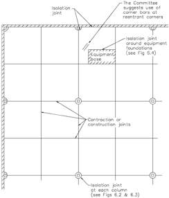

generally in conformity with a predetermined joint layout. When concreting is interrupted long enough for the placed concrete  to  harden,  the  construction  documents  should provide a detail to address this unplanned event. A contingency plan for this unplanned event should also be discussed in the slab  preconstruction  meeting.  For  specialty  floors  such  as defined traffic slabs, unplanned joints can have a significant effect on the long-term floor flatness and levelness when not detailed appropriately.

In areas not subjected to wheel traffic or when differential curling movement is not a concern, a butt joint or keyed joint may be adequate. In areas subjected to wheeled traffic, heavy loads, or both, joints with load transfer devices are recommended (Fig. 6.5). A keyed joint is not recommended for load transfer in areas subjected to wheel traffic because the male and female key components lose contact when the joint opens due to drying shrinkage. This can eventually cause a breakdown of the concrete joint edges and failure of the top side portion of the key.

Construction joints are commonly formed using bulkheads. These  bulkheads  should  be  placed  to  ensure  specified concrete  slab  thickness  and  elevation  at  the  slab  edge. Provide the necessary support to keep the bulkheads straight, true, and rigid during the entire placing and finishing operations. When positive load transfer is required, provisions should be made along the bulkhead to ensure proper alignment of the load-transfer device during placing and finishing operations. Proper  alignment  can  be  achieved  by  rigidly  attaching alignment devices to the bulkhead or by accurately slotting or  drilling  the  bulkhead  to  accept  a  load-transfer  device. These methods should allow the load-transfer device to be

Fig. 6.2-Typical diamond and round isolation joints.

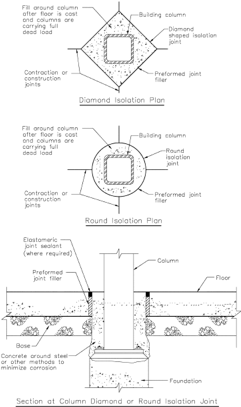

installed at the joint face while maintaining proper alignment during  placing  and  finishing  operations.  The  load-transfer devices should be parallel to the top surface, each other, and perpendicular to the joint face. Depending on the method used, the load-transfer device can be inserted before or after the bulkhead is removed. When incorporating alignment or installation devices into the bulkhead, which remain in the slab, the device should be manufactured with a thin rigid material that is a tight fit with the load-transfer device to minimize vertical deflection due  to  load.  Load-transfer  devices  in  direct  contact  with  the concrete will be the most effective load-transfer mechanism for controlling vertical joint deflection.

All construction joints should  be  internally vibrated at frequent intervals to properly consolidate the concrete at the joint and around the load-transfer devices. Vibratory screeds, laserguided  screeds,  and  hand-rodding  techniques  do  not  provide sufficient internal vibration around the load-transfer devices.

6.1.3 Sawcut contraction joints -Sawcut contraction joints are  used  to  limit  random,  out-of-joint  floor  slab  cracking. Joints are usually located on column lines, with intermediate joints located at equal spaces between column lines (Fig. 6.1).

--''',,'',',',,''',,'''',',,,'''-'',,',,,,-'',,',,,,---

## ACI COMMITTEE REPORT

Fig. 6.3-Alternate column isolation joint.

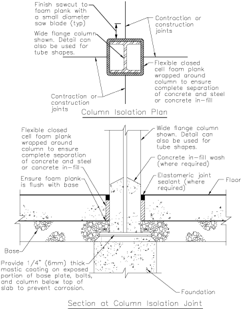

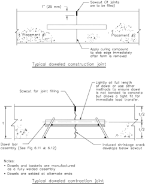

Fig. 6.4-Typical isolation joint around equipment foundation.

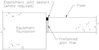

Consider the following when selecting spacing of sawcut contraction joints:

- Slab design method;
- Slab thickness;
- Type, amount, and location of reinforcement;
- Shrinkage potential of the concrete,  including  cement type  and  quantity;  aggregate  type,  size,  gradation, quantity, and quality; water-cementitious material ratio; type of admixtures; and concrete temperature;
- Base friction;
- Floor slab restraints;
- Layout  of  foundations,  racks,  pits,  equipment  pads, trenches, and similar floor discontinuities; and
- Environmental factors such as temperature, wind, and humidity.
- Establishing slab joint spacing, thickness, and reinforcement requirements is the responsibility of the designer. The specified

Fig. 6.5-Typical doweled joints.

Fig. 6.6-Recommended joint spacing for unreinforced slabs.

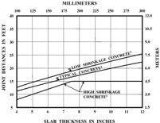

joint spacing will be a principal factor dictating both the amount and the character of random cracking to be experienced, so joint spacing should always be carefully selected. For unreinforced slabs-on-ground  and  for  slabs  reinforced  only  for  limiting crack  widths,  other  than  continuously  reinforced  with more  than  0.5%  of  steel  by  cross-sectional  area,  Fig.  6.6

Fig. 6.7-Joint details at loading dock.

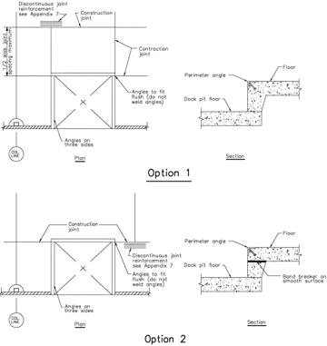

provides recommendations for joint spacing. The spacings are based on shrinkage values for specimens that have been moist-cured 7 days and then placed in air storage per ASTM C157/C157M.  Use  the  appropriate  prism  size  for the concrete mixture being placed. The procedures in ACI 209R can be used along with the ASTM C157/C157M test information to predict the ultimate drying shrinkage. Using only a few days of laboratory drying shrinkage data and the procedures from ACI 209R to predict the ultimate drying shrinkage may  lead to unreliable values. Using  28-day laboratory shrinkage  values  (7  days  of  curing  and  then  21  days  of  air storage) and the procedures in ACI 209R to predict the ultimate drying shrinkage, however, have provided useful results.

Sawcut  contraction  joints  should  be  continuous  across intersecting joints, not staggered or offset. The aspect ratio of  slab  panels  that  are  unreinforced,  reinforced  only  for crack-width control, or made with shrinkage-compensating concrete should be a maximum of 1.5 to 1; however, a ratio of  1  to  1  is  preferred.  L-  and  T-shaped  panels  should  be avoided.  Floors  around  loading  docks  have  a  tendency  to crack  due  to  their  configuration  and  restraints.  Figure  6.7 shows two options that minimize slab cracking at reentrant

--''',,'',',',,''',,'''',',,,'''-'',,',,,,-'',,',,,,--- corners of loading docks. In Option 1, the loading dock pit wall is placed integral with the slab and, therefore, most of the shrinkage movement is forced to the construction joint shown in the figure.  To  minimize  the  opening  width  of  this construction joint, place the joint at 1/2 of the typical slab joint spacing. In Option 2, create a slip surface at the top of the pit wall that will help equalize the shrinkage movement on each side of the slab panel so the typical slab joint spacing can be used. By using a construction joint as shown in Option 2, there is less likelihood of cracking at the dock pit corners.

Plastic or metal inserts are not recommended for creating a  contraction joint in any exposed floor surface subject to wheel traffic.

Contraction joints in industrial and commercial floors are usually formed by sawing a continuous slot in the slab to form a weakened plane so a crack will form below (Fig. 6.8).

When using load-transfer assemblies at sawcut contraction joints, the concrete around these assemblies should be internally vibrated.  This  properly  consolidates  the  concrete  around  the load-transfer assemblies. Section 6.3 provides further details on sawcutting of joints.

## 6.2-Load-transfer mechanisms

Use load-transfer devices at construction and contraction joints  (Fig.  6.5)  when  positive  load  transfer  is  required, unless a sufficient amount  of  post-tensioning  force  is provided across the construction joint to transfer the shear. Load-transfer devices force concrete on both sides of a joint to deflect approximately equally when subjected to a load. This  can  help  prevent  damage  to  an  exposed  edge  when subjecting the joint to wheel traffic.

For dowels to be effective, they should be smooth, aligned, and supported so they remain parallel in both the horizontal and vertical planes during the placing and finishing operation. All dowels should have flat, square, and deburred end edges that will not restrain concrete shrinkage. Properly aligned, smooth  dowels  allow  the  joint  to  open  freely  as  concrete shrinks. ACI 117 provides tolerances for the installation of slab-on-ground round dowels.

Plate dowels are now commonly used in construction and contraction joints. Manufacturers offer various plate dowel geometries and associated installation devices. Plate dowels can minimize shrinkage restraint by using a tapered shape, formed  void,  or  by  having  compressible  material  on  the vertical faces with a thin bond breaker on the top and bottom dowel  surfaces  (Fig.  6.9  and  6.10)  (Schrader  1987,  1991; PTI 2000; Ringo and Anderson 1992; Metzger 1996; Walker and Holland 1998; American Concrete Paving Association 1992). When  a  formed  void  on  the  vertical sides is constructed by a stay-in-place device, then that stay-in-place device should be of a rigid material and fit tightly with the dowel surface to  minimize  vertical  deflection  at  the  joint. The tapered shape along with a thin bond breaker on all sides allows a void space to develop along the vertical sides of the

Fig. 6.8-Sawcut contraction joint.

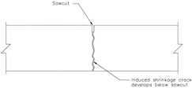

dowel to eliminate restraint as the slab shrinks from the joint. Similarly, a formed void or the compressible material will also eliminate the restraint as the slab shrinks from the joint.

Dowel  baskets  (Fig.  6.11  and  6.12)  should  be  used  to maintain alignment of dowels in sawcut contraction joints, and alignment installation devices should be used in construction joints. Plate dowels in contraction joint basket assemblies with the compressible material or tapered shape allow  for  some  horizontal  misalignment  with  the  sawcut contraction  joint.  In  corrosive  environments,  the  designer should consider corrosion protection for the dowels. Plate and square dowel systems that minimize horizontal restraint as shown in Fig. 6.9, 6.10, and 6.12 can be placed close to the intersection  of  joints,  but  no  closer  than  6  in.  (150  mm). Other dowels should be placed no closer than 12 in. (300 mm) from the intersection of any joints because the maximum movement caused by horizontal dry shrinkage occurs at this point, and the corner of the slab may consequently crack. --''',,'',',',,''',,'''',',,,'''-'',,',,,,-'',,',,,,---

Table 6.1 provides recommended dowel sizes and spacing for  round  and  square  shapes.  Because  of  the  various  plate dowel geometries and installation devices available from the different manufacturers, the manufacturers should be consulted for their recommended plate dowel size and spacing.

A less effective load-transfer mechanism than those just discussed is aggregate interlock. Aggregate interlock depends on the irregular face of the cracked concrete at joints for load transfer. Designers that choose aggregate interlock as the load-transfer mechanism at joints are cautioned that, for unreinforced concrete slabs, the joint spacings in Fig. 6.6 are intended to minimize the potential for midpanel out-ofjoint random cracking, and are independent of load transfer requirements at joints. Not all joints activate uniformly. This results in some joint opening widths that are larger than might normally be anticipated (Walker and Holland 2007b). These wide joints are often called the 'dominant joints.' The dominant joint behavior is made worse by the ever-increasing use of vapor retarders/barriers placed below the floor slab, which reduces base friction and makes the dominant joints more noticeable  and  problematic.  Where  aggregate  interlock  is anticipated as the only load-transfer mechanism in a slab-onground, joint spacing should be the thoughtful result of an evaluation of the anticipated, activated, joint-opening widths and  the  type  of  wheel  loadings  on  the  slab.  Furthermore, when the designer cannot be sure of positive long-term shear transfer at the joints through aggregate interlock, then positive

Fig. 6.9-Plan view indicating provisions for longitudinal movement at doweled construction joints.

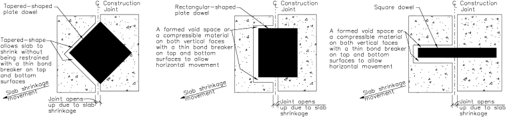

Fig. 6.10-Isometric view indicating provisions for longitudinal movement at doweled construction joints.

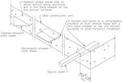

Fig. 6.11-Round dowel basket assembly.

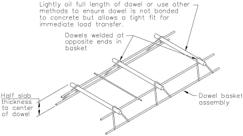

load-transfer devices should be used at all joints subject to wheel traffic.

With respect to this issue, PCA implemented a test program to examine the effectiveness of aggregate interlock as a loadtransfer  mechanism  (Colley  and  Humphrey  1967).  The program tested 7 and 9 in. (180 and 230 mm) thick slabs. The test slabs were constructed using 1-1/2 in. (38 mm) maximumsize aggregate, fully supported on various base materials, and loaded using repetitive applications of 9000 lb (40 kN) on 16 in. (440 mm) diameter pads centered 9 in. (230 mm) from the joints. Among the findings were the following:

- Joint  effectiveness  for  7  in.  (180  mm)  thick  slabs  is reduced to 60% at an opening width of 0.025 in. (0.6 mm);
- Joint  effectiveness  for  9  in.  (230  mm)  thick  slabs  is reduced to 60% at an opening width of 0.035 in. (0.9 mm);
- Three values of foundation-bearing support were used. The  values  used  were k =  89,  145,  and  452  lb/in. 3 (24,200, 39,400, and 123,000 kN/m 3 ). Joint effectiveness was  increased  with  increases  in  foundation  bearing value k ; and
- Joint effectiveness increased with increased aggregate particle angularity.

Using the opening width of a joint or crack as an acceptance criterion has been used with limited success in predicting its service life. There are a number of difficulties in using the opening width. These include:

- How to measure the width, because a crack edge may not  have  well-defined  boundaries  due  to  spalling  or other factors;
- The crack width will change with temperature;
- The crack or joint opening width will vary along the length; --''',,'',',',,''',,'''',',,,'''-'',,',,,,-'',,',,,,---
- The crack is wider at the top than at the bottom, due to curling; and

Fig. 6.12-Different plate dowel basket assemblies.

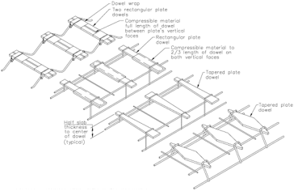

Table 6.1-Dowel size and spacing for construction and contraction joints*

|                      | Dowel dimensions, in. (mm)   | Dowel dimensions, in. (mm)   | Dowel dimensions, in. (mm)   | Dowel dimensions, in. (mm)   | Dowel dimensions, in. (mm)   | Dowel spacing center-to center, † in. (mm)   | Dowel spacing center-to center, † in. (mm)   | Dowel spacing center-to center, † in. (mm)   |
|----------------------|------------------------------|------------------------------|------------------------------|------------------------------|------------------------------|----------------------------------------------|----------------------------------------------|----------------------------------------------|
| Slab depth,          | Construction joint           | Construction joint           | Contraction joint            | Contraction joint            | Plate                        | ‡                                            | §||                                          |                                              |
| in. (mm)             | Round ‡                      | Square §||                   | Round ‡                      | Square §||                   | dowel                        | Round                                        | Square                                       | Plate dowel                                  |
| 5 to 6 (130 to 150)  | 3/4 x 10 (19 to 250)         | 3/4 x 10 (19 x 250)          | 3/4 x 13 (19 x 330)          | 3/4 x 13 (19 x 330)          | M/R #                        | 12 (300)                                     | 14 (360)                                     | 18 (460)                                     |
| 7 to 8 (180 to 200)  | 1 x 13 (25 x 330)            | 1 x 13 (25 x 330)            | 1 x 16 (25 x 410)            | 1 x 16 (25 x 410)            | M/R #                        | 12 (300)                                     | 14 (360)                                     | 18 (460)                                     |
| 9 to 11 (230 to 280) | 1-1/4 x 15 (32 x 380)        | 1-1/4 x 15 (32 x 380)        | 1-1/4 x 18 (32 x 460)        | 1-14 x 18 (32 x 460)         | M/R #                        | 12 (300)                                     | 12 (300)                                     | 18 (460)                                     |

* Table values based on a maximum joint opening of 0.20 in. (5 mm). Carefully align and support dowels during concrete operations. Misaligned dowels may lead to cracking. Spacings are based on dowels in direct contact with a thin bond breaker. Total dowel length includes allowance made for joint opening and minor errors in positioning dowels.

† Dowel spacing up to 24 in. (610 mm) for round, square, and plate dowels have been used successfully.

‡ ACI Committee 325 (1956), Teller and Cashell (1958).

§ Walker and Holland (1998).

|| Square dowels should have compressible material securely attached on both vertical faces.
