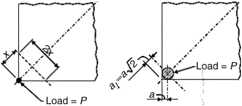

# CHAPTER 7-DESIGN OF UNREINFORCED CONCRETE SLABS

- Source: ACI 360R-10.pdf
- Generated: 2026-03-04T22:38:09+00:00
- Chunk: 23/31
- Estimated tokens: ~4,392
- Total pages: 76
- Type: chapter

## CHAPTER 7-DESIGN OF UNREINFORCED CONCRETE SLABS

## 7.1-Introduction

The thickness of unreinforced concrete slabs is determined using an allowable concrete flexural tensile stress. Although the  effects  of  any  welded  wire  reinforcement,  plain  or deformed bars, post tensioning, fibers, or any other type of reinforcement are not considered, joints may be reinforced for load transfer across the joint. Slabs are normally designed to  remain uncracked due to applied loads with a factor of safety of 1.4 to 2.0 relative to the modulus of rupture.

It  is  important  to  note  that,  as  set  forth  in  ACI  318, slabs-on-ground  are  not  considered  structural  members unless they are used to transmit vertical or horizontal loads from other elements of the building's structure (Chapter 12). Consequently, cracking, joint instability, and surface character problems are considered slab serviceability issues and not relevant to the general integrity of the building structure.

Concrete floor slabs employing portland cement, regardless of slump, will begin to experience a reduction in volume as soon  as  they  are  placed.  This  continues  as  long  as  water, heat, or both, are released into the surroundings. Because the drying and cooling rates at the top and bottom of the slab are dissimilar,  the  shrinkage  will  vary  with  the  depth.  This distorts the as-cast shape and reduces volume. Resistance to this  distortion  introduces  internal  concrete  stresses  that, when unrelieved, may cause cracks.

Controlling the effects of drying shrinkage is critical to the performance of unreinforced concrete slabs. Two principal objectives  of  unreinforced  slab-on-ground  design  are  to avoid  the  formation  of  random,  out-of-joint  cracks  and  to maintain adequate joint stability. The slab's anticipated live loading governs its thickness and cross-joint shear transfer

requirements, whereas shrinkage considerations dictate the maximum joint spacing. Current  design  and  construction  procedures  are  based upon  limiting cracking and curling, due to restrained shrinkage,  to  acceptable  levels,  but  not  eliminating  them. ACI 302.1R suggests that cracking in up to 3% of the slab panels in a normally jointed floor is a realistic expectation. Refer to ACI 224R for further discussion of cracking in reinforced and unreinforced concrete slabs. Fig. 7.1-Corner load on slab-on-ground. --''',,'',',',,''',,'''',',,,'''-'',,',,,,-'',,',,,,---

In jointed, unreinforced slabs-on-ground, the design intends to cause shrinkage cracks to occur beneath sawcut contraction joints. In industrial construction, this can result in a floor slab that is susceptible to relative movement of the joint edges and joint maintenance problems when exposed to wheel traffic. When the designer cannot be sure of positive long-term  shear  transfer  at  the  joints  through  aggregate interlock, then positive load-transfer devices should be used at all joints subject to wheel traffic. Refer to Section 6.2 for additional information.

## 7.2-Thickness design methods

When the slab is loaded uniformly over its entire area and supported by uniform subgrade, stresses will be due solely to restrained  volumetric  changes;  however,  most  slabs  are subjected to nonuniform loading. In warehouses, the necessity for maintaining clear aisles for access to stored materials results in  alternating  loaded  and  unloaded  areas.  Rack  post  and  lift truck wheel loads present a more complex loading pattern.

As noted in  Chapter  1,  the  analysis  of  slabs  supporting concentrated loads is based largely on the work of Westergaard (1923, 1925, 1926). Three separate cases, differentiated on the basis of the location of the load with respect to the edge of the  slab,  might  be  considered  (Winter  et  al.  1964). These cases are provided to illustrate the effect of load location, particularly at free corners or edges. Most of the generally used structural design methods discussed do not provide for loading  at  free  edges  and  corners.  The  designer  should carefully consider such loading.

Case 1 : Wheel load close to corner of large slab -With a load applied at the corner of a slab, the critical stress in the concrete is tension at the top surface of the slab. An approximate solution assumes a point load acting at the corner of the slab (Fig. 7.1). At short distances from the corner, the upward reaction of the soil has little effect, and the slab is considered to act as a cantilever. At a distance x from the corner,  the  bending  moment  is Px ;  it  is  assumed  to  be

uniformly distributed across the slab section width at right angles to the bisector of the corner angle. For a 90-degree corner, the section width is 2 x , and the bending moment per unit width of slab is

<!-- formula-not-decoded -->

When h is the thickness of the slab, the tensile stress at the top surface is

<!-- formula-not-decoded -->

This equation provides reasonably close results only in the immediate vicinity of the slab corner, and only when the load is applied over a small contact area.

In an analysis that considers the reaction of the subgrade, and that considers the load to be applied over a contact area of radius a (Fig. 7.1), Westergaard derives the expression for critical tension at the top of the slab, occurring at a distance 2 from the corner of the slab a 1 L

<!-- formula-not-decoded -->

where f t is concrete tensile stress, psi (Pa); a is the radius of load  contact  area,  in.  (m); P is  the  load  on  the  slab-onground, lb (N); h is the slab thickness, in. (m); and in which L is the radius of relative stiffness [in. (m)], equal to

<!-- formula-not-decoded -->

where E is  elastic  modulus  of  concrete,  psi  (Pa); ν is Poisson's ratio for concrete-approximately 0.15; and k is modulus of subgrade reaction, lb/in. 3 (N/m 3 ).

The value of L reflects the relative stiffness of the slab and the subgrade. It will be large for a stiff slab on a soft base, and small for a flexible slab on a stiff base.

Case 2 : Wheel load considerable distance from edges of slab -When  the  load  is  applied  some  distance  from  the edges  of  the  slab  at  approximately  four  times  the  relative stiffness  (4 L ),  the  critical  stress  in  the  concrete  will  be  in tension at the bottom surface. This tension is greatest directly under  the  center  of  the  loaded  area,  and  is  given  by  the expression

<!-- formula-not-decoded -->

Case 3 : Wheel load at edge of slab, but removed considerable distance from corner -When the load is applied at a point along an edge of the slab, the critical tensile stress is at the bottom of the concrete, directly under the load, and is equal to

<!-- formula-not-decoded -->

For Eq. (7-4) and (7-5), use P in pounds (lb), h in inches (in.), and k in pounds per cubic inch (lb/in. 3 ), then f b will be in pounds per square inch (lb/in. 2 ). The logarithms are base 10.

If  the  flexural  tensile  stress,  as  given  by  the  previous equations,  exceeds  the  allowable  concrete  flexural  tensile stress,  it  is  necessary  to  increase  slab  thickness,  increase concrete flexural  strength,  or  provide  reinforcement.  Such reinforcement  is  usually  designed  to  provide  for  all  the tension indicated by the analysis of the assumed homogeneous, elastic slab. --''',,'',',',,''',,'''',',,,'''-'',,',,,,-'',,',,,,---

Case 4 : Loads distributed over partial areasIn addition to concentrated loads, uniform loads distributed over partial areas  of  slabs  may  produce  the  critical  design  condition. Again,  in  warehouses,  heavy  loads  alternate  with  clear aisles.  With  such  a  loading  pattern,  cracking  is  likely  to occur along the centerline of the aisles.

In an analysis based on such loading, Rice (1957) derived an expression for the critical negative moment in the slab Mc that occurs at the center of the aisle

<!-- formula-not-decoded -->

where

Mc = slab moment at the center of the aisle, in.-lb/in. (m-N/m);

λ =

, in. -1 (m -1 ); k 4 EI ⁄ 4

E =

elastic modulus of concrete, psi (Pa);

I =

moment of inertia, in. 4 (m 4 );

a =

half-aisle width, in. (m);

k =

modulus of subgrade reaction, lb/in. 3 (N/m 3 );

w =

uniform load, psi (N/m 2 ); and

e =

base of natural logarithms.

Recognizing  that the aisle width cannot always  be predicted exactly, Rice suggests that a 'critical aisle width' be used. This width is such as to maximize the above for bending moment (Westergaard 1926).

Generally accepted thickness design methods for unreinforced slabs-on-ground are the:

- PCA method (Section 7.2.1);
- WRI method (Section 7.2.2); and
- COE method (Section 7.2.3).

Each of these methods, described in Chapter 1, seek to avoid  live  load-induced  cracks  through  the  provision  of adequate slab cross section by using an adequate factor of safety  against  rupture.  The  PCA  and  WRI  methods  only address live loads imposed on the slab's interior, whereas the COE method only considers live loads imposed on the slab's edges  or  joints.  All  three  methods  assume  that  the  slab remains  in  full  contact  with  the  ground  at  all  locations. Curl-induced stresses are not considered. Design examples in Appendixes l, 2, and 3 show how to use all three methods.

7.2.1 Portland Cement Association design methodThe PCA method is based on Pickett's analysis (Ringo 1986). The  variables  used  are  flexural  strength,  working  stress,

wheel  contact  area,  spacing,  and  the  subgrade  modulus. Assumed values are Poisson's ratio (0.15) and the concrete modulus  of  elasticity  (4,000,000  psi  [28,000  MPa]).  The PCA method is for interior loadings only; that is, loadings are not adjacent to free edges.

7.2.1.1 Wheel loadsSlabs-on-ground are subjected to various  types,  sizes,  and  magnitudes  of  wheel  loads.  Lift truck loading is a common example of wheel loads. Small wheels have tire inflation or contact pressures in the range of 85 to 100 psi (0.6 to 0.7 MPa) for pneumatic tires, 90 to 120 psi (0.6 to 0.8 MPa) for steel-cord tires, and 180 to 250 psi (1.2 to 1.7 MPa) for solid or cushion tires (Goodyear Tire and Rubber Co. 1983). Some  polyurethane tire pressures exceeding 1000 psi (6.9 MPa) have been measured. Large wheels have tire pressures ranging from 50 to 90 psi (0.3 to 0.6 MPa). Appendix l shows use of the PCA design charts for wheel loadings.

7.2.1.2 Concentrated loadsConcentrated loads can be more severe than wheel loads. Design for concentrated loads is the same as for wheel loads. Consider also the proximity of  rack  posts  to  joints.  Generally,  flexure  controls  the concrete slab thickness. Bearing stresses and shear stresses at the bearing plates should also be checked in accordance with ACI 318. Section A1.3 shows the PCA design charts used  for  concentrated  loads  as  found  in  conventionally spaced rack and post storage.

7.2.1.3 Uniform loadsUniform loads do not stress the concrete slab as highly as concentrated loads. The two main design objectives are to prevent top cracks in the unloaded aisles and to avoid excessive settlement due to consolidation of the subgrade. Top cracks are caused by tension in the top of  the  slab  and  depend  largely  on  slab  thickness,  load placement, and short- and long-term subgrade deflections. The PCA tables for uniform loads (Appendix l) are based on the work of Hetenyi (1946), considering the flexural strength of  the  concrete  and  the  subgrade  modulus  as  the  main variables.  Values  other  than  the  flexural  strength  and subgrade modulus are assumed in the tables.

7.2.1.4 Construction loadsThe PCA method does not directly  address  construction  loading.  If,  however,  such loading  can  be  determined  as  equivalent  wheel  loads, concentrated loads, or uniform loads, the same charts and tables can be used.

## 7.2.2 Wire Reinforcement Institute design method

7.2.2.1 IntroductionThe WRI design charts, for interior loadings  only,  are  based  on  a  discrete  element  computer model. The slab is represented by rigid bars, torsion bars for plate twisting, and elastic joints for plate bending. Variables are  slab  stiffness  factors,  modulus  of  elasticity,  subgrade modulus,  and  trial  slab  thickness;  diameter  of  equivalent loaded area; distance between wheels; flexural strength; and working stress.

7.2.2.2 Wheel loadsSlabs-on-ground subject to wheel loadings are discussed in Section 7.2.1.1. The WRI thickness selection method starts with an assumption of slab thickness so that the stiffness of slab relative to the subgrade is determined. The moment in the slab caused by the wheel loads and the slab's required thickness are then determined. Appendix 2 shows the use of the WRI design charts for wheel loadings.

7.2.2.3 Concentrated  loadsThe WRI  charts  do  not address concentrated loads directly. Because it is possible, however,  to  determine  a  wheel  load  that  represents  an equivalent concentrated loading, the charts can be used.

7.2.2.4 Uniform loadsThe WRI provides other charts (Appendix 2) for design of slab thickness where the loading is uniformly distributed on either side of an aisle. In addition to the variables listed in Section 7.2.2.1, the aisle width and the uniform load are variables in this method.

7.2.2.5 Construction loadsConstruction loads such as equipment, cranes, concrete trucks, and pickup trucks may affect  slab  thickness  design.  As  with  the  PCA  design method, these are not directly addressed by WRI. Thickness design,  however,  may  be  based  on  an  equivalent  load expressed in terms of wheel loads or uniform loads.

7.2.3 The COE design methodThe COE design charts are intended for wheel and axle loadings applied at an edge or joint only. The variables inherent in the axle configuration are built into the design index category. Concentrated loads, uniform loads, construction loads, and line and strip loads are not addressed.

The COE method is based on Westergaard's formula for edge stresses in a concrete slab-on-ground. The edge effect is reduced by a joint transfer coefficient of 0.75 to account for load transfer across the joint. Variables are concrete flexural strength, subgrade modulus, and the design index category.

The  design  index  is  used  to  simplify  and  standardize design for the lighter-weight lift trucks, generally having less than a 25,000 lb (110 kN) axle load. The traffic volumes and daily operations of various sizes of lift truck for each design index  are  considered  representative  of  normal  warehouse activity  and  are  built  into  the  design  method.  Assumed values  are  an  impact  factor  of  25%,  concrete  modulus  of elasticity of 4,000,000 psi (28,000 MPa), Poisson's ratio of 0.20, the wheel contact area, and the wheel spacings. The latter two values are fixed internally for each index category.

Appendix 3 illustrates the use of the design index category and the COE charts. Additional design charts for pavements with protected and unprotected corners have been developed by the COE for pavements, although they may be applied to slabs-on-ground in general.

## 7.3-Shear transfer at joints

A  principal  concern  governing  the  spacing  of  sawcut contraction joints is edge curl (Walker and Holland 1999). Effective shear transfer at both construction and intermediate sawcut contraction joints is required to avoid a loaded free edge. Also, curl and shrinkage can reduce joint stability by disengaging aggregate interlock or keyed joints, allowing the free  edges  to  deflect  independently  under  wheel  traffic. Excessive  curling  and  shrinking  can  also  reduce  the  joint stability  of  doweled  joints.  Positive  load-transfer  devices, such as dowels, should be used for joints subjected to wheel traffic where the joint is expected to open more than 0.025 to 0.035 in. (0.6 to 0.9 mm). Chapter 6 contains an expanded discussion of jointing of slabs-on-ground and protecting the

--''',,'',',',,''',,'''',',,,'''-'',,',,,,-'',,',,,,---

joints.  The  PCA  (2001)  provides  considerations  for  the effectiveness of shear transfer at joints.

7.3.1 Steel  dowelsSteel  dowels  are  the  most  effective means to provide effective load transfer and to ensure adjacent curled joint edges deflect together. Refer to Chapter 6 for a discussion of different doweling approaches.

When dowels are installed across a joint, the slab edges abutting the joint may still curl and deflect when loaded, but they do so in unison. When the wheel reaches the joint, no significant relative vertical displacement between the panels is encountered, and the impact loads imposed on the edges are greatly reduced.

## 7.4-Maximum joint spacing

Assuming  the  subgrade  is  relatively  free  from  abrupt changes  in  elevation,  such  as  that  caused  by  uncorrected wheel  rutting,  the  tensile  stresses  created  in  the  shrinking panel by subgrade frictional restraint are relatively minor in comparison to curling-induced stresses. These higher curling stresses are likely the principal cause of shrinkage cracking in  most  unreinforced  concrete  floor  slabs  (Walker  and Holland 1999).

In general, joint spacing should not exceed the spacing in Fig. 6.6 and as discussed in Chapter 6. Refer to Chapter 14 for discussion on how joint spacing affects curling-induced stress.
