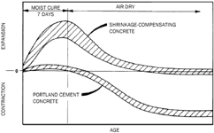
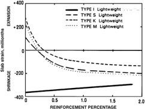
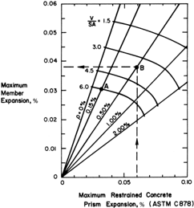
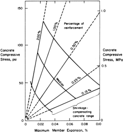

# CHAPTER 9-DESIGN OF SHRINKAGECOMPENSATING CONCRETE SLABS

- Source: ACI 360R-10.pdf
- Generated: 2026-03-04T22:38:09+00:00
- Chunk: 25/31
- Estimated tokens: ~4,585
- Total pages: 76
- Type: chapter

## CHAPTER 9-DESIGN OF SHRINKAGECOMPENSATING CONCRETE SLABS

## 9.1-Introduction

This chapter deals with shrinkage-compensating concrete slabs  made with cement conforming to ASTM C845. The design  procedure  differs  significantly  from  that  for  conventional concrete with ASTM C150/C150M portland cement and blends conforming to ASTM C595.

When concrete dries, it contracts or shrinks and when it is wetted  again,  it  expands.  These  volume  changes  with changes in moisture content are an inherent characteristic of hydraulic-cement concrete. ACI 224R discusses this phenomenon  in  detail.  Volume  changes  also  occur  with temperature changes.

Shrinkage-compensating concrete is expansive cement concrete  that,  when  restrained  by  the  proper  amount  of reinforcement or other means, will expand an amount equal to or slightly greater than the anticipated drying shrinkage. Subsequent drying shrinkage reduces the expansion strains, but  ideally,  a  residual  compressive  stress  remains  in  the concrete, thereby minimizing shrinkage cracking and curling.  Sections  9.1.1  and  9.1.2  explain  how  shrinkagecompensating concrete  differs  from  conventional  concrete with respect to volume changes.

9.1.1 Portland-cement  and  blended-cement  concreteThe shortening of cement and blended-cement concrete due to  shrinkage  is  restrained  by  reinforcement  and  friction between the ground and the slab. This shortening occurs at an  early  age,  and  the  friction  can  cause  concrete  tension restraint stress in excess of its early tensile strength, thereby cracking the slab.

As drying shrinkage continues, cracks open wider. This may  present  maintenance  problems,  and  when  the  crack width exceeds 0.025 in. (0.6 mm), aggregate interlock (load transfer)  becomes  ineffective.  Refer  to  Section  6.2  for additional information on aggregate interlock. Cracking due to  shrinkage  restraint  can  be  minimized  by  closer  joint spacing or post-tensioning, or crack widths can be minimized with additional distributed reinforcement.

9.1.2 Shrinkage-compensating  concrete  compared  with conventional  concreteShrinkage-compensating  concrete

is used to limit cracking and curling. Shrinkage-compensating concrete is made with cement conforming to ASTM C845 rather  than  ASTM  C150/C150M  or  C595/C595M.  Therefore, the volume change characteristics are different. Shrinkage-compensating concrete undergoes an initial volume increase during the first few days of curing, and then undergoes drying shrinkage. The drying-shrinkage characteristics of shrinkage-compensating concrete are similar to those  of  portland-cement  concrete.  The  drying  shrinkage  of shrinkage-compensating concrete is affected by the same factors as portland-cement concrete. These include water content of the  concrete  mixture,  type  of  aggregate  used,  aggregate gradation, and cement content. The water content influences the expansion during curing and subsequent shortening due to drying  shrinkage.  Figure  9.1  illustrates  the  typical  lengthchange characteristics of shrinkage-compensating and portlandcement concrete prism specimens tested in accordance with ASTM C878/C878M (ACI Committee 223 1970).

In  shrinkage-compensating  concrete,  the  expansion  is restrained  by  the  bonded  reinforcement,  which  causes tension in the reinforcement. As a result of this expansive strain  causing  tension  in  the  reinforcement,  compression develops  in  the  concrete  to  oppose  this  tension.  These stresses  are  relieved  over  time  by  drying  shrinkage  and creep. It is intended that the restrained expansion be greater than the resultant long-term shrinkage, as shown in Fig. 9.2, so  the  concrete  remains  in  compression.  The  minimum recommended amount of concrete expansion for slabs-onground, measured in accordance with ASTM C878/C878M, is 0.03%.

## 9.2-Thickness determination

For  a  shrinkage-compensating  concrete  slab-on-ground, the determination of the slab thickness is similar to that used for other slab-on-ground design methods. The PCA, WRI, and COE methods are all appropriate. Refer to Chapter 7 and Appendixes l, 2, and 3. Appendix 5 illustrates other design considerations specific to shrinkage-compensating concrete.

## 9.3-Reinforcement

9.3.1 RestraintAn elastic type of restraint, such as that provided by internal reinforcement, should be provided to develop  shrinkage  compensation.  Other  types  of  restraint such as adjacent structural elements, subgrade friction, and integral  abutments,  are  largely  indeterminate,  and  may provide either too much or too little restraint. Subgrade frictional coefficients in the range of 1 to 2 have been used with acceptable results. High restraint, however, induces a high compressive stress in the concrete but provides little shrinkage  compensation.  To  reduce  subgrade  frictional restraint, which allows easier expansion, two sheets of polyethylene  have  been  used  successfully.  Subgrade  frictional coefficients  as  low  as  0.20  have  been  measured  (Timms 1964) for two sheets of polyethylene in the laboratory. Due to the construction variations in the base, however; a more realistic  subgrade  friction  value  of  0.30  for  two  sheets  of polyethylene is likely  and  recommended for projects with

Fig. 9.1-Typical length change characteristics of shrinkage-compensating and portland-cement concretes (ACI Committee 223 1970).

--''',,'',',',,''',,'''',',,,'''-'',,',,

Fig. 9.2-Effect of reinforcement on shrinkage and expansion at 250 days (Russell 1980).

smooth  and  level  bases.  Wherever  possible,  the  designer should specify the reinforcement recommended in ACI 223.

- 9.3.2 Minimum  reinforcementA  minimum  ratio  of reinforcement area to gross concrete area of 0.0015 should be  used  in  each  direction  that  shrinkage  compensation  is desired. This minimum ratio does not depend on the reinforcement yield strength. When procedures outlined in ACI 223 are  followed,  however,  a  reinforcement  ratio  of  less  than 0.0015 may be used.
- 9.3.3 Effect of reinforcement locationThe position of the steel is critical to both slab behavior and internal concrete stress. ACI 223 recommends positioning reinforcement 1/3 of the depth from the top. The top reinforcement balances the restraint  provided  by  the  subgrade  and  provides  elastic restraint  against  expansion.  Exercise  caution  when  using smaller percentages of reinforcement because small-gauge bars and wires may be more difficult to position and maintain in the top portion of the slab. Use lower reinforcement percentages with stiffer, more widely spaced reinforcement such as ASTM A497/A497M, deformed wire reinforcement ASTM  A615/A615M,  ASTM  A996/A996M,  and  ASTM A706/A706M deformed bars.

Fig. 9.3-Slab expansion versus prism expansion for different volume-surface ratios and reinforcement percentages (from ACI 223).

9.3.4 Maximum  reinforcementThe  objective  of  full shrinkage  compensation  is  to  attain  restrained  member expansive  strains  equal  to  or  greater  than  the  restrained shrinkage  strains.  Kesler  et  al.  (1973)  cautioned  that  the maximum level of reinforcement should be approximately 0.6%  because,  at  that  point,  restrained  expansion  strains equaled  restrained  shrinkage  strains.  This  maximum  ratio does  not  depend  on  the  reinforcement  yield  strength.  To prevent  concrete  from  shrinking  more  than  the  restrained expansion, use lighter percentages of steel. Should high steel ratios  be  required  for  structural  design  conditions,  higher expansion  levels  in  the  concrete,  as  measured  by  ASTM C878/C878M prisms, would be required.

The required level of ASTM C878/C878M prism expansion strains can be determined by using Fig. 9.3. The figure shows the  relationship  between  prism  expansions,  reinforcement percentages, volume-surface relationship, and resulting concrete slab expansions. Use the volume-surface ratio for different  slabs  and  different  reinforcement  percentages  to estimate the anticipated member shrinkage strains. When the resulting  slab  expansions  are  greater  than  the  resulting shrinkage  strains  for  a  given  volume-surface  relationship, then full shrinkage compensation occurs. This prism value is the minimum value that should be specified or verified in the lab with trial mixtures; the minimum recommended amount of concrete expansion for slabs-on-ground measured in accordance with ASTM C878/C878M is 0.03% (Russell 1973). --''',,'',',',,''',,'''',',,,'''-'',,',,,,-'',,',,,,---

9.3.5 Alternative minimum restraint levelsRussell concluded that restrained expansion should be equal to or

Fig. 9.4-Calculated compressive stresses induced by expansion (ACI 223).

greater than restrained shrinkage (Keeton 1979).  The concrete shrinkage depends on aggregate type and gradation, unit water content, volume-surface ratios, environment, and other conditions. Volume-surface ratio mathematically expresses the drying surface or surfaces in comparison to the volume of a concrete member. Slabs-on-ground have singlesurface (top) drying, whereas walls and elevated structural slabs  have  two  faces  for  drying.  Thus,  6:1  is  the  volumesurface  ratio  for  a  6  in.  (150  mm)  slab  drying  on  the  top surface. The expansion strain depends largely on the expansion capability of the concrete mixture, which in turn depends on cement factor, curing, admixture, and the level of internal and external restraint.

The minimum reinforcement required to properly control expansion  for  shrinkage  compensation  depends  on  the potential  shrinkage  of  the  slab  and  the  restrained  prism expansion  of  the  concrete  mixture  measured  according  to ASTM C878/C878M. For a given volume-surface ratio and a minimum standard prism expansion level, which has been verified  with  trial  batch  data,  the  internal  restraint  levels provided by less than 0.15% steel in a typical 6 in. (150 mm) slab can be used (ACI SP-64 (ACI Committee 223 1980)). When the slab expansion is greater than the shrinkage strain for  a  surface-volume  ratio  of  6:1,  using  Russell's  (1980) data, full compensation can be achieved. Figure 9.4 shows circumferential curves depicting shrinkage strains for volume-surface ratios for other slab thicknesses.

Exercise care when using low reinforcement ratios. When light reinforcement is used, it may accidentally be depressed into the bottom 1/3 of the slab, which can lead to subsequent warping and cracking. Light, but stiff, reinforcement can be obtained by using larger bars or wire at a wider spacing. The maximum  spacing  of  reinforcing  bars  should  not  exceed

three times the slab thickness. For smooth wire reinforcement, the spacing should not be more than 14 in. (360 mm), even though a wider spacing is easier for workers to step through. Deformed welded wire reinforcement can be spaced in the same  manner  as  reinforcing  bars.  When  tests  and  design calculations are not performed, the minimum 0.15% reinforcement is often specified.

## 9.4-Other considerations

9.4.1 Curvature  benefitsKeeton  (1979) investigated portland-cement concrete and shrinkage-compensating concrete slabs that were allowed to dry only from the top surface for 1 year after both types were given similar wet curing. The expansion and shrinkage profiles of both slabs were monitored. Expansive strains of the shrinkage-compensating concrete were greater at the top fibers than at the lower fibers of a slab-on-ground, setting up a convex profile that was  the  opposite  of  the  concave  profile  of  portland-cement concrete  slabs.  This  occurred  despite  having  reinforcement located in the top 1/4 of the slab. Both reinforced and plain slabs, as well as fiber-reinforced slabs, displayed this behavior.

9.4.2 Prism  and  slab  expansion  strains  and  stressesBecause the reinforcement percentage varies, use the ASTM C878/C878M  restrained  concrete  prism  test  to  verify  the expansive potential of a given mixture. Use Fig. 9.3 to determine the amount of slab expansion (strain) using the known prism expansion value and the percent of slab reinforcement.

The amount of internal compressive force acting on the concrete  can  be  estimated  by  using  Fig.  9.4  knowing  the maximum  member  (slab)  expansion  and  the  percent  of internal slab reinforcement.

9.4.3 Expansion/isolation jointsBecause a slab may be restrained externally on one side by a previously cast slab, the opposite side should accommodate the expansive strains. When a slab is adjacent to a stiff wall, pit wall, or other slab, external  restraint  on  two  opposite  sides  is  present.  When external restraints are stiff, compressive stresses as high as 45 to 172 psi (0.31 to 1.19 MPa) may prevent the concrete from expanding and elongating the steel (Russell 1973).

Normal asphaltic premolded fiber isolation joints are far too  stiff  to  provide  adequate  isolation  and  accommodate expansion as their minimum strength requirements are in the 150 psi (1.0 MPa) range at a compression of 50% of the original joint thickness. A material with a maximum compressive  strength  of  25  psi  (0.17  MPa)  at  50%  deformation according to ASTM D1621 or D3575 should be used.

For a slab allowed to expand only at one end during initial expansion, the width of the isolation joint should be equal to two times the anticipated slab expansion using Fig. 9.3 and multiplied by the length of the longest dimension of the slab. For a 100 x 120 ft (30 x 37 m) slab with expansion strain of 0.00035, the required joint width is

Joint width = 2 ×120 × 12 × 0.00035 = 1.008 in.   (in.-lb) (2 × 36.6 × 1000 × 0.00035 = 25.6 mm    [SI])

Use 1 in. (25 mm) thick joint material when the slab is to expand only at one end, and use 1/2 in. (13 mm) thick joint material if allowed to expand at both ends.

9.4.4 Construction jointsWhen using shrinkagecompensating concrete, slabs may be placed in areas as large as 16,000 ft 2 (1500 m 2 ) without joints (ACI 223). Placements of  this  size  should  only  be  considered  in  ideal  conditions. Placements of 10,000 ft 2 (930 m 2 ) or less are more common with joint spacing of 100 ft (30 m).

Slab sections should be as square as possible, and provisions should  be  made  to  accommodate  differential  movement between adjacent slabs in the direction parallel to the joint between the two slabs. ACI 223 provides explanation and details.

9.4.5 Placing  sequenceThe placement sequence should allow the slab's expansive strains to occur against a free and unrestrained  edge.  The  opposite  end  of  a  slab,  when  cast against a rigid element, should be free to move. A formed edge should have the brace stakes or pins loosened after the final set of the concrete to accommodate the expansive action.

The placing sequence should be organized so that the edges of slabs are free to move for the maximum time possible before placing adjacent slabs. At least 70% of the maximum measured laboratory expansion per ASTM C878/C878M should occur before  placing  adjacent  slabs  when  a  slab  is  not  free  to expand on two opposite ends. Refer to ACI 223 for placement pattern examples. Avoid checker-boarded placements unless placing  a  compressible  joint  material  between  the  slabs before concrete placement as per Section 9.4.3.

Before establishing the placement sequence, consider the results  of  expansion  testing  per  ASTM  C878/C878M.  A minimum  level  of  prism  expansion  of  0.03%  is  recommended  for slabs-on-ground. Higher expansion results accommodate  larger  slab  placements  or  slabs  that  have higher  amounts  of  reinforcements.  Trial  batches  for  the tested mixture proportion should use materials identical to those that will be used during construction and tested at the proposed slump that will be used in the field.

9.4.6 Concrete  overlaysOverlays  are  used  at  times  to increase the thickness of a slab during initial construction or as a remedial measure. Improved wear performance or new finished floor elevation are the common reasons for using overlays. The two types of overlays-bonded and unbondedare covered in ACI 302.1R as Class 7 and Class 8 floors.

Bonded overlays are generally a minimum of 3/4 in. (19 mm) thick,  but  thicknesses  of  3  in.  (76  mm)  or  more  are  not uncommon. Bonded overlays are used to improve surface abrasion resistance with the use of a wear-resistant aggregate. To improve the abrasion resistance and impact resistance of floor  surfaces,  employ  a  more  ductile  material,  such  as graded iron.

Joints  in  a  deferred  topping  slab  should  accommodate shrinkage strains by matching the base slab joints. The base slab joints should be carefully coordinated with the topping slab joints and continued through the topping, or a crack will develop. Base slabs that contain cracks that move due to slab motion will often reflect cracks into the topping. Therefore, these cracks should be repaired. When the base slab contains

--''',,'',',',,''',,'''',',,,'''-'',,',,,,-'',,',,,,---

shrinkage-compensating concrete, the portland-cement concrete bonded topping should be applied at least 10 days after  placing  the  base  slab.  This  allows  the  base  slab  to display  volume  change  characteristics  similar  to  portlandcement concrete, as both the topping and the base slab shorten simultaneously.  For  bonded  toppings,  joints  in  addition  to those matching joints in the base slab do not serve a purpose.

A  bonded  topping  of  shrinkage-compensating  concrete should not be attempted as an overlay on a portland-cement concrete  base  slab.  The  base  slab  restraint  negates  the expansion  action  of  the  topping  and  leads  to  cracking  or possibly delamination.
