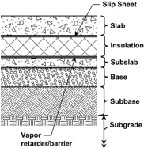

# CHAPTER 13-DESIGN OF SLABS FOR REFRIGERATED FACILITIES

- Source: ACI 360R-10.pdf
- Generated: 2026-03-04T22:38:09+00:00
- Chunk: 29/31
- Estimated tokens: ~1,915
- Total pages: 76
- Type: chapter

## CHAPTER 13-DESIGN OF SLABS FOR REFRIGERATED FACILITIES

## 13.1-Introduction

Chapter 13 provides design guidance for concrete slabs in refrigerated  buildings.  The  typical  floor  in  a  refrigerated building is a slab on a slip sheet on insulation on a vapor retarder/barrier on either a soil base or a subslab (Fig. 13.1).

The  floor  slab  is  considered  a  slab-on-ground.  The  slip sheet,  typically  a  polyethylene  film  (6  mil  [0.15  mm] minimum thickness), is a bond break between the slab and the insulation. The insulation may be in single or multiple layers, depending on the thermal requirements. For a room at a temperature above 32°F (0°C), insulation is typically not required. Insulation is typically extruded polystyrene board, rigid polyurethane board, or cellular glass board insulation. The  vapor  retarder/barrier  is  under  the  insulation  and  is usually  a  polyethylene  film  (10  mil  [0.25  mm]  minimum thickness), 45 mil (1.14 mm) EPDM membrane (EPDM is an acronym for Ethylene-Propylene-Diene-Monomer, which is a type of synthetic rubber), or bituminous materials in the form  of  liquid-applied  coatings  or  composite  sheets.  For refrigerated buildings, install vapor retarders/barriers on the warm side of the insulation. Under the vapor retarder/barrier, there  is  a  soil  base  or  a  subslab.  Many  times,  a  subslab  is installed for ease of insulated floor-system construction, or to --''',,'',',',,''',,'''',',,,'''-'',,',,,,-'',,',,,,---

Fig. 13.1-Typical slab-on-ground construction for refrigerated building.

encase  a  grid  of  heating  pipes  or  conduits.  Refrigerated buildings with operating temperatures below freezing require an under-floor heating system to prevent the ground from freezing and heaving. The insulated floor system can be installed over a structural slab supported by deep foundations such as piles.

## 13.2-Design and specification considerations

Design a floor slab installed over insulation as a slab-onground. The slab type and method of design can be any type described in other chapters. Slab thickness and reinforcement design should follow the methods and guidelines as described in this guide. The following paragraphs describe the  differences  and  special  considerations  for  slabs  in refrigerated buildings.

13.2.1 Insulation modulusFor slab-on-ground design, the strength of the soil support system directly below the slab is considered. In the case of a floor in a refrigerated building, consider  the  strength  of  the  insulation  in  a  similar  manner. Some design methods use the modulus of subgrade reaction to account for soil properties. Insulation has a similar modulus.

The insulation's modulus of subgrade reaction should be determined using the plate-bearing test described in Chapter 4 (ASTM D1196). The value of k is normally defined as the pressure to cause a 30 in. (760 mm) diameter plate to deflect 0.05 in. (1.3 mm). The COE, however, determines k for the deformation obtained under a 10 psi (0.07 MPa) pressure. Do not use data provided by the manufacturer using ASTM D1621 with the design methods in Chapter 13.

13.2.2 Compressive  creepCompressive  loading  on insulation causes deformation in the insulation. Insulation deformation  increases  when  the  load  continues  to  be applied.  In  addition  to  the  instantaneous  deformation described by the insulation modulus, there is a gradual, permanent deformation of the insulation known  as compressive creep.

Long-term creep should be limited to 2% of the thickness over  a  20-year  period  by  limiting  live  loads  to  1/5  the

compressive strength and dead loads to 1/3 the compressive strength of the insulation. Manufacturer guidelines may vary.

13.2.3 ReinforcementSlabs in refrigerated facilities do not require special considerations for reinforcement because of  room  temperature.  The  design  of  reinforcement  should follow  methods  described  elsewhere  in  this  guide.  When reinforcement  is  to  be  used,  such  as  deformed  bars,  posttensioning cables or welded wire, reinforcing supports with runners or plates should be used so as to not penetrate the insulation or vapor retarder/barrier.

- 13.2.4 JointsLocations  of  slab  joints  in  refrigerated buildings follow the same guidelines as slabs in nonrefrigerated buildings. Load-transfer devices, such as dowel bars, should be  used  in  joints.  Keyed  joints  and  sawcut  joints  using aggregate  interlock  for  load  transfer  are  inadequate  in  a refrigerated building. The temperature shrinkage in the slabs causes  the  joints  to  open  wider  and  makes  those  joints ineffective  in  load  transfer.  Joints  should  be  filled  after refrigerated rooms reach operating temperature. This allows the slab to contract and stabilize due to temperature reduction. The colder the room or the greater the temperature reduction, the more the slab will contract. The slab takes longer to stabilize at the operating temperature than the room air; consequently, it is best to wait as long as possible to fill the joints. Armoring the construction joints, for example, with embedding steel bars in the joint edges is a viable option to reduce joint maintenance. This is particularly applicable in rooms operating at freezing temperatures, where maintenance occurs less often because of cold temperatures and the limited availability of products that work at these temperatures. Refer to Chapter 6 for more information on floor joints.

13.2.5 CuringProper curing is very important for slabs in  refrigerated  areas.  Because  a  vapor  retarder/barrier  is directly beneath the slab, and therefore all water leaving the slab passes through the upper surface, there can be a higher incidence of curling.

13.2.6 Underslab toleranceElevation tolerance for the soil base or for the subslab, when used, is important because the  rigid  board  floor  insulation  mirrors  the  surface  upon which it bears. The surface of the insulation typically cannot be adjusted. When using a subslab, the surface should have a smooth flat finish or a light steel-trowel finish. Avoid irregularities in the soil base or subslab because the insulation may bear on high points and extend higher than the adjacent insulation board. A high point may create a rocking situation, which means that the insulation is not fully supported. The elevation of the base or subslab should conform to a tolerance of +0/-1/2 in. (+0/-13 mm). This is more stringent than ACI 117, and should be specified in the project documents.

13.2.7 FormingTypically,  slab-on-ground  forms  are staked into the soil below. For a refrigerated building, this is not acceptable because of the floor insulation and the vapor retarder/barrier.  Construct  forms  for  this  floor  type  with  a form  mounted  vertically  on  a  horizontal  base,  such  as plywood. Place this L-shaped form on the insulation and use sandbags to hold it in place.

## 13.3-Temperature drawdown

Gradual  temperature  reduction  for  a  refrigerated  room controls cracking caused by differential thermal contraction and allows drying to remove excess moisture from the slab after curing. A typical drawdown schedule:

|                          | Temperature   | Time               |
|--------------------------|---------------|--------------------|
| 1. Ambient to 35°F (2°C) | 10°F (6°C)    | Per day (24 hours) |
| 2. Hold at 35°C (2°C)    | -             | 2 to 5 days        |
| 3. 35°C (2°C) to final   | 10°F (6°C)    | Per day            |
