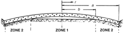
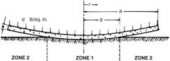
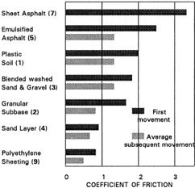
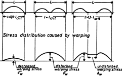
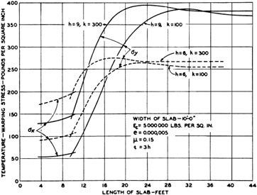
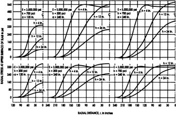
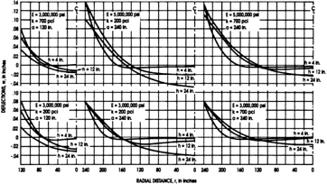

# CHAPTER 14-REDUCING EFFECTS OF SLAB SHRINKAGE AND CURLING 14.1-Introduction

- Source: ACI 360R-10.pdf
- Generated: 2026-03-04T22:38:09+00:00
- Chunk: 30/31
- Estimated tokens: ~10,272
- Total pages: 76
- Type: chapter

## CHAPTER 14-REDUCING EFFECTS OF SLAB SHRINKAGE AND CURLING 14.1-Introduction

Chapter 14 provides design methods to reduce the effect of drying shrinkage and curling or warping in slabs-on-ground. The material is largely based on Ytterberg's three articles (Ytterberg 1987). For further analysis and discussion, refer to Walker and Holland (1999). For information on concrete shrinkage, refer to ACI 209R and Ytterberg (1987).

To  be  workable  enough  for  placement,  virtually  all concrete  is  produced  with  approximately  twice  as  much water  as  needed  to  hydrate  the  cement.  Because  water primarily  leaves  the  concrete  from  the  upper  surface  of slabs-on-ground, a moisture gradient is created between the top  and  bottom  of  the  slab.  Moist  subgrades  and  low humidity at the top surface magnify such moisture gradients. Shrinkage  occurs  in  all  three  dimensions,  but  moisture evaporation from the top surface causes the upper half of the slab to shrink more than the lower half. Curling is caused primarily by the difference in drying shrinkage between the top and bottom surfaces of the slab. The effects of shrinkage and curling due to loss of moisture from the slab surface are often overlooked by designers, although curling stresses can be  quite  high.  Analysis  by  Walker  and  Holland  (1999) indicates curling stresses can easily range from 200 to 450 psi (1.4 to 3.1 MPa). Slab design should consider the two most important items that affect curling: moisture content of the subgrade, and shrinkage potential of concrete. Often, compressive strength and slump testing of the slab concrete are used to evaluate the shrinkage potential and neither of the two tests are good indicators of future drying shrinkage and curling.  Higher  compressive  strength,  however,  generally correlates with greater shrinkage and curl.

Significant curling of slabs-on-ground has become more prevalent in the past 30 years. This is partly due to the emergence of more finely ground cements, smaller maximum-size  coarse  aggregates,  and  gap-graded  aggregates, all of which increase the water demand in concrete. The problem might also be compounded by increases in the specified compressive strength, resulting in a higher modulus  of  elasticity.  Such  strength  increases  are  usually achieved by increasing the total volume of water and cement per  cubic  yard,  even  though  the w / cm should  be  reduced. This results in a higher modulus of elasticity, increased brittleness, and decreased curl relaxation due to creep. For slabs-on-ground, the commonly specified 28-day compressive strength  of  3000  psi  (21  MPa)  in  years  past  has  been increased to as much as 5000 psi (34 MPa) to permit reduc-

tion of calculated slab thickness. Under certain conditions, however, higher compressive strength can actually decrease load-carrying strength due to increased curling stress (Walker and Holland 1999). Higher strengths can improve durability, but designers should consider alternatives to high 28-day compressive strength when attempting to reduce slab thickness.

Shrinkage and curling problems have become  more common because slabs are being constructed on less desirable, higher-moisture-content subgrades as the availability of costeffective industrial land has decreased. Slab thickness has not increased, nor have well-designed vapor retarder/barrier and aggregate blotter systems been specified to offset this increase in subgrade moisture. Furthermore, the modulus of subgrade reaction of subgrades and subbases is seldom determined by the  plate  test,  as  suggested  in  Chapter  4.  Excess  subgrade moisture  adds  to  the  moisture  gradient  already  present  in slabs-on-ground and increases slab curling.

Appropriate design and specification provisions  can reduce  shrinkage  cracking  and  curling.  Such  provisions should include:

- Relative shrinkage of various concrete mixtures;
- Type and location of reinforcement;
- Subgrade friction;
- Concrete planarity;
- Permeability;
- Slab thickness;
- Shrinkage restraints;
- Location of sawcut contraction joints; and
- Properly designed vapor retarder/barrier and aggregate blotter systems.

## 14.2-Drying and thermal shrinkage

Typical portland-cement concrete, along with shrinkagecompensating concrete, shrinks approximately 0.04 to 0.08% due to drying (PCA 2002). For slabs-on-ground, the shrinkage  restraint  from  the  subgrade  varies  with  the coefficient  of  friction  and  planarity  of  the  surface  of  the subbase. Thermal movement is caused by a change in slab temperature from the time of initial placement. Consider this for  any  floor  when  casting  concrete  at  a  significantly different temperature than the normal operating temperature. Thermal contraction can be calculated by using the concrete's coefficient of thermal expansion of 5.5 × 10 -6 per °F (9.9 × 10 -6 per °C). For example, lowering the temperature of a floor slab from 70 to 0°F (21 to -18°C) can shorten a 100  ft  (30  m)  slab  by  0.46  in.  (12  mm),  assuming  no subgrade restraint.

## 14.3-Curling and warping

'Curling' and 'warping' are used interchangeably in this guide,  in  conformance  with  'ACI  Concrete  Terminology' (American Concrete Institute 2009).

Curling  occurs  at  slab  edges  because  of  differential shrinkage.  The  upper  part  of  the  slab-on-ground  almost always has the greater shrinkage because the top surface is commonly free to dry faster, and the upper portion has higher unit  water  content  at  the  time  of  final  set.  Higher  relative

Table 14.1-Cumulative effect on adverse factors on concrete shrinkage (Tremper and Spellman 1963)

| Effect of departing from use of best materials and workmanship                                                                                                  | Equivalent increase in shrinkage,%   | Cumulative effect                                                        |
|-----------------------------------------------------------------------------------------------------------------------------------------------------------------|--------------------------------------|--------------------------------------------------------------------------|
| Temperatures of concrete at discharge allowed to reach 80°F (27°C), whereas with reasonable precautions, temperatures of 60°F (16°C) could have been maintained | 8                                    | 1.00×1.08 = 1.08                                                         |
| Used 6 to 7 in. (150 to 180 mm) slump where 3 to 4 in. (76 to 100 mm) could have been used                                                                      | 10                                   | 1.08×1.10 = 1.19                                                         |
| Excessive haul in transit mixture, too long a waiting period at job site, or too many revolutions at mixing speed                                               | 10                                   | 1.19×1.10 = 1.31                                                         |
| Use of 3/4 in. (19 mm) maximum-size aggregate under conditions where 1-1/2 in. (38 mm) could have been used                                                     | 25                                   | 1.31×1.25 = 1.64 --''',,'',',',,''',,'''',',,,'''-'',,',,,,-'',,',,,,--- |
| Use of cement having relatively high shrinkage characteristics                                                                                                  | 25                                   | 1.64×1.25 = 2.05                                                         |
| Excessive 'dirt' in aggregate due to insufficient washing or contamination during handling                                                                      | 25                                   | 2.05×1.25 = 2.56                                                         |
| Use of aggregates of poor inherent quality with respect to shrinkage                                                                                            | 50                                   | 2.56×1.50 = 3.84                                                         |
| Use of an admixture that produces high shrinkage                                                                                                                | 30                                   | 3.84×1.30 = 5.00                                                         |
| Total increase                                                                                                                                                  | Summation 183%                       | Cumulative 400%                                                          |

humidity in the ambient air at the upper surface reduces the severity  of  curling  even  though  the  concrete  may  contain high shrinkage materials. Curvature occurs over the entire slab panel, but according to Walker and Holland (1999), the edges can actually lift off the subgrade for a distance of 2 to 7 ft (0.6 to 2.1 m) from all slab edges, from cracks wider than hairline,  and  from  joints  with  or  without  positive  loadtransfer devices. Refer to Fig. 14.1 and 14.2 for the curling effect in exaggerated fashion.

Curling of concrete slabs at joints and cracks is directly related  to  drying  shrinkage.  Reducing  drying  shrinkage reduces  curling.  There  can  also  be  curling  due  to  the temperature differential between the top and bottom slab's surfaces.  For  interior  slabs,  temperature  differential  is  a small amount.

## 14.4-Factors that affect shrinkage and curling

Drying shrinkage and curling can be reduced by reducing the  total  water  content  (not  necessarily  the w / c )  in  the concrete. Tremper and Spellman (1963) found that drying shrinkage is the product, not merely the summation, of eight individual  factors  that  control  the  water  requirements  of concrete. Table 14.1 shows the cumulative effect of these eight factors, resulting in about a fourfold increase in drying shrinkage rather than a twofold increase when arithmetically added. The influence of four of these factors on the water demand of concrete is discussed.

14.4.1 Effect of maximum-size coarse aggregateTable 14.1 shows that using 3/4 in. (19 mm) maximum-size aggregate under  conditions  where  1-1/2  in.  (38  mm)  maximum-size aggregate  could  have  been  used  will  increase  concrete shrinkage approximately 25% because of the greater water demand of the 3/4 in. (19 mm) maximum-size aggregate. In addition to the water demand effect, aggregate generally acts

to  control  (reduce)  shrinkage  by  restraining  cement  paste shrinkage. To minimize shrinkage of the cement paste, the concrete should contain the maximum practical amount of incompressible, clean, well-graded aggregate.

In actual practice, the dry-rodded volume of coarse aggregate is approximately 50 to 66% of the concrete volume when 1/2 in. (13 mm) maximum-size aggregate is used, but can be as high as 75% when 1-1/2 in. (38 mm) maximum-size aggregate is used (ACI 211.1). Using large-size coarse aggregates may be more expensive  than  smaller-size  aggregates,  but  it  can  save  on cement content. Designers should specify the nominal top-size coarse aggregate if a larger size is desired.

14.4.2 Influence of cementTable 14.1 shows the possibility of  a  25%  increase  in  concrete  shrinkage  if  a  cement  with relatively  high  shrinkage  characteristics  is  used.  Twentyeight-day  design  strengths  are  usually  most  economically achieved  using  Type  I  or  Type  III  cement  because  these cements  usually  give  higher  early  strength  than  Type  II cement, with all else being equal. Type I and III cements can cause  higher  concrete  shrinkage  than  Type  II  cement because of their physical and chemical differences. Specifying  minimum  concrete  compressive  strength  without regard to cement type or relative cement mortar shrinkage can  contribute  to  slab  shrinkage  and  curling.  Designers should therefore specify the type of cement used for slabson-ground. Because the quality of cement may vary from each brand and within a brand, comparative cement mortar shrinkage  tests  (ASTM  C157/C157M)  conducted  before starting the project are desirable.

14.4.3 Influence  of  slumpA 6 to 7 in. (150 to 180 mm) slump concrete will have only 10% more shrinkage than a 3 to 4 in. (76 to 100 mm) slump concrete (Table 14.1). This increase in  shrinkage  potential  would  be  anticipated  when  the  slump increase was due to additional water or admixtures that increase the shrinkage. When shrinkage is to be kept to a minimum, then  slump  control  is  only  a  small  factor  in  the  equation. Slump  by  itself  is  not  an  adequate  indicator  of  expected shrinkage. The specification and control of many factors are necessary for satisfactory slab shrinkage in the hardened state.

14.4.4 Influence  of  water-reducing  admixturesWater reductions  of  approximately  7%  may  be  achieved  with ASTM C494/C494M  Type  A  water-reducing  admixtures, but their effect on shrinkage and curling is minimal. Chloridebased admixtures of this type definitely increase shrinkage of the concrete (Tremper and Spellman 1963).

Some water-reducing admixtures increase concrete shrinkage, even at reduced mixing water contents, as shown by numerous investigators (Ytterberg 1987). A reduction in mixing  water  content,  permitted  by  the  use  of  waterreducing  admixtures,  will  not  always  decrease  shrinkage proportionally. Introducing a water-reducing or high-range water-reducing  admixture  (Types  A  and  F,  ASTM  C494/ C494M) or decreasing slump from 5 to 3 in. (130 to 76 mm) does not significantly change shrinkage in many cases. Note that  ASTM  C494/C494M  allows  concrete  manufactured with admixtures to have up to 35% greater shrinkage than the same concrete without the admixture.

Fig.  14.1-Highway  slab  edges  curl  downward  at  edges during the day when the sun warms the top of the slab.

Fig. 14.2-Slabs indoors curl upward because of the moisture differential between the top and bottom of slabs.

14.4.5 Shrinkage-reducing admixturesSince their introduction in Japan in 1983 (Sato et al. 1983; Tomita et al. 1986) and in the U.S. in the mid 1990s, the use of shrinkagereducing admixtures (SRAs) has grown. Hundreds of structures incorporate  the  technology.  According  to  the  Capillary Tension Theory (Tomita 1992), the main causes of drying shrinkage is the surface tension developed in the small pores of the cement paste of concrete. When these pores lose moisture through  evaporation,  a  meniscus  forms  at  the  air/water interface.  Surface  tension  in  the  meniscus  pulls  the  pore walls inward; the concrete responds to these internal forces by  shrinkage.  This  shrinkage  mechanism  occurs  only  in pores within a fixed range of sizes. The amount of cementpaste shrinkage caused by surface tension depends primarily on the w / c . Cement type and fineness, and other ingredients such as admixtures and supplementary cementitious materials that affect pore size distribution in the hardened paste, also affect cement-paste shrinkage.  The  SRA  reduces shrinkage  by  reducing  the  surface  tension  of  water  in  the pores between 2.5 and 50 nanometers in diameter. The SRA disperses in the concrete during mixing, after the concrete hardens the admixture remains in the pore system, where it continues to reduce the surface tension effects that contribute to  drying  shrinkage  (Ai  and  Young  1997).  Shrinkagereducing admixtures have also been shown to reduce curling and the time required to reach specified moisture vapor emission rates  (MVER) (Berke and Li 2004). Projects have been completed with extended joint spacing exceeding 60 ft (18 m) with minimal or no cracking (Bae 2004).

## 14.5-Compressive strength and shrinkage

In the competitive concrete supply market, increases of 1-day, 3-day, and 28-day compressive strengths are often obtained at the expense of increased shrinkage. More cement and more water per cubic yard (cubic meter) (not necessarily a  higher w / c ),  a  higher  shrinkage  cement,  or  a  water-

--''',,'',',',,''',,'''',',,,'''-'',,',,,,-'',,',,,,---

reducing admixture that increases shrinkage, are the typical means used for increasing compressive strength.

The main reason for controlling compressive strength and, therefore, modulus of rupture, is to ensure that the unreinforced slab thickness is of sufficient strength to transmit loads to the subgrade. Consider a 60-day, 90-day, or longer strength test, rather than a 28-day strength test, for designing slab thickness. This  assumes  that  the  design  loads  would  not  be  applied during the first 60 or 90 days.

Instead of using a higher design strength to minimize slab thickness,  consider  adding  conventional  reinforcement  or post-tensioning.  For  another  approach  to  minimize  slab thickness, quadrupling the slab contact area of equivalently stiff base plates beneath post loads (8 x 8 in. [200 x 200 mm] plates instead of 4 x 4 in. [100 x 100 mm] plates) could decrease the required slab thickness by more than 1 in. (25 mm).

## 14.6-Compressive strength and abrasion resistance

Abrasion  resistance  is  a function  of the w / cm (and compressive strength) at the top surface of the concrete. The cylinders or cubes tested to measure compressive strength are not a measure of surface abrasion resistance.

The slab's upper part has a higher water content than the lower portion because of the gravity effect on concrete material before  set  takes  place.  Compressive  strengths  are  always higher in the lower half of floors, and shrinkage is always higher in the upper half (Pawlowski et al. 1975).

The finishing process, primarily the type and quality of the troweling operation, significantly affects the abrasion resistance at the top surface. When concrete cannot resist the expected abrasive action, special metallic or mineral aggregate shakeon hardeners may be used to improve surface abrasion of floors placed in a single lift. A separate floor topping with low w / cm can also improve abrasion resistance.

## 14.7-Removing restraints to shrinkage

It is important to isolate the slab from anything that could restrain contraction or expansion. Frequently, designers use the floor slab as an anchor by detailing reinforcing bars from foundation walls, exterior walls, and pit walls to the floor slab. When there is no other way to anchor these walls except by tying them into the floor, then unreinforced slabs should be jointed no more than 10 to 15 ft (3.0 to 4.5 m) from the wall so that the remainder of the floor is free to shrink and move. Also, the first joint from the anchored wall tends to open  much  wider  because  all  of  the  shrinkage  from  the restrained panel occurs at this joint.

In most industrial slabs-on-ground, it is desirable to reduce joints  to  a  minimum  because  joints  are  a  maintenance problem when exposed to high-frequency lift truck traffic. Therefore, it may be better to anchor walls to a separate slab under the finished floor slab with at least 6 in. (150 mm) of base material between the two slabs to minimize joints in the finished  floor  slab.  This  is  not  often  done,  but  is  recommended where reduction of cracks and joints is important.

Besides isolating the slab-on-ground from walls, columns, and column footings, the slab should be isolated from guard posts (bollards) that penetrate the floor and are anchored into the ground below. The slab should be isolated from any other slab  shrinkage  restraints,  such  as  drains.  A  compressible material  should  be  specified  full  slab  depth  around  all restraints to allow the slab to shrink and move relative to the fixed items. Electrical conduit and storm drain lines should be  buried  in  the  subgrade  so  they  do  not  reduce  the  slab thickness or restrain drying shrinkage.

Restraint  parallel  to  joints  due  to  conventional  round dowels can be eliminated by using square, tapered-plate, or rectangular-plate  dowel  systems  with  formed  voids  or compressible isolation material on the bar or plate sides. This allows transverse and longitudinal movement while transferring vertical load. Refer to Chapter 6 for more information.

## 14.8-Base and vapor retarders/barriers

A  permeable  base,  with  a  smooth,  low-friction  surface reduces  shrinkage  cracking  because  it  allows  the  slab  to shrink  with  minimal  restraint.  A  relatively  dry  base  also allows some water from the bottom of the slab to leave by acting as a blotter before the concrete sets. A vapor retarder/ barrier  should  be  used  where  required  to  control  moisture transmission  through  the  floor  system.  A  vapor  retarder/ barrier  in  direct  contact  with  the  slab  may  increase  slab curling.  A  vapor  retarder/barrier,  aggregate  blotter  system design, or both, should be evaluated as set forth in Chapter 4. An option discussed in Chapter 4 is to cover the retarder/ barrier  with  at  least  4  in.  (100  mm)  of  reasonably  dry, trimmable,  compactible  granular  material  to  provide  a permeable, absorptive base directly under the slab. Using 4 in. (150 mm) or more of this material over the retarder/barrier will improve constructibility and minimize damage.

A slab cast on an impervious base can experience serious shrinkage cracking and curling (Nicholson 1981). When the base is kept moist by groundwater or when the slab is placed on a wet base, this increases the moisture gradient in the slab and  increases  curl.  When  the  aggregate  material  over  the vapor  retarder/barrier  is  not  sufficiently  dry  at  concrete placement,  it  will  not  act  as  a  blotter  and  can  exacerbate curling  and  moisture  problems.  In  spite  of  the  inherent problems  with  placing  concrete  directly  on  the  vapor retarder/barrier, it is better to do so when there is a chance that the aggregate blotter will not be relatively dry. Chapter 4 provides more information. When using crushed stone as a base material, the upper surface of the crushed stone should be  choked  off  with  fine  aggregate  material  to  provide  a smooth surface that allows the slab-on-ground to shrink with minimum restraint. --''',,'',',',,''',,'''',',,,'''-'',,',,,,-'',,',,,,---

When polyethylene is required only to serve as a slip sheet to reduce friction between slab and base, and the base is to remain dry, then the polyethylene can be installed without a stone cover. Holes should be drilled in the sheet, while the sheet is still folded or on a roll, at approximately 12 in. (300 mm) centers to allow water to leave the slab bottom before the concrete sets.

Figure 14.3 shows the variation in values for base friction. In post-tensioned slabs over two sheets of polyethylene, the friction factor may be taken as 0.3 (Timms 1964). For post-

tensioned  slabs  over  100  ft  (30  m),  0.5  might  be  used  to account for variations in base elevation over longer distances.

## 14.9-Distributed reinforcement to reduce curling and number of joints

The upper half of a floor slab has the greater shrinkage. Reinforcement should be in the upper half of the slab so that the steel restrains concrete shrinkage. A reinforcement ratio of 1.0% (Abdul-Wahab and Jaffar 1983) could be justified in the direction perpendicular to the slab edge to minimize slab curling deflection. One and one-half to 2 in. (38 to 51 mm) of concrete cover is preferred. Reinforcement in the lower part of the slab may actually increase upward slab curling for slabs under roof and not subject to surface heating by the sun. To avoid being pushed down by the feet of construction workers,  reinforcing  wire  or  bars  should  preferably  be spaced a minimum of 14 in. (360 mm) in each direction. The bar reinforcement should be located and supported based on the  most  stringent  recommendations  of  CRSI  10MSP  and CRSI 10PLACE. The wire reinforcement should be supported based on the most stringent recommendations of WRI-TF-702 (WRI 2008a) and WRI-WWR-500 (WRI 2008b). Neuber (2006) provides additional information for supporting light welded wire reinforcement.

For unreinforced slabs, the joint spacing recommendations of  Fig.  6.6  have  generally  produced  acceptable  results.  A closer joint spacing is more likely to accommodate the higher shrinkage  concrete  mixtures  often  encountered  (Fig.  6.6). When greater joint spacings are desirable to reduce maintenance, consider a continuously reinforced, a post-tensioned, or  a  shrinkage-compensating  concrete  slab  as  a  means  to reduce the number of joints in slabs-on-ground. Joint locations should be detailed on the slab construction drawings.

## 14.10-Thickened edges to reduce curling

Curling is greatest at corners of slabs and corner curling reduces  as  slab  thickness  increases  (Child  and  Kapernick 1958). Corner curling vertical deflections of 0.05 and 0.11 in. (1.3 and 2.8 mm) were measured for 8 and 6 in. (200 and 150 mm) thick slabs, respectively, after 15 days of surface drying.

Thickening free edges reduces the slab stress due to edge loads. Edge curling may also be reduced by thickening slab edges.  The  thickened  edge  adds  weight  and  reduces  the surface  area  exposed  to  drying  relative  to  the  volume  of concrete, both of which reduce upward curling. Typically, thickened free slab edges should only be used in situations such as between the slab and equipment foundations or other free  edges  at  isolation  joints  where  positive  load-transfer devices, such as dowels, should not be used. The free slab edges at these locations should be thickened 50% with a gradual 1-in10 slope. Provided that the subgrade is smooth with a low coefficient of friction, as described in Section 14.8, then thickened edges should not be a significant linear shrinkage restraint; however, curling stresses are increased somewhat. --''',,'',',',,''',,'''',',,,'''-'',,',,,,-'',,',,,,---

## 14.11-Relation between curing and curling

Because curling and drying shrinkage are both a function of  potentially  free  water  in  the  concrete  at  the  time  of

Fig. 14.3-Variation in values of coefficient of friction for 5 in. (125  mm)  slabs  on  different  bases  (based  on Design  and Construction of Post-Tensioned Slabs-on-Ground [PTI 2004]).

concrete set, curing methods that retain water in the concrete delay shrinkage and curling of enclosed slabs-on-ground.

Curing  did  not  decrease  curling  in  a  study  of  concrete pavements  where  test  slabs  cured  for  7  days  under  wet burlap,  then  ponded  until  load  tests  for  the  flat,  uncurled, slabs  were  completed  (Child  and  Kapernick  1958).  After completing load tests on the flat slabs, usually within 5 to 6 weeks,  the  water  was  removed  and  the  slabs  were permitted to dry from the top. The load tests were repeated on the curled slabs. Adding water to the surface reduced the curl, especially hot water, but after removing the water, the slabs curled again to the same vertical deflection as before the application of the water.

Water curing can saturate the base and subgrade, creating a reservoir of water that may eventually transmit through the slab (Chapter 4).

Because all curing methods are used for a limited time, curing methods will not be as effective as when the surface is exposed to long-term, high ambient relative humidity for improving surface durability. Extended curing only delays curling; it does not reduce curling.

## 14.12-Warping stresses in relation to joint spacing

Warping stress increases as the slab length increases only up to a certain slab length (Kelley 1939; Leonards and Harr 1959; Walker and Holland 1999). The slab lengths at which these warping stresses reach a maximum are referred to as critical slab lengths, and are measured diagonally, corner to corner. Critical lengths, in feet (meters), are shown below for slabs  4  to  10  in.  (100  to  250  mm)  thick  and  temperature gradients T of  20,  30,  and  40°F  (11,  17,  and  22°C).  A modulus of subgrade reaction k of 100 lb/in. 3  (27 kPa/mm)

Fig.  14.4-Effect  of  slab  length  on  warping  and  warping stress in an exposed highway slab (Eisenmann 1971).

and a modulus of elasticity E of 3 × 10 6 psi (21,000 MPa) were used in determining these values:

| Slab thickness   | T = 20°F (11°C)   | T = 30°F (17°C)   | T = 40°F (22°C)   |
|------------------|-------------------|-------------------|-------------------|
| 4 in. (100 mm)   | 21 ft (6.4 m)     | -                 | -                 |
| 6 in. (150 mm)   | 26 ft (7.9 m)     | 27 ft (8.2 m)     | -                 |
| 8 in. (200 mm)   | -                 | 34 ft (10.4 m)    | 35 ft (10.7 m)    |
| 10 in. (250 mm)  | -                 | 38 ft (11.6 m)    | 40 ft (12.2 m)    |

Computer  studies  indicate  that  these  lengths  increase mostly  with  slab  thickness  and  temperature  gradient,  and increase only slightly with changes in modulus of elasticity and  modulus  of  subgrade  reaction.  Figure  14.4  shows deformation  and  warping  stress  curves  for  three  highway slabs with lengths less than, equal to, and greater than the critical slab length. Warping stress does not increase as slab length increases beyond the critical length because vertical deformation does not increase.

There will be a marked loss of effectiveness of aggregate interlock at sawcut contraction joints when the joints are too far apart (Spears and Panarese 1983). Positive load transfer using dowels or plates should be provided where joints are expected to open more than 0.025 to 0.035 in. (0.6 to 0.9 mm) for slabs subjected to wheel traffic. Refer to Section 6.2 for additional information. Slabs may be more economical when sawcut contraction joint spacing is increased beyond lengths noted previously by using distributed reinforcement designed for crack-width control, but not less than 0.50% of the  cross-sectional  area.  Floor  and  lift  truck  maintenance cost may be lower with the least number and length of joints, as long as curling is not sufficient to cause cracking or joint spalling. Increased joint spacings larger than the critical slab length will not increase warping stresses.

## 14.13-Warping stresses and deformation

Using  the  concept  of  a  subgrade  reaction  modulus, Westergaard (1927) provided equations for warping stress and  edge  deflections  caused  by  temperature  gradients  in slabs-on-ground.  Although  his  research  does  not  refer  to moisture gradients, it is equally applicable to either temperature or  moisture  gradients  across  the  thickness  of  a  slab-onground. The only shortcoming is the incorrect assumption that  slabs-on-ground  are  fully  supported  by  the  subgrade when they are warped from temperature gradients.

When slabs-on-ground warp from temperature or moisture gradients, they are not fully supported by the subgrade, and unsupported edges have higher stresses than when they are supported. Consider these factors as described in Walker and Holland (1999). Bradbury  (1938)  extended  Westergaard's  work  with  a working  stress  formula  called  the  Westergaard-Bradbury formula.  In  1939,  Kelley  (1939)  used  the  WestergaardBradbury formula to calculate the warping stresses shown in Fig. 14.5 for 6 and 9 in. (150 and 230 mm) slabs-on-ground. Note that Kelley calculated a maximum stress of approximately 390 psi (2.7 MPa) for a 9 in. (230 mm) slab with a length of 24 ft (7.3 m). --''',,'',',',,''',,'''',',,,'''-'',,',,,,-'',,',,,,---

In 1959, Leonards and Harr (1959) calculated the warping stresses  shown  in  Fig.  14.6,  presented  herein  for  general understanding. The upper center set of curves in Fig. 14.6 shows  a  maximum warping stress of approximately 560 psi (3.9 MPa) for almost the same assumptions made by Kelley when he computed a stress of 390 psi (2.7 MPa). The only significant  difference  is  that  Kelley  used  a  27°F  (15°C) change in temperature across the slab whereas Leonards and Harr used a 30°F (17°C) temperature difference across the slab  thickness.  Adjusting  for  this  gradient  difference  by multiplying by the ratio, 30/27, Kelley's stress would be 433 psi (3.0 MPa) instead of 390 psi (2.7 MPa). Leonards and Harr's 560 psi (3.9 MPa) stress, however, is still 29% greater than the stress Kelley calculated due to their better assumptions. Walker and Holland (1999) had similar results to Leonards and Harr (1959).

Leonards and Harr (1959) calculated warping stress with a computer  model  that  permitted  the  slab  to  lift  off  the subgrade when the uplift force was greater than the gravity force. Figure 14.7 shows their vertical deflection curves for the same six cases of slabs shown in Fig. 14.6. The upward slab edge lift and downward slab center deflection shown in Fig.  14.7  is  the  usual  case  for  slabs  inside  buildings. Temperature gradient is small for slabs inside a building, but the moisture gradient can be equivalent to about a 5°F per in. (2.8°C per 25 mm) of slab thickness temperature gradient for such slabs under roof. Leonards and Harr assumed a 30°F (17°C) gradient across all the slabs, shown in Fig. 14.6 and 14.7, no matter what the thickness. They also assumed a cold top and a hot slab bottom, which is not the usual temperature gradient, but it is a usual equivalent moisture gradient for slabs inside buildings with a very moist bottom and very dry top.

Ytterberg's  1987  paper  documents  the  conflict  between the  Westergaard  assumption  of  a  fully  supported  slab-onground and the reality of either unsupported slab edges or supported slab  centers.  Because  the  three  commonly  used slab thickness design methods (PCA, WRI, and COE) all are based on Westergaard's work and the assumption that slabs are always fully supported by the subgrade, they give erroneous results for slab thickness where the slab is not in contact with the subgrade. This is called the cantilever effect. The thickness

Fig. 14.5-Increases in slab length, beyond a certain amount, do not increase warping stress in the slab interior (Kelley 1939). (Note: 1 psi = 0.0069 MPa; 1 ft = 0.3048 ft.)

Fig. 14.6-Representative radial stresses for an effective temperature difference of 30°F between top and bottom (Leonards and Harr 1959). (Note: 1 psi = 0.0069 MPa; 1 in. = 25.4 mm; 1°F = 0.56°C.)

design of the outer 3 to 5 ft (0.9 to 1.5 m) of slab panels on ground might be based on a cantilever design when warping is anticipated.

Another anomaly is that the three slab thickness design methods  permit  thinner  slabs  as  the  modulus  of  subgrade reaction increases. A higher subgrade reaction modulus actually increases the length of unsupported curled slab edges because the center of the slab is less able to sink into the subgrade. Thus, curling stress increases as the subgrade stiffens, and resultant load-carrying strength decreases for edge loadings; however, higher k with  loadings  away  from  the  edges  allows  thinner slabs. Designers should consider these factors.

Highway slabs-on-ground should be designed for a 3°F (1.7°C) per in. (25 mm) daytime positive gradient (down-

Fig. 14.7-Representative curling deflection curves for 20 and 40 ft slabs with an effective temperature difference of 30°F between top and bottom (Leonards and Harr 1959). (Note: 1 psi = 0.0069 MPa; 1 in. = 25.4 mm; 1°F[ ∆ T] = 0.56°C; 1 lb/ft 3 = 0.2714 MN/m 3 .)

ward curl)  and  a  1°F  (0.6°C)  per  in.  (25  mm)  nighttime negative gradient (upward curl) (ACI Committee 325 1956). Enclosed slabs-on-ground should be designed for a negative gradient (upward curl) of 3 to 6°F per in. (1.7 to 3.4°C per 25 mm) (Leonards and Harr 1959).

The Westergaard-Bradbury formula (Yoder and Witczak 1975) concluded that warping stress in slabs is proportional to  the  concrete's  modulus  of  elasticity,  and  partially  proportional to the modulus of elasticity of aggregates. To reduce slab warping, low-modulus aggregates, such as limestone or sandstone,  are  preferable  to  higher-modulus  aggregates, such as granite and especially traprock; however, when no hardener or topping is used, many low-modulus aggregates will not be as durable for some applications.

## 14.14-Effect of eliminating sawcut contraction joints with post-tensioning or shrinkage-compensating concrete

Post-tensioned  and  shrinkage-compensated  slabs  do  not have  intermediate sawcut  contraction joints. The  total amount of drying shrinkage movement is forced to occur at the  placement  perimeter  when  concrete  is  placed  in  large areas  without  intermediate  sawcut  contraction  joints.  The construction joints surrounding 10,000 to 12,000 ft 2 (930 to 1100 m 2 ) of post-tensioned or shrinkage-compensated concrete slabs  will  commonly  open  much  more  than construction joints for the same areas of conventional jointed portland-cement concrete slabs. This is because the intermediate sawcut contraction joints within the latter slabs take up most of the shrinkage.

Where vehicle traffic crosses construction joints in posttensioned  or  shrinkage-compensated  slabs-on-ground,  the joints should be doweled or provide a sufficient amount of post-tensioning force across the joint to transfer the shear. The top edges of the construction joints should be protected with  back-to-back  steel  bars,  epoxy-armored  edges,  or  by other equally durable material.

## 14.15-Summary and conclusions

Designers of enclosed slabs-on-ground can reduce shrinkage cracking and shrinkage curling by considering the features that affect these phenomena and addressing them:

## 14.15.1 Subgrade conditions

- Before and during slab installation, check for smoothness, dryness,  and  permeability  of  the  base  and  subgrade. Measure  and  record  the  base  and  subgrade  moisture content immediately before concrete placement; and
- Do not use a vapor retarder/barrier unless required to control moisture transmission through the slab. When used, consider using an aggregate blotter over the vapor retarder/barrier.

## 14.15.2 Design details

- Where random cracking is acceptable, specify distributed reinforcement  in  the  upper  half  of  the  slab  or  use  the appropriate fiber concentrations to minimize or eliminate sawcut contraction joints. Shrinkage reinforcement is not needed in the bottom half of slabs-on-ground;
- When reinforcement is used, select practical spacings and diameters of wires and bars, considering at least 14 in. (350 mm) spacing and 3/8 in. (9 mm) diameter;
- Consider square, tapered-plate or rectangular-plate dowel  systems  that  eliminate  restraint  longitudinally and transversely while transferring vertical load;
- Eliminate as many slab restraints as possible, isolating those that remain;
- Specify  largest  practical  size  of  base  plate  for  rack posts. Include the base plate size in the slab thickness design  process,  with  a  base  plate  thickness  adequate enough to distribute post load over area of plate; and
- Consider  shrinkage-compensating  concrete  or  posttensioning as design options.

## 14.15.3 Control of concrete mixture

- Specify  workable  concrete  with  the  largest  practical maximum size of coarse aggregate and with aggregate gap-grading minimized;
- Consider specifying 60or 90-day concrete design strength  to  permit  using  concrete  with  lower  shrinkage than is obtained with the same compressive strength at 28 days. Use lowest compressive strength and corresponding minimum cement content feasible and mineral or metallic hardener or topping when surface durability is a concern;
- Before  slab  installation,  consider  shrinkage  testing  of various  cements  (mortars),  aggregate  gradations,  and concrete mixtures;
- Specify the cement type and brand;
- Consider a daily check of aggregate gradation to ensure uniform water demand and shrinkage of concrete; and
- Consider  plant  inspection  to  perform  the  aforementioned  testing  and  monitor  batching  for  uniformity, referring to ACI 311.5 for guidance.
