# CHAPTER 15-REFERENCES 15.1-Referenced standards and reports

- Source: ACI 360R-10.pdf
- Generated: 2026-03-04T22:38:09+00:00
- Chunk: 31/31
- Estimated tokens: ~25,824
- Total pages: 76
- Type: chapter

## CHAPTER 15-REFERENCES 15.1-Referenced standards and reports

The  standards  and  reports  listed  below  were  the  latest editions  at  the  time  this  document  was  prepared.  Because these documents are revised frequently, the reader is advised to contact the proper sponsoring group when it is desired to refer to the latest version.

## American Association of State Highway &amp; Transportation Officials

| GDPS-4-M                    | Guide for the Design of Pavement Structures                                            |
|-----------------------------|----------------------------------------------------------------------------------------|
| T 307                       | Determining the Resilient Modulus of Soils and Aggregate Materials                     |
| American Concrete Institute | American Concrete Institute                                                            |
| 117                         | Specifications for Tolerances for Concrete Construction and Materials and Commentary   |
| 201.1R                      | Guide for Conducting a Visual Inspection of Concrete in Service                        |
| 209R                        | Prediction of Creep, Shrinkage, and Temperature Effects in Concrete Structures         |
| 211.1                       | Standard Practice for Selecting Proportions for Normal, Heavyweight, and Mass Concrete |
| 223                         | Standard Practice for the Use of Shrinkage- Compensating Concrete                      |
| 224R                        | Control of Cracking in Concrete Structures                                             |
| 302.1R                      | Guide for Concrete Floor and Slab Construction                                         |
| 302.2R                      | Guide for Concrete Slabs that Receive Moisture- Sensitive Flooring Materials           |
| 311.5                       | Guide for Concrete Plant Inspection and Testing of Ready-Mixed Concrete                |
| 318                         | Building Code Requirements for Structural Concrete and Commentary                      |
| 330R                        | Guide for Design and Construction of Concrete Parking Lots                             |
| 336.2R                      | Suggested Analysis and Design Procedures for Combined Footings and Mats                |

--''',,'',',',,''',,'''',',,,'

| 350                                                                                                                             | Code Requirements for Environmental Engi-                                                                                          |
|---------------------------------------------------------------------------------------------------------------------------------|------------------------------------------------------------------------------------------------------------------------------------|
| 504R                                                                                                                            | neering Concrete Structures and Commentary Guide to Sealing Joints in Concrete Structures (withdrawn)                              |
| 544.1R                                                                                                                          | Report on Fiber Reinforced Concrete                                                                                                |
| 544.2R                                                                                                                          | Measurement of Properties of Fiber Reinforced Concrete                                                                             |
| 544.3R                                                                                                                          | Guide for Specifying, Proportioning, and Production of Fiber-Reinforced Concrete                                                   |
| 544.4R                                                                                                                          | Design Considerations for Steel Fiber Reinforced Concrete                                                                          |
| ASTM International                                                                                                              |                                                                                                                                    |
| A36/A36M Standard Specification for Carbon Struc-                                                                               |                                                                                                                                    |
| tural Steel A497/A497M Specification for Steel Welded                                                                           |                                                                                                                                    |
| Wire                                                                                                                            |                                                                                                                                    |
| Reinforcement, Deformed, for Concrete                                                                                           |                                                                                                                                    |
| Reinforcement A615/A615M Standard Specification for Deformed and Plain Carbon Steel Bars for Concrete                           |                                                                                                                                    |
| Reinforcement                                                                                                                   |                                                                                                                                    |
| Steel Deformed and Plain Bars for                                                                                               |                                                                                                                                    |
| A820/A820M A996/A996M                                                                                                           | Standard Specification for Steel Fibers for Fiber-Reinforced Concrete Standard Specification for Rail-Steel and                    |
| C150/C150M C157/C157M                                                                                                           | Standard Specification for Portland Cement Standard Test Method for Length Change of Hardened Hydraulic-Cement Mortar and Concrete |
| C494/C494M                                                                                                                      | Standard Specification for Chemical Admixtures for Concrete                                                                        |
| C595/C595M                                                                                                                      | Standard Specification for Blended Hydraulic Cements                                                                               |
| C845                                                                                                                            | Standard Specification for Expansive                                                                                               |
| C878/C878M                                                                                                                      | Hydraulic Cement Standard Test Method for Restrained Expansion of Shrinkage-Compensating Concrete                                  |
| C1399                                                                                                                           | Standard Test Method for Obtaining Average Residual-Strength of Fiber- Reinforced Concrete                                         |
| C1550                                                                                                                           | Standard Test Method for Flexural Toughness of Fiber Reinforced Concrete (Using Centrally Loaded Round Panel)                      |
| C1609/C1609M Standard Test Method for Flexural Perfor- mance of Fiber-Reinforced Concrete (Using Beam with Third-Point Loading) |                                                                                                                                    |
| Standard Test Method for Particle-Size                                                                                          |                                                                                                                                    |
| D698 Standard Test Methods for                                                                                                  |                                                                                                                                    |
|                                                                                                                                 | Compaction Characteristics of Soil Using                                                                                           |
|                                                                                                                                 | Laboratory                                                                                                                         |
|                                                                                                                                 | of Lubricating Grease                                                                                                              |
| D566                                                                                                                            | Standard Test Method for Dropping                                                                                                  |
|                                                                                                                                 | Analysis of Soils                                                                                                                  |
| D422                                                                                                                            |                                                                                                                                    |
|                                                                                                                                 | Point                                                                                                                              |

## ACI COMMITTEE REPORT

|       | Standard Effort (12,400 ft-lbf/ft 3 (600 3                                                                                                                                  |
|-------|-----------------------------------------------------------------------------------------------------------------------------------------------------------------------------|
| D854  | kN-m/m )) Standard Test Methods for Specific Gravity of Soil Solids by Water Pycnometer                                                                                     |
| D1196 | Standard Test Method for Nonrepetitive Static Plate Load Tests of Soils and Flexible Pavement Components, for Use in Evaluation and Design of Airport and Highway Pavements |
| D1241 | Standard Specification for Materials for Soil-Aggregate Subbase, Base, and Surface Courses                                                                                  |
| D1556 | Standard Test Method for Density and Unit Weight of Soil in Place by the Sand- Cone Method                                                                                  |
| D1557 | Standard Test Methods for Laboratory Compaction Characteristics of Soil Using Modified Effort (56,000 ft-lbf/ft 3 (2,700 kN-m/m 3 ))                                        |
| D1586 | Standard Test Method for Standard Pene- tration Test (SPT) and Split-Barrel Sampling of Soils                                                                               |
| D1621 | Standard Test Method for Compressive                                                                                                                                        |
| D1883 | Properties of Rigid Cellular Plastics Standard Test Method for CBR (Cali- fornia Bearing Ratio) of Laboratory-                                                              |
| D2167 | Compacted Soils Standard Test Method for Density and Unit Weight of Soil in Place by the Rubber Balloon Method                                                              |
| D2216 | Standard Test Methods for Laboratory Determination of Water (Moisture) Content of Soil and Rock by Mass                                                                     |
| D2240 | Standard Test Methodfor Rubber Property-                                                                                                                                    |
| D2487 | Durometer Hardness Standard Practice for Classification of Soils for Engineering Purposes (Unified                                                                          |
| D2488 | Soil Classification System) Standard Practice for Description and Identification of Soils (Visual-Manual Procedure)                                                         |
| D2922 | Standard Test Methods for Density of Soil and Soil-Aggregate in Place by Nuclear Methods (Shallow Depth)                                                                    |
| D2937 | Standard Test Method for Density of Soil in Place by the Drive-Cylinder Method                                                                                              |
| D3017 | Standard Test Method for Water Content of Soil and Rock in Place by Nuclear                                                                                                 |
| D3575 | Methods (Shallow Depth) Standard Test Methods for Flexible Cellular Materials Made from Olefin Polymers                                                                     |
| D4253 | Standard Test Methods for Maximum Index Density and Unit Weight of Soils Using a Vibratory Table                                                                            |
| D4254 | Standard Test Methods for Minimum Index Density and Unit Weight of Soils and Calculation of Relative Density                                                                |

D4263

D4318

D4829

E1155

F1869

F2170

STP-169D

Standard

Test

Method for

Indicating

Moisture in Concrete by the Plastic Sheet

Method

Standard Test Methods for Liquid Limit,

Plastic Limit, and Plasticity Index of Soils

Standard

Test

Method

Index of Soils

Standard Test Method for Determining for

Expansion

F F

Floor  Flatness  and

F L

Numbers

Standard

Moisture

Test

Method

Floor  Levelness for

Vapor

Measuring

Emission

Concrete

Subfloor

Calcium Chloride

Standard  Test  Method  for  Determining

Relative

Humidity in

Concrete

Floor

Slabs Using in situ Probes

Significance  of  Tests  and  Properties  of

Concrete and Concrete-Making Materials

Concrete Reinforcing Steel Institute (CRSI)

10MSP

Manual of Standard Practice

10PLACE

Placing Reinforcing Bars

Japan Society of Civil Engineers (JSCE)

JSCE-SF4

Standard for Flexural Strength and Flexural

Toughness

The above publications may  be obtained from the following organizations:

American Concrete Institute

38800 Country Club Drive

Farmington Hills, MI 48331

www.concrete.org

ASTM International

100 Barr Harbor Drive

West Conshohocken, PA 19428

www.astm.org

Concrete Reinforcing Steel Institute

933 North Plum Grove Road

Schaumburg, IL 60173

www.crsi.org

Japan Society of Civil Engineers

Yotsuya 1-chome, Shinjuku-ku

Tokyo, Japan 160-0004

www.jsce-int.org

## 15.2-Cited references

Abdul-Wahab, H. M. S., and Jaffar, A. S., 1983, 'Warping of  Reinforced  Concrete  Slabs  Due  to  Shrinkage,'  ACI JOURNAL, Proceedings V. 80, No. 2, Mar.-Apr., pp. 109-115.

ACI Committee 223, 1970, 'Expansive Cement Concrete-Present  State  of  Knowledge,'  ACI  JOURNAL, Proceedings V. 67, No. 8, Aug., pp. 582-610.

Using

Rate of

Anhydrous

ACI Committee 223, 1980, Cedric Willson Symposium on Expansive  Cement ,  SP-64,  American  Concrete  Institute, Farmington Hills, MI, 323 pp.

ACI Committee 325, 1956, 'Structural Design Considerations for Pavement Joints,' ACI JOURNAL, Proceedings V. 53, No. 7, July, pp. 1-28.

Ai, H., and Young, J. F., 1997, 'Mechanisms of Shrinkage Reduction  Using  a  Chemical  Admixture,' Proceedings  of the 10th International Congress on the Chemistry of Cement , H. Justnes, eds., Gothenburg, Sweden, V. 3.

American Association of State Highway &amp; Transportation Officials (AASHTO), 1993, 'Guide for the Design of Pavement Structures,' GDPS-4-M, Washington, DC, 720 pp.

American Concrete Institute, 2009, 'ACI Concrete Terminology,' American Concrete Institute, Farmington Hills, MI, http://terminology.concrete.org (accessed Feb. 10, 2010).

American Concrete Paving Association, 1992, Design and Construction of Joints for Concrete Streets , Skokie, IL.

Babaei,  K.,  and  Fouladgar,  A.  M.,  1997,  'Solutions  to Concrete  Bridge  Deck  Cracking,' Concrete  International , V. 19, No. 7, July, pp. 34-37.

Bae, J., 2004, 'Admixture Controls Slab Drying Shrinkage,' Concrete International ,  V. 26, No. 9, Sept., pp. 88-89.

Balaguru, P.; Narahari, R.; and Patel, M., 1992, 'Flexural Toughness of Steel Fiber-Reinforced Concrete,' ACI Materials Journal , V. 89, No. 6, Nov.-Dec., pp. 541-546.

Banthia, N., and Yan, C., 2000, 'Shrinkage Cracking in Polyolefin Fiber-Reinforced Concrete,' ACI Materials Journal , V. 97, No. 4, July-Aug., pp. 432-437.

Batson,  G.;  Ball,  C.;  Bailey,  L.;  and  Landers,  J.,  1972, 'Flexural Fatigue Strength of Steel Fiber Reinforced Concrete Beams,' ACI JOURNAL, Proceedings V. 69, No. 11, Nov., pp. 673-677.

Beckett, D., 1995, 'Thickness Design of Concrete Industrial Ground Floors,' Concrete , V. 29, No. 4, Aug., pp. 21-23.

Berke, S. N., and Li, L., 2004, 'Early Age Shrinkage and Moisture  Loss  of  Concrete,' Concrete  Science  and  Engineering: A Tribute to Arnon Bentur ,  International  RILEM Symposium, pp. 231-245.

Bradbury, R. D., 1938, 'Reinforced Concrete Pavements,' Wire Reinforcement Institute, Washington, DC, 190 pp.

Brewer,  H.  W.,  1965,  'Moisture  Migration-Concrete Slab-on-Ground Construction,' Journal of the PCA Research and Development Laboratories , V. 7, No. 2.

Burmister, D. M., 1943, 'Theory of Stresses and Displacements  in  Layered  Systems  and  Applications  to  Design  of Airport Runways,' Highway Research Board, Proceedings , V. 23.

Child,  L.  D.,  and  Kapernick,  J.  W.,  1958,  'Tests  of Concrete  Pavements  on  Gravel  Subbases,' Proceedings , ASCE, V. 84, No. HW3, Oct., 31 pp.

Clements, M. J. K., 1996, 'Measuring the Performance of Steel Fibre Reinforced Shotcrete,' IX Australian Tunneling Conference , Sydney, Australia, Aug.

Colley,  B.  E.,  and  Humphrey,  H.  A.,  1967,  'Aggregate Interlock  at  Joints  in  Concrete  Pavements,' Development

Department  Bulletin D124,  Portland  Cement  Association, Skokie, IL.

Concrete  Society,  2003,  'Concrete  Industrial  Ground Floors-A Guide to their Design and Construction,' Concrete Society Technical Report No. 34, third edition, 146 pp.

Dakhil, F. H., and Cady, P. D., 1975, 'Cracking of Fresh Concrete as Related to Reinforcement,'  ACI  JOURNAL, Proceedings V. 72, No. 8, Aug., pp. 421-428. Department of Defense, 1977, 'Engineering and Design: Rigid  Pavements  for  Roads,  Streets,  Walks  and  Open Storage  Areas,'  TM-5-822-6,  U.S.  Government  Printing Office, Washington DC. Department  of  the  Army,  1984,  'Rigid  Pavements  for Roads, Streets, Walks and Open Storage Areas,' EM 1110-3132, Apr. --''',,'',',',,''',,'''',',,,'''-'',,',,,,-'',,',,,,---

Departments  of  the  Army  and  the  Air  Force,  1987, 'Concrete Floor Slabs-on-Ground Subjected to  Heavy Loads,'  ARMY  TM  5-809-12,  Air  Force  AFM  88-3, Chapter 15, Aug.

Destree, X., 2000, 'Structural Application of Steel Fibre as  Principal  Reinforcing:  Conditions-Designs-Examples,' RILEM Proceedings: On Fibre-Reinforced Concretes (FRC) ,  Sept.  13-15,  Lyon,  France,  RILEM  Publications S.A.R.L., pp. 291-302.

Eisenmann,  J.,  1971,  'Analysis  of  Restrained  Curling Stresses  and  Temperature  Measurements  in  Concrete Pavements,' Temperature and Concrete ,  SP-25, American Concrete Institute, Farmington Hills, MI, pp. 235-250.

Fudala, D., 2008, 'Understanding and Specifying F-min,' Concrete International , V. 30, No. 7, July, pp. 52-56.

Goodyear  Tire  and  Rubber  Co.,  1983,  'Over-the-Road Tires,  Engineering  Data'  and  'Off-the-Road  Tires,  Engineering Data,' Engineering Reports , Akron, OH.

Hetenyi,  M.,  1946, Beams on Elastic Foundations ,  The University of Michigan Press, Ann Arbor, MI.

Heukelom,  W.,  and  Klomp,  A.  J.  G.,  1962,  'Dynamic Testing as a Means of Controlling Pavements During and After Construction,' Proceedings of the (1st) International Conference on the Structural Design of Asphalt Pavements , pp. 667-685.

Hoff, G., 1987, 'Durability of Fiber Reinforced Concrete in  a  Severe  Marine  Environment,' Concrete  Durability , Proceedings of the Katharine and Bryant Mather International  Symposium ,  SP-100,  J.  M.  Scanlon,  ed.,  American Concrete Institute, Farmington Hills, MI, pp. 997-1026.

Industrial Truck Association (ITA), 1985, Recommended Practices Manual , Pittsburgh, PA.

Johnston,  C.  D.,  and  Skarendahl,  A.,  1992,  'Comparative Flexural  Performance  Evaluation  of  Steel  Fibre-Reinforced Concrete  According  to  ASTM  C1018  Shows  Importance  of Fibre Parameters,' Materials and Structures , V. 25, pp. 191-200.

Keeton, J. R., 1979, 'Shrinkage Compensating Cement for Airport Pavement: Phase 2,' Technical No. TN-1561, (FAARD-79-11), Civil Engineering Laboratory, U.S.  Naval Construction Battalion Center, Port Hueneme, CA.

Kelley,  E.  F.,  1939,  'Applications  of  the  Results  of Research to the Structural Design of Concrete Pavement,' ACI JOURNAL, Proceedings V. 35, No. 6, June, pp. 437-464.

Kelly,  D.  L.,  2007,  'Wall  Bracing  to  Slab-on-Ground Floors,' Concrete International, V. 29, No. 7, July, pp. 29-35.

Kesler,  C.  E.;  Seeber,  K.  E.;  and  Bartlett,  D.  L.,  1973, 'Behavior  of  Shrinkage-Compensating  Concretes  Suitable for Use in Bridge Decks, Interim Report, Phase I,' T&amp;AM Report No. 372, University of Illinois, Urbana, IL.

Lambrechts, A.; Nemegeer, J.; Vanbrabant, J.; and Stang, H., 2003, 'Durability of Steel Fibre Reinforced Concrete,' Durability  of  Concrete ,  Proceedings  of  the Sixth CANMET/ACI International Conference, SP-212, V. M. Malhotra, ed., American Concrete Institute, Farmington Hills, MI, pp. 667-684.

Leonards,  G.  A.,  and  Harr,  M.  E.,  1959,  'Analysis  of Concrete  Slabs-on-Ground,' Proceedings ,  ASCE,  V.  855 M3, pp. 35-58.

Lösberg,  A.,  1961, Design  Methods  for  Structurally Reinforced Concrete Pavements , Chalmers Tekniska Hogskolas Handlingar, Transactions of Chalmers University of Technology, Sweden.

Lösberg,  A.,  1978,  'Pavement  and  Slabs-on-Ground  with Structurally Active Reinforcement,' ACI JOURNAL, Proceedings V. 75, No. 12, Dec., pp. 647-657.

Metzger, S., 1996, 'A Closer Look at Industrial Joints,' Concrete Repair Digest , Feb.-Mar.

Meyerhof,  G.  G.,  1962,  'Load-Carrying  Capacity  of Concrete  Pavements,' Journal  of  the  Soil  Mechanics  and Foundations Division , ASCE, June, pp. 89-117.

Morse, D., and Williamson, G., 1977, 'Corrosion Behavior of Steel Fibrous Concrete,' Report No. CERL-TRM-217,  Construction  Engineering  Research  Laboratory, Champaign, IL.

NCHRP,  1974,  'Roadway  Design  in  Seasonal  Frost Area,' National Cooperative Highway Research Program , Report  No.  26,  Transportation  Research  Board,  National Research Council, Washington, DC, 104 pp.

Neuber,  J.,  2006,  'Support  Requirements  for  WeldedWire Reinforcement in Slabs,' Concrete International , V. 28, No. 9, Sept., pp. 39-41.

Neville,  A.  M.,  1996, Properties  of  Concrete ,  fourth edition, Pearson Education Ltd., Harlow, UK, pp. 490-495.

Nicholson, L. P., 1981, 'How to Minimize Cracking and Increase Strength of Slabs-on-Ground,' Concrete Construction , V. 26, No. 9, Sept., pp. 739-741.

Packard, R. G., 1976, 'Slab Thickness Design for Industrial Concrete  Floors  on  Grade,'  ISI95.01D,  Portland  Cement Association, Skokie, IL.

Park, P., and Paulay, T., 1975, Reinforced Concrete Structures , John Wiley &amp; Sons, New York, pp. 457-461.

Pawlowski, H.; Malinowski, K; and Wenander, H., 1975, 'Effect  of  Vacuum  Treatment  and  Power  Trowelling  on Concrete  Wear  Resistance,' Report No.  75:10,  Chalmers University of Technology, Gothenburg, Sweden, Dec., 14 pp. Pichumani, R., 1973, 'Finite Element Analysis of Pavement  Structures  Using  AFPAV  Code,' Air  Force  Technical Report No. AFWL-TR-72-186, Kirtland Air Force Base, NM.

Portland  Cement  Association  (PCA),  1984,  'Thickness Design for Concrete Highway and Street Pavements,' Engineering Bulletin EB109.01P, Skokie, IL, 47 pp.

Portland  Cement  Association  (PCA),  1988, Design  of Heavy Industrial Concrete Pavements ,  IS234.01P, Skokie, IL, 12 pp.

Portland  Cement  Association  (PCA),  2001,  'Concrete Floors  on  Ground,' Engineering  Bulletin EB075,  third edition, Skokie, IL, 136 pp.

Portland Cement Association (PCA), 2002, 'Design and Control of Concrete Mixtures,' Engineering Bulletin EB001.14, 14th edition, Skokie, IL, 358 pp.

Post-Tensioning Institute (PTI), 1996, Design and Construction  of  Post-Tensioned  Slabs-on-Ground ,  second edition, Farmington Hills, MI, 90 pp.

Post-Tensioning Institute (PTI), 2000, 'Specifications for Unbonded Single Strand Tendons,' second edition, Amended May 2003, Farmington Hills, MI, 36 pp.

Post-Tensioning Institute (PTI), 2004, Design and Construction  of  Post-Tensioned  Slabs-on-Ground , third edition, 2008 Supplement, Farmington Hills, MI, 155 pp.

Post-Tensioning  Institute  (PTI),  2006, Post-Tensioning Manual , sixth edition, Farmington Hills, MI, 354 pp.

Ramakrishnan, V., and Josifek,  C.,  1987,  'Performance Characteristics  and  Flexural  Fatigue  Strength  on  Concrete Steel Fiber Composites,' Proceedings of the International Symposium on Fibre Reinforced Concrete ,  Madras,  India, Dec., pp. 2.73-2.84.

Ramakrishnan,  V.;  Oberling,  G.;  and  Tatnall,  P.,  1987, 'Flexural Fatigue Strength of Steel Fiber Reinforced Concrete,' Fiber Reinforced Concrete Properties and Applications , SP-105, S. P. Shah and G. B. Batson, eds., American Concrete Institute, Farmington Hills, MI, pp. 225-245.

Rice, P. F., 1957, 'Design of Concrete Floors on Ground for Warehouse Loadings,' ACI JOURNAL, Proceedings V. 54, No. 8, Aug., pp. 105-113.

Ringo, B. C., 1985, 'Consideration in Planning and Designing an Industrial Floor,' Concrete Construction , Addison, IL.

Ringo,  B.  C.,  1986,  'Design  Workshop  for  Industrial Slabs-on-Ground,' Seminar  Booklet,  World  of  Concrete , Concrete Construction Publications, Addison, IL.

Ringo, B. C., and Anderson, R. B., 1992, Designing Floor Slabs-on-Ground:  Step-by-Step  Procedures,  Sample  Solutions, and Commentary , The Aberdeen Group, Addison, IL.

Robins, P. J., and Calderwood, R. W., 1978, 'Explosive Testing of Fibre-Reinforced Concrete,' Concrete (London), V. 12, No. 1, Jan., pp. 26-28.

Russell, H. G., 1973, 'Design of Shrinkage-Compensating Concrete  Slabs,' Klein  Symposium  on  Expansive  Cement Concretes , SP-38, American Concrete Institute, Farmington Hills, MI, pp. 193-226.

Russell, H. G., 1980, 'Performance of ShrinkageCompensating Concretes in Slabs,' Cedric Willson Symposium on Expansive Cement , SP-64, American Concrete Institute, Farmington Hills, MI, pp. 81-114.

Sato, T.; Goto, T.; and Sakai, K.; 1983, 'Mechanism for Reducing Drying Shrinkage of Hardened Cement  by Organic Additives,' CAJ Review , May, pp. 52-55.

Schrader, E. K., 1987, 'A Proposed Solution to Cracking by Dowels,' Concrete Construction , Dec., pp. 1051-1053.

Schrader,  E.  K.,  1991,  'A  Solution  to  Cracking  and Stresses  Caused  by  Dowels  and  Tie  Bars,' Concrete International , V. 13, No. 7, July, pp. 40-45.

Shashanni,  G.;  Vahman,  J.;  and  Valdez,  E.,  2000,  '24 Steps to Successful Floor Slabs,' Concrete International , V. 22, No. 1, Jan., pp. 45-50.

Spears, R., and Panarese, W. C., 1983, 'Concrete Floors on Ground,' EB075.02D, (Revised 1990), second edition, Portland Cement Association, Skokie, IL.

Stevens,  D.  J.;  Banthia,  N.;  Gopalaratnam,  V.  S.;  and Tatnall,  P.  C.,  eds.,  1995, Testing  of  Fiber  Reinforced Concrete , SP-155, American Concrete Institute, Farmington Hills, MI, 254 pp.

Suaris,  W.,  and  Shah,  S.  P.,  1981,  'Test  Method  for Impact  Resistance  of  Fiber  Reinforced  Concrete,' Fiber Reinforced  Concrete-International  Symposium ,  SP-81, G. C. Hoff, ed. American Concrete Institute, Farmington Hills, MI, pp. 247-260.

Subrizi, C.; Fisher, A.; and Deerkoski, J. S.; 2004, 'Introducing SEI/ASCE 37-02 Design Loads on Structures during Construction,' Structure Magazine , Mar., pp. 26-28.

Tarr, S. M., 2004,  'Industrial  Slab-on-Ground  Joint Stability,' Concrete Repair Bulletin , May/June, pp. 6-9.

Teller, L. W., and Cashell, H. D., 1958, 'Performance of Doweled Joints Under Repetitive Loading,' Highway Research  Board  Bulletin  217 ,  Transportation  Research Board, National Research Council, Washington, D.C., pp. 8-43; discussion by B. F. Friberg, pp. 44-49.

Thompson, H. P., and Anderson, R. B., 1968, 'Analysis of a Prestressed Post-Tensioned Slab Using the Kelly System,' H. Platt Thompson Engineers, Jan. 31.

Tilt-Up Concrete Association (TCA), 2005, 'Guidelines for  Temporary  Wind  Bracing  of  Tilt-Up  Concrete  Panels During Construction,' TCA Guideline 1-05, Mount Vernon, IA, 15 pp.

Timms,  A.  G.,  1964,  'Evaluating  Subgrade  Friction Reducing Mediums for Rigid Pavements,' Highway Research Record No. 60, Highway Research Board, pp. 28-38.

Tomita, R., 1992, 'A Study of the Mechanism of Drying Shrinkage Through the Use of An Organic Shrinkage Reducing Agent,' Concrete Library of JSCE No. 19, pp. 233-245.

Tomita, R.; Simoyama, Y.; and Inoue, K., 1986, 'Properties of  Hardened  Concrete  Impregnated  with  Cement  Shrinkage Reducing Agents,' CAJ Review , May, pp. 314-317.

Tremper, B., and Spellman, D. C., 1963, 'Shrinkage of Concrete-Comparison  of  Laboratory  and  Field  Performance,' Highway Research Record , No. 3, pp. 30-61.

Trottier,  J.  F.;  Morgan,  D.  R.;  and  Forgeron,  D.,  1997, 'The Influence of Fiber Type: Fiber Reinforced Concrete for Exterior Slabs-on-Grade, Part I,' Concrete International ,

V. 19, No. 6, June, pp. 35-39.

Walker, W. W., and Holland, J. A., 1998, 'Plate Dowels for Slabs-on-Ground,' Concrete International , V. 20, No. 7, July, pp. 32-35.

Walker,  W.  W.,  and  Holland,  J.  A.,  1999,  'The  First Commandment for Floor Slabs: Thou Shalt Not Curl Nor Crack… (Hopefully),' Concrete International , V. 21, No. 1, Jan., pp. 47-53.

Walker,  W.  W.,  and  Holland,  J.  A.,  2001,  'Design  of Unreinforced Slabs-on-Ground Made Easy,' Concrete International , V. 23, No. 5, May, pp. 37-42.

Walker, W. W., and Holland, J. A., 2007a, 'PerformanceBased Dowel Design,' Concrete Construction , V. 52, No. 1, Jan., pp. 72-84.

Walker, W. W., and Holland, J. A., 2007b, 'The Hidden Cost of Aggregate Interlock,' Concrete Construction , V. 52, No. 2, Feb., pp. 36-41.

Westergaard, H. M., 1923, 'On the Design of Slabs on Elastic Foundation  with  Special  Reference  to  Stresses  in  Concrete Pavements,' Ingenioren , V. 12, Copenhagen (in German).

Westergaard, H. M., 1925, 'Theory of Stresses in Road Slabs,' Proceedings, 4th Annual Meeting , Highway Research Board, Washington DC.

Westergaard, H. M., 1926, 'Stresses in Concrete Pavements Computed by Theoretical Analysis,' Public Roads , V. 7, No. 2, Apr.

Westergaard,  H.  M.,  1927,  'Analysis  of  Stresses  in Concrete  Roads  Caused  by  Variations  of  Temperature,' Public Roads , V. 8, No. 3.

Williamson, G. R., 1965, 'The Use of Fibrous Reinforced Concrete  in  Structures  Exposed  to  Explosive  Hazards,' Miscellaneous Paper No. 5-5, U.S. Army Ohio River Division Laboratories, Aug.

Winkler,  E.,  1867, Die  Lehre  von  der  Elastizitat  und Festigkeit , Prague, Verlag, p. 182.

Winter, G.; Urquhart, L. C.; O'Rourke, C. E.; and Nilson, A. H., 1964, Design of Concrete Structures , seventh edition, McGraw-Hill Book Co., New York.

Winterkorn, H. F., and Fang, H.-Y., eds., 1975, Foundation Engineering Handbook , Van Nostrand Reinhold, New York.

Wire Reinforcement Institute (WRI), 2008a, 'TF 702-R2-08: Supports are Needed for Long-term Performance of Welded Wire Reinforcement in Slabs-on-Grade,' Hartford, CT.

Wire Reinforcement Institute (WRI), 2008b, 'WWR-500: Manual  of  Standard  Practice-Structural  Welded  Wire Reinforcement,' eighth edition, Hartford, CT.

Wray, W. K., 1978, 'Development of Design Procedure for  Residential  and  Light  Commercial  Slabs-on-Ground Constructed over Expansive Soils,' PhD dissertation, Texas A&amp;M University, College Station, TX.

Wray, W. K., 1986, 'Principles of Soil Suction: Geotechnical Engineering Applications,' Design and Construction of Slabs-on-Ground , SCM-11(86), American Concrete Institute, Farmington Hills, MI, 29 pp.

Yoder,  E.  J.,  and  Witczak,  M.  W.,  1975, Principles  of Pavement Design , second edition, John Wiley &amp; Sons, New York, 711 pp.

Ytterberg, R. F., 1987, 'Shrinkage and Curling of Slabson-Ground,' Concrete International , V. 9, No. 4, pp. 22-31; V. 9, No. 5, pp. 54-61; and V. 9, No. 6, pp. 72-81.

Zia, P.; Preston, K. H.; Scott, N. L.; and Workman, E. B., 1979,  'Estimating  Prestress  Losses,' Concrete  International , V. 1, No. 6, June, pp. 33-38.

Fig. A1.1-The PCA design chart for axles with single wheels.

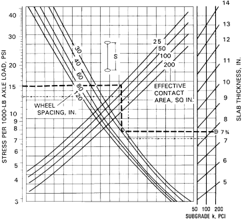

## APPENDIX 1-DESIGN EXAMPLES USING PORTLAND CEMENT ASSOCIATION METHOD A1.1-Introduction

The following two examples show the determination of thickness for a slab-on-ground using design charts published by PCA in Concrete Floors on Ground (2001). Both examples select the thickness based on limiting the tension on the bottom of the slab. The following examples presented are in inch-pound units. A table for converting the examples to SI units, along with an example of the process, is provided at the end of the Appendixes.

## A1.2-The PCA thickness design for single-axle load

This procedure selects the thickness of a concrete slab for a single-axle loading with single wheels at each end. Use of the design chart (Fig. A1.1) is illustrated by assuming the following:

Loading: axle load = 22.4 kips Effective contact area of one wheel = 25 in. 2 Wheel spacing = 40 in. Subgrade modulus k = 200 lb/in. 3

Material: concrete Compressive strength = 4000 psi Modulus of rupture = 570 psi --''',,'',',',,''',,'''',',,,'''-'',,',,,,-'',,',,,,---

Design: Selected safety factor = 1.7 Allowable stress = 335 psi Stress/1000 lb of axle load = 335/22.4 = 14.96 = 15 Solution: thickness = 7-3/4 in., as determined from Fig. A1.1.

Figures A1.2 and A1.3 are also included for determining the effective load contact area and for the equivalent load factor.

Fig.  A1.2-Relationship  between  load  contact  area  and effective load contact area.

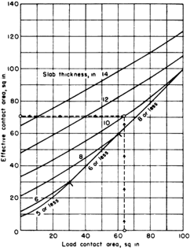

Fig. A1.3-The PCA design chart for axles with dual wheels.

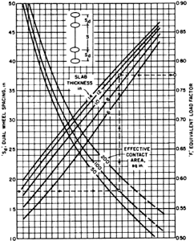

Fig. A1.4-Post configurations and loads.

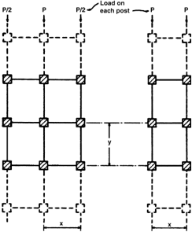

Fig.  A1.5-The  PCA  design  chart  for  post  loads  where subgrade modulus is 100 pci.

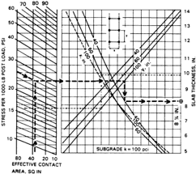

## A1.3-The PCA thickness design for slab with post loading

This procedure selects the slab thickness due to loading by a grid of posts shown in Fig. A1.4, such as from rack storage supports. The use of the design chart (Fig. A.1.5) is illustrated assuming the following:

Loading: post load = 15.5 kips Plate contact area for each post = 36 in. 2 Long spacing y = 100 in.

Fig.  A1.6-The  PCA  design  chart  for  post  loads  where subgrade modulus is 50 pci.

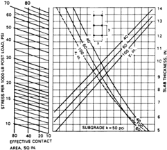

Fig.  A1.7-The  PCA  design  chart  for  post  loads  where subgrade modulus is 200 pci.

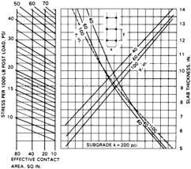

Short spacing x = 40 in.

Material: concrete Compressive strength = 4000 psi Modulus of rupture = 570 psi k = 100 lb/in. 3

Stress per 1000 lb of post load = 407/15.5 = 26.3

Design: selected safety factor = 1.4 Allowable stress = 407 psi -Use 26

Solution: Thickness = 8-1/4 in., as determined from Fig. A1.5. Figures A1.6 and A1.7 are also included for rack and post loads with subgrade modulus values of k = 50 and 200 lb/in. 3 , respectively.

Table A1.1-Allowable distributed loads for unjointed aisle with nonuniform loading and variable layout (Packard 1976)

| Slab thickness, in.   | Subgrade k , * lb/in. 3   |   Allowable load, lb/ft 2† Concrete flexural strength, psi |   Allowable load, lb/ft 2† Concrete flexural strength, psi |   Allowable load, lb/ft 2† Concrete flexural strength, psi |   Allowable load, lb/ft 2† Concrete flexural strength, psi |
|-----------------------|---------------------------|------------------------------------------------------------|------------------------------------------------------------|------------------------------------------------------------|------------------------------------------------------------|
| Slab thickness, in.   | Subgrade k , * lb/in. 3   |                                                        550 |                                                        600 |                                                        650 |                                                        700 |
|                       | 50                        |                                                        535 |                                                        585 |                                                        635 |                                                        685 |
|                       | 100                       |                                                        760 |                                                        830 |                                                        900 |                                                        965 |
|                       | 200                       |                                                       1075 |                                                       1175 |                                                       1270 |                                                       1370 |
|                       | 50                        |                                                        585 |                                                        640 |                                                        695 |                                                        750 |
|                       | 100                       |                                                        830 |                                                        905 |                                                        980 |                                                       1055 |
|                       | 200                       |                                                       1175 |                                                       1280 |                                                       1390 |                                                       1495 |
|                       | 50                        |                                                        680 |                                                        740 |                                                        800 |                                                        865 |
|                       | 100                       |                                                        960 |                                                       1045 |                                                       1135 |                                                       1220 |
|                       | 200                       |                                                       1355 |                                                       1480 |                                                       1603 |                                                       1725 |
|                       | 50                        |                                                        760 |                                                        830 |                                                        895 |                                                        965 |
|                       | 100                       |                                                       1070 |                                                       1170 |                                                       1265 |                                                       1365 |
|                       | 200                       |                                                       1515 |                                                       1655 |                                                       1790 |                                                       1930 |
|                       | 50                        |                                                        830 |                                                        905 |                                                        980 |                                                       1055 |
|                       | 100                       |                                                       1175 |                                                       1280 |                                                       1390 |                                                       1495 |
|                       | 200                       |                                                       1660 |                                                       1810 |                                                       1965 |                                                       2115 |
|                       | 50                        |                                                        895 |                                                        980 |                                                       1060 |                                                       1140 |
|                       | 100                       |                                                       1270 |                                                       1385 |                                                       1500 |                                                       1615 |
|                       | 200                       |                                                       1795 |                                                       1960 |                                                       2120 |                                                       2285 |

* k of subgrade; disregard increase in k due to subbase.

† For allowable stress equal to 1/2 flexural strength.

Note: Based on aisle and load widths giving maximum stress.

## A1.4-Other PCA design information

Tables A1.1 and A1.2 are also included for uniform load applications. Refer to examples of their uses in PCA (2001) and Ringo (1985).

## APPENDIX 2-SLAB THICKNESS DESIGN BY THE WIRE REINFORCEMENT INSTITUTE (WRI) METHOD A2.1-Introduction

The following two examples show the determination of thickness  for  a  slab-on-ground  based  on  an  unreinforced slab. Place a nominal quantity of distributed reinforcement in the upper 1/3 of the slab. The primary purpose of this reinforcement is to limit the width of any cracks (when they occur)  that  may  form  between  the  joints.  The  following examples  presented  are  in  inch-pound  units.  A  table  for converting the examples to SI units, along with an example of the process, is provided at the end of the Appendixes.

The design charts are for a single axle loading with two single wheels and for the controlling moment in an aisle with uniform loading on either side. Tension on the bottom of the slab controls the first situation. Tension on the top of the slab controls the second situation. Both procedures start with use of  a  relative  stiffness  term D / k ,  and  require  the  initial assumption of the concrete modulus of elasticity E and slab thickness H ,  as  well  as  selected  the  allowable  tensile  unit stress and the appropriate subgrade modulus k .

## A2.2-The WRI thickness selection for single-axle wheel load

This  procedure  selects  the  concrete  slab  thickness  for  a single axle with wheels at each end of the axle, using Fig. A2.1,

Table A1.2-Allowable distribution loads, unjointed aisles, uniform loading, and variable layout; PCA method

|                                           |                                           |                                           | Allowable load, lb/ft 2                   | Allowable load, lb/ft 2                   | Allowable load, lb/ft 2                   | Allowable load, lb/ft 2                   | Allowable load, lb/ft 2                   | Allowable load, lb/ft 2                                      |
|-------------------------------------------|-------------------------------------------|-------------------------------------------|-------------------------------------------|-------------------------------------------|-------------------------------------------|-------------------------------------------|-------------------------------------------|--------------------------------------------------------------|
| Slab thickness, in.                       | Working stress, psi                       | Critical aisle width * ,                  | At critical aisle                         | 6 ft                                      | At other 8 ft aisle                       | aisle 10 ft aisle                         | widths 12 ft aisle                        | 14 ft aisle                                                  |
| in. width aisle Subgrade k = 50 lb/in. 3† | in. width aisle Subgrade k = 50 lb/in. 3† | in. width aisle Subgrade k = 50 lb/in. 3† | in. width aisle Subgrade k = 50 lb/in. 3† | in. width aisle Subgrade k = 50 lb/in. 3† | in. width aisle Subgrade k = 50 lb/in. 3† | in. width aisle Subgrade k = 50 lb/in. 3† | in. width aisle Subgrade k = 50 lb/in. 3† | in. width aisle Subgrade k = 50 lb/in. 3†                    |
| 5                                         | 300                                       | 5.6                                       | 610                                       | 615                                       | 670                                       | 815                                       | 1050                                      | 1215                                                         |
| 5                                         | 350                                       | 5.6                                       | 710                                       | 715                                       | 785                                       | 950                                       | 1225                                      | 1420                                                         |
| 5                                         | 400                                       | 5.6                                       | 815                                       | 820                                       | 895                                       | 1085                                      | 1400                                      | 1620                                                         |
| 6                                         | 300                                       | 6.4                                       | 670                                       | 675                                       | 695                                       | 780                                       | 945                                       | 1175                                                         |
| 6                                         | 350                                       | 6.4                                       | 785                                       | 785                                       | 810                                       | 910                                       | 1100                                      | 1370                                                         |
| 8                                         | 400                                       | 6.4                                       | 895                                       | 895                                       | 925                                       | 1040                                      | 1260                                      | 1570                                                         |
| 8                                         | 300                                       | 8.0                                       | 770                                       | 800                                       | 770                                       | 800                                       | 880                                       | 1010 --''',,'',',',,''',,'''',',,,'''-'',,',,,,-'',,',,,,--- |
|                                           | 350                                       | 8.0                                       | 900                                       | 935                                       | 900                                       | 935                                       | 1025                                      | 1180                                                         |
|                                           | 400                                       | 8.0                                       | 1025                                      | 1070                                      | 1025                                      | 1065                                      | 1175                                      | 1350                                                         |
| 10                                        | 300                                       | 9.4                                       | 845                                       | 930                                       | 855                                       | 850                                       | 885                                       | 960                                                          |
| 10                                        | 350                                       | 9.4                                       | 985                                       | 1085                                      | 1000                                      | 990                                       | 1035                                      | 1120                                                         |
| 12                                        | 400                                       |                                           |                                           |                                           |                                           |                                           |                                           | 1285                                                         |
| 12                                        |                                           | 9.4                                       | 1130                                      | 1240                                      | 1145                                      | 1135                                      | 1185                                      |                                                              |
|                                           | 350                                       | 10.8                                      | 1065                                      | 1240                                      | 1115                                      | 1070                                      | 1080                                      | 1125 1290                                                    |
|                                           |                                           | 10.8                                      | 1220                                      |                                           |                                           |                                           | 1230                                      |                                                              |
| 14                                        | 400                                       |                                           |                                           | 1420                                      | 1270                                      | 1220                                      |                                           |                                                              |
| 14                                        | 300                                       | 12.1                                      | 980                                       | 1225                                      | 1070                                      | 1000                                      | 980                                       | 995                                                          |
|                                           | 350                                       | 12.1                                      | 1145                                      | 1430                                      | 1245                                      | 1170                                      | 1145                                      | 1160                                                         |
|                                           | 400                                       | 12.1                                      | 1310                                      | 1630                                      | 1425                                      | 1335                                      | 1310                                      | 1330                                                         |
| Subgrade k = 100 lb/in. 3†                | Subgrade k = 100 lb/in. 3†                | Subgrade k = 100 lb/in. 3†                | Subgrade k = 100 lb/in. 3†                | Subgrade k = 100 lb/in. 3†                | Subgrade k = 100 lb/in. 3†                | Subgrade k = 100 lb/in. 3†                | Subgrade k = 100 lb/in. 3†                | Subgrade k = 100 lb/in. 3†                                   |
| 5                                         | 300                                       | 4.7                                       | 865                                       | 900                                       | 1090                                      | 1470                                      | 1745                                      | 1810                                                         |
| 5                                         | 350                                       | 4.7                                       | 1010                                      | 1050                                      | 1270                                      | 1715                                      | 2035                                      | 2115                                                         |
| 5                                         | 400                                       | 4.7                                       | 1155                                      | 1200                                      | 1455                                      | 1955                                      | 2325                                      | 2415                                                         |
| 6                                         | 300                                       | 5.4                                       | 950                                       | 955                                       | 1065                                      | 1320                                      | 1700                                      | 1925                                                         |
| 6                                         | 350                                       | 5.4                                       | 1105                                      | 1115                                      | 1245                                      | 1540                                      | 1985                                      | 2245                                                         |
|                                           | 400                                       | 5.4                                       |                                           |                                           |                                           |                                           |                                           | 2565                                                         |
|                                           |                                           |                                           | 1265                                      | 1275                                      | 1420                                      | 1760                                      | 2270                                      |                                                              |
| 8                                         | 300                                       | 6.7                                       | 1095                                      | 1105                                      | 1120                                      | 1240                                      | 1465 1705                                 | 1815 2120                                                    |
| 8                                         | 350 400                                   | 6.7 6.7                                   | 1280 1460                                 | 1285 1470                                 | 1305 1495                                 | 1445                                      |                                           | 2420                                                         |
|                                           |                                           |                                           |                                           | 1265                                      | 1215                                      | 1650                                      | 1950                                      | 1610                                                         |
|                                           | 300                                       | 7.9                                       | 1215                                      |                                           |                                           | 1270                                      | 1395                                      |                                                              |
| 10                                        | 350                                       | 7.9                                       | 1420                                      | 1475                                      | 1420                                      | 1480                                      | 1630                                      | 1880                                                         |
| 10                                        | 400                                       | 7.9                                       | 1625                                      | 1645 1425                                 | 1625 1325                                 | 1690 1330                                 | 1860 1400                                 | 2150                                                         |
| 12                                        | 300 350                                   | 9.1 9.1                                   | 1320 1540                                 | 1665                                      | 1545                                      | 1550                                      | 1635                                      | 1535 1795                                                    |
| 12                                        | 400                                       | 9.1                                       | 1755                                      | 1900                                      | 1770                                      | 1770                                      | 1865                                      | 2050                                                         |
| 14                                        | 300                                       | 10.2                                      | 1405                                      | 1590                                      | 1445                                      | 1405                                      | 1435                                      | 1525                                                         |
| 14                                        | 350                                       | 10.2                                      | 1640                                      |                                           | 1685                                      | 1640                                      | 1675                                      | 1775                                                         |
|                                           |                                           |                                           |                                           | 1855                                      |                                           |                                           |                                           |                                                              |
|                                           | 400                                       | 10.2                                      | 1875                                      | 2120                                      | 1925                                      | 1875                                      | 1915                                      | 2030                                                         |
| Subgrade k = 200 lb/in. 3†                | Subgrade k = 200 lb/in. 3†                | Subgrade k = 200 lb/in. 3†                | Subgrade k = 200 lb/in. 3†                | Subgrade k = 200 lb/in. 3†                | Subgrade k = 200 lb/in. 3†                | Subgrade k = 200 lb/in. 3†                | Subgrade k = 200 lb/in. 3†                | Subgrade k = 200 lb/in. 3†                                   |
| 5                                         | 300                                       | 4.0                                       | 1225                                      | 1400                                      | 1930                                      | 2450                                      | 2565                                      | 2520                                                         |
| 5                                         | 350                                       | 4.0                                       | 1425                                      | 1630                                      | 2255                                      | 2860                                      | 2990                                      | 2940                                                         |
|                                           | 400                                       | 4.0                                       | 1630                                      | 1865                                      | 2575                                      | 3270                                      | 3420                                      | 3360                                                         |
|                                           | 300                                       | 4.5                                       | 1340                                      | 1415                                      | 1755                                      | 2395                                      | 2740                                      | 2810                                                         |
| 6                                         | 350                                       | 4.5                                       | 1565                                      | 1650                                      | 2050                                      | 2800                                      | 3200                                      | 3275                                                         |
| 6                                         | 400                                       | 4.5                                       | 1785                                      | 1890                                      | 2345                                      | 3190                                      | 3655                                      | 3745                                                         |
| 8                                         | 300                                       | 5.6                                       | 1550                                      | 1550                                      | 1695                                      | 2045                                      | 2635                                      | 3070                                                         |
| 8                                         |                                           |                                           | 2065                                      |                                           |                                           | 2730                                      | 3515                                      |                                                              |
|                                           | 350                                       | 5.6                                       | 1810                                      | 1810                                      | 1980                                      | 2385                                      | 3075                                      | 3580                                                         |
|                                           | 400                                       | 5.6                                       |                                           | 2070                                      | 2615                                      |                                           |                                           | 4095                                                         |
|                                           | 300                                       | 6.6                                       | 1730                                      | 1745                                      | 1775                                      | 1965                                      | 2330                                      | 2895                                                         |
|                                           |                                           | 6.6                                       |                                           |                                           | 2070                                      | 2290                                      |                                           | 3300                                                         |
| 10                                        | 350 400                                   | 6.6                                       | 2020 2310                                 | 2035 2325                                 | 2365                                      | 2620                                      | 2715                                      | 3860                                                         |
| 10                                        | 300                                       | 7.6                                       | 1890                                      | 1945                                      | 1895                                      | 1995                                      | 3105 2230                                 | 2610                                                         |
| 12                                        | 350                                       | 7.6                                       | 2205                                      | 2270                                      | 2210                                      | 2330                                      | 2600                                      | 3045                                                         |
| 12                                        | 400                                       | 7.6                                       | 2520                                      | 2595                                      | 2525                                      | 2660                                      | 2972                                      | 3480                                                         |
| 14                                        | 300                                       | 8.6                                       | 2025                                      | 2150                                      | 2030                                      | 2065                                      | 2210                                      | 2480                                                         |
| 14                                        | 350 400                                   | 8.6 8.6                                   | 2360 2700                                 | 2510 2870                                 | 2365 2705                                 | 2405 2750                                 | 2580 2950                                 | 2890 3305                                                    |

* Critical aisle width equals 2.209 times the radius of relative stiffness.

† k of subgrade; disregard increase in k due to subbase.

Notes: Assumed load width = 300 in.; allowable load varies only slightly for other load widths. Allowable stress = 1/2 flexural strength.

Fig. A2.1-Subgrade and slab stiffness relationship, used with WRI design procedure.

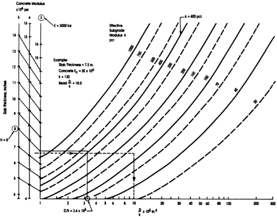

A2.2, and A2.3. The procedure starts with Fig. A2.1, where a  concrete  modulus  of  elasticity E ,  slab  thickness H ,  and modulus of subgrade reaction k are assumed or known. For example, taking

E = 3000 ksi Thickness = 8 in. (trial value) 3

Subgrade modulus k = 400 lb/in.

Figure A2.1 gives the relative stiffness parameter D / k = 3.4 × 10 5 in. 4 ; the procedure then uses Fig. A2.2.

Wheel contact area = 28 in. 2 Diameter of equivalent circle = = 6 in. Wheel spacing = 45 in. 28 4 × ( ) / π

This gives the basic bending moment of 265 in.-lb/in. of width/kip of wheel load for the wheel load using the larger design  chart  in  Fig.  A2.2.  The  smaller  chart  in  the  figure gives the additional moment due to the other wheel as 16 in.lb/in. of width kip of wheel load.

Moment = 265 + 16 = 281 in.-lb/in./kip (Note that in.-lb/in. = ft-lb/ft) Axle load = 14.6 kips Wheel load = 7.3 kips

Design moment = 281 × 7.3 = 2051 ft-lb/ft

Then, from Fig. A2.3: Allowable tensile stress = 190 psi Solution: slab thickness H = 7-7/8 in.

When the design thickness differs substantially from the assumed thickness, repeat the procedure with a new assumption of thickness.

## A2.3-The WRI thickness selection for aisle moment due to uniform loading

The procedure for the check of tensile stress in the top of the concrete slab due to this loading uses Fig. A2.1 and A2.4. Figure A2.3 is a part of Fig. A2.4, separated herein for clarity of procedure.

The procedure starts as before with determination of the term D / k = 3.4 × 10 5 in. 4 It then goes to Fig. A2.4 as follows:

2

Aisle width = 10 ft = 120 in. Uniform load = 2500 lb/ft 2 = 2.5 kips/ft Allowable tension = MOR/SF = 190 psi

Find the solution by plotting up from the aisle width to D / k , then  to  the  right-hand  plot  edge,  then  down  through  the uniform load value to the left-hand edge of the next plot, then horizontally to the allowable stress and down to the design thickness.

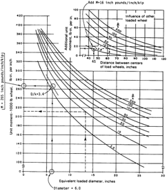

Fig.  A2.2-Wheel  loading  design  chart  used  with  WRI procedure.

Fig. A2.4-Uniform load design and slab tensile stress charts used with WRI design procedure.

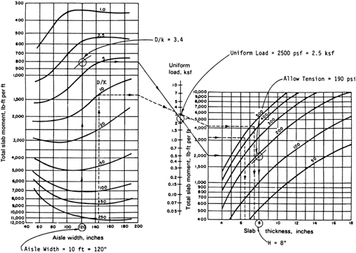

Fig. A2.3-Slab tensile stress charts used with WRI design procedure.

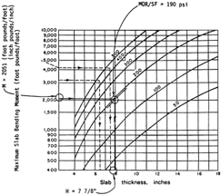

Solution: thickness = 8.0 in.

Again,  when  the  design  thickness  differs  substantially from the assumed value, repeat the process until reasonable agreement is obtained.

## APPENDIX 3-DESIGN EXAMPLES USING CORPS OF ENGINEERS' (COE) CHARTS A3.1-Introduction

The following examples show the determination of thickness for a slab-on-ground using the procedures published by the COE. The procedures appear in publications issued by the Departments of Defense (1977), the Department of the Army (1984, 1987) and the Department of the Air Force (1987). The examples  presented  are  in  inch-pound  units.  A  table  for converting the examples to SI units, along with an example of the process, is provided at the end of the Appendixes.

The  procedure  is  based  on  limiting  the  tension  on  the bottom of the concrete at an interior joint of the slab. The loading is generalized in design index categories (Table A3.1). The  procedure  uses  an  impact  factor  of  25%,  a  concrete modulus of elasticity of 4000 ksi, and a factor of safety of approximately  2.  The  joint  transfer  coefficient  has  been taken as 0.75 for this design chart (Fig. A3.1).

The  six  categories  shown  in  Table  A3.1  are  commonly used. Figure A3.1 shows 10 categories.

Categories 7 through 10 for exceptionally heavy vehicles are not covered in this guide.

## A3.2-Vehicle wheel loading

This example selects the thickness of the concrete slab for a  vehicle  in  design  index  Category  IV  (noted  as  Design Index 4 in Fig. A3.1). The vehicle parameters are needed to select the design index category from Table A3.1. Use of the design chart is illustrated assuming the following:

Loading: DI IV (Table A3.1)

Materials: concrete

Modulus of elasticity E = 4000 ksi

Modulus of rupture = 615 psi (28-day value)

Modulus of subgrade reaction k = 100 lb/in. 3

Solution: required thickness = 6 in. is determined from the design  chart  (Fig.  A3.1)  by  entering  with  the  flexural strength on the left and proceeding along the solid line.

## A3.3-Heavy lift truck loading

This example selects the thickness of the concrete slab for a lift truck, assuming the following:

Loading: axle load 25,000 lb

Vehicle passes: 100,000

Concrete flexural strength: 500 psi

Modulus of subgrade reaction k = 300 lb/in. 3

Figure A3.2 shows the design curve. Enter at the flexural strength with 500 psi on the left. From there, proceed with the  following  steps:  go  across  to  the  intersection  with  the curve of k = 300; go down to the line representing the axle load; go across to the curve for the number of vehicle passes;

Fig.  A3.1-COE  curves  for  determining  concrete  floor thickness by design index.

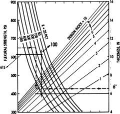

Table A3.1-Design index categories used with the COE slab thickness selection method

| Category                              | I      | II     | III       | IV        | V         | VI        |
|---------------------------------------|--------|--------|-----------|-----------|-----------|-----------|
| Capacity, lb                          | 4000   | 6000   | 10,000    | 16,000    | 20,000    | 52,000    |
| Design axle load, lb                  | 10,000 | 15,000 | 25,000    | 36,000    | 43,000    | 120,000   |
| No. of tires                          | 4      | 4      | 6         | 6         | 6         | 6         |
| Type of tire                          | Solid  | Solid  | Pneumatic | Pneumatic | Pneumatic | Pneumatic |
| Tire contact area, in. 2              | 27.0   | 36.1   | 62.5      | 100       | 119       | 316       |
| Effect contact pressure, psi          | 125    | 208    | 100       | 90        | 90        | 95        |
| Tire width, in.                       | 6      | 7      | 8         | 9         | 9         | 16        |
| Wheel spacing, in.                    | 31     | 33     | 11.52.11  | 13.58.13  | 13.58.13  | 20.79.20  |
| Aisle width, in.                      | 90     | 90     | 132       | 144       | 144       | 192       |
| Spacing between dual wheel tires, in. | -      | -      | 3         | 4         | 4         | 4         |

and finally, go down to find the final solution for the slab thickness of 5-1/4 in.

## APPENDIX 4-SLAB DESIGN USING POST-TENSIONING

This chapter includes:

- Design  example:  using  post-tensioning  to  minimize cracking; and
- Design example: equivalent tensile stress design.

## A4.1-Design example: Using post-tensioning to minimize cracking

Assume post-tensioned (PT) strip 500 x 12 ft.

Fig. A3.2-The COE design curves for concrete floor slabs with heavy forklift traffic.

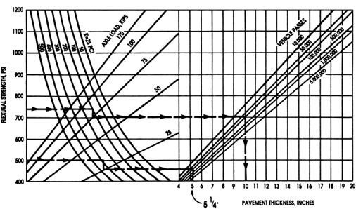

Determine  minimum  residual  (effective)  compression after all losses.

Calculate post-tensioning requirement for minimum residual compression ( P / A ), assume 250 psi:

Assume slab thickness: 6 in.

Calculate P-T requirement to overcome the subgrade friction using Eq. (A4-1).

Assume subgrade friction factor: 0.5.

<!-- formula-not-decoded -->

Calculate final effective force in PT tendon (friction and long-term losses).

Assume P e = 26,000 lb.

Calculate the required spacing of the PT tendons using Eq. (A4-2).

<!-- formula-not-decoded -->

= 0.95 ft (11.4 in.)

Use  11  in.  to  provide  more  than  250  psi  compression. Twelve  inch  spacing  provides  a  compression  of  approximately 230 psi, which may be adequate. Use groups of two cables 22 in. on center (or groups of three at 33 in. on center)

The  type  and  magnitude  of  loading  and  other  serviceability criteria determines the final spacing.

When there is rack loading with post far  apart  or  other concentrated loading spaced sufficiently far apart as to not significantly  influence  each  other,  then  check  with  the Westergaard Eq. (7-4)

<!-- formula-not-decoded -->

where f b is the tensile stresses at the bottom of the concrete slab; P is the concentrated load; h is the slab thickness; a is the radius of a equivalent circular load contact area; and k is the modulus of subgrade reaction. --''',,'',',',,''',,'''',',,,'''-'',,',,,,-'',,',,,,---

Assume:

P = 15,000 lb;

h = 6 in;

a = 4.5 in. (base plate 8 x 8 in.);

k = 150 lb/in. ; and

3

f b

=

545 psi.

Cracking of concrete: 7.5 × = 474 psi f c ′

Post-tensioning to provide necessary precompression of: 545 474 = 71 psi

Post-tensioning providing 250 psi is adequate.

In  the  case  of  two  or  more  placements  post-tensioned together across the joint and creating a continuous slab, use the following:

Case  1 :  Multiple  (12)  strips  30  ft  wide  post-tensioned partially  in  the  30  ft  direction  before  placing  the  adjacent strip. Final stress ties all strips together on the end.

When calculating the force to overcome the subgrade friction, consider the total width of all strips to be (12 x 30 = 360 ft).

Case 2: First place a section of 200 ft, stressed partially, and then place and stress the other section of 160 ft.

When  calculating  the  force  to  overcome  the  subgrade friction, use the following criteria:

Placement 1: Formula

<!-- formula-not-decoded -->

<!-- formula-not-decoded -->

Placement 2:

<!-- formula-not-decoded -->

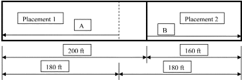

The tendons in Placement 1 have to overcome maximum friction based on 180 ft length at the critical section at the center of the combined length (dashed line).

The tendons in Placement 2 have to overcome maximum friction based on 160 ft length at the critical section at the joint  between  Placement  1  and  2  (pulling  Placement  2 toward Placement 1).

## A4.2-Design example: Equivalent tensile stress design

Determine the reduction in slab thickness of a 6 in. thick unreinforced slab when using post-tensioning.

Assume a modulus of rupture  of  9 with  a  factor  of safety of 2 was used to design the unreinforced 6 in. thick slab. Then, the allowable tension stress for 4000 psi concrete is f c ′

<!-- formula-not-decoded -->

When  the  P-T  force provides an effective residual compression of 150 psi (selected for this example) with the tendons in the center of the slab, then the allowable tensile stress due to the bending moments is 150 psi + 285 psi = 435 psi.

The moment strength of the slab is given by

<!-- formula-not-decoded -->

Equate the moment capacity of the unreinforced slab to the post-tensioned slab

<!-- formula-not-decoded -->

<!-- formula-not-decoded -->

Increase the 150 psi residual compressive stress to use a 4 in. thick slab or reduce it to use a 5 in. thick slab.

## APPENDIX 5-DESIGN EXAMPLE USING SHRINKAGE-COMPENSATING CONCRETE

## A5.1-Introduction

ACI 223 discusses the material in this appendix in greater detail. Slab design using this material is divided into three parts.

Part 1:

Select slab thickness by using Appendixes 1, 2, or 3. This follows  the  assumption  that  the  slab  is  being  designed  to remain essentially uncracked due to external loading. --''',,'',',',,''',,'''',',,,'''-'',,',,,,-''

Follow this  by  designing  the  concrete  mixture  and  the reinforcing steel to compensate for subsequent drying shrinkage. Because the net result of initial expansion and later shrinkage is to be essentially zero, do not consider prestress.

Part 2:

Selecting  the  appropriate  amount  of  reinforcement  is  a critical  part  of  the  design.  The  reinforcement  can  be nonprestressed steel, as illustrated in this appendix, or posttensioning tendons. Place the reinforcement in the top 1/3 to 1/4 of the slab (ACI 223).

Part 3:

Determine the required prism expansion to ensure shrinkage  compensation,  as  this  leads  concrete  mixture design.  This  is  shown  in  Section  A5.2.  Expansion  of  the length of the slab is also determined.

## A5.2-Example selecting the optimum amount of reinforcement to maximize the compressive stress in the concrete where the slab thickness, the joint spacing, and prism expansion are known

This  example  is  the  typical  design  case  for  a  slab-onground. The following data are known:

Slab thickness = 6.0 in.

Joint spacing = 100 ft

Prism expansion = 0.05% (ASTM C878/C878M)

Coefficient  of  subgrade  friction  =  0.30  (for  two  sheets  of polyethylene)

The slab is assumed to dry on the top surface only; therefore, the volume-surface ratio = 6.0 in.

Ignore  the  small  eccentricity  due  to  the  reinforcement being located near the top of the slab and the eccentricity due to the subgrade friction.

Determine  the  optimum  amount  of  reinforcement  that produces the maximum tension in the reinforcement which causes the maximum  compressive  stress in the slab. Designing  the  reinforcement  to  produce  this  maximum

Fig.  A5.1-Prediction  of  member  expansion  from  prism data (ACI Committee 223 1970).

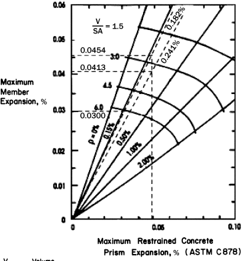

compression force minimizes the tension stress due to the subgrade friction when the slab shrinks. For these given data, the optimum reinforcement is No. 4 at 18 in. ( A s = 0.131 in. 2 /ft, ρ =  0.182%). Determine this optimum reinforcement by a few iterations of the following procedure. The final iteration is shown below:

Determine the force in the reinforcement without subgrade restraint. For No. 4 at 18 in., ρ = 0.182% and from Fig. A5.1, the slab expansion is ε exp = 0.0454% or 0.000454 in./in. The stress in the reinforcement is

<!-- formula-not-decoded -->

--''',,'',',',,''',,'''',',,,'''-'',,',,,,-'',,',,,,---

Subgrade friction force is

<!-- formula-not-decoded -->

Because the subgrade friction varies over the length of the slab, use the average force, which is

<!-- formula-not-decoded -->

The equivalent steel area is

<!-- formula-not-decoded -->

The equivalent reinforcement ratio in percent is

<!-- formula-not-decoded -->

From Fig. A5.1, the slab expansion with subgrade restraint is ε exp\_equ = 0.0413% or 0.000413 in./in.

From Fig. A5.1, the slab shrinkage with subgrade restraint is ε sh\_equ = 0.0300% or 0.000300 in./in.

The force in the reinforcement after the concrete shrinkage has occurred is

<!-- formula-not-decoded -->

<!-- formula-not-decoded -->

This  tension  force  causes  the  maximum  compressive stress in the slab due to the reinforcement and helps reduce the tension stress due to the subgrade restraint.

## APPENDIX 6-DESIGN EXAMPLES FOR STEEL FRC SLABS-ON-GROUND USING YIELD LINE METHOD

## A6.1-Introduction

These  examples  show  the  design  of  a  slab-on-ground containing steel FRC. This design procedure is iterative and involves assumption of a slab thickness, determination of a residual strength factor,  and  determination  of  the reasonableness  of  the  residual  strength  factor.  Select  an appropriate fiber type and quantity rate to meet the residual strength factor.

a

= radius of circle with area equal to that of the base plate, in. (mm)

E =

elastic modulus of concrete, psi (MPa)

f c ′ =

concrete cylinder compressive strength, psi (MPa)

f r =

concrete modulus of rupture, psi (MPa)

h =

slab thickness, in. (mm)

k =

modulus of subgrade reaction, lb/in. 3 (N/mm 3 )

L =

radius of effective stiffness, in. (mm)

Mn =

negative  bending  moment  strength  of  the  slab, tension at top slab surface, in.-k (N-mm);

Mp =

positive  bending  moment  strength  of  the  slab, tension at bottom slab surface, in.-k (N-mm)

P ult =

ultimate load strength of the slab, kip

R e,3 =

residual strength factor (JSCE SF4)

S =

slab section modulus, in. 3 /in. (mm 3 /mm)

ν =

Poisson's ratio for concrete (approximately 0.15)

## A6.2-Assumptions and design criteria

Slab thickness h = 6 in. (150 mm)

Concrete compressive strength (cylinder) f c ′ =  4000  psi (27.5 MPa)

Concrete rupture modulus f r = 550 psi (3.79 MPa)

Concrete elastic modulus E = 3,600,000 psi (25,000 MPa)

Poisson's ratio ν = 0.15

Modulus of subgrade reaction, k = 100 lb/in. 3 (0.027 N/mm 3 )

Storage rack load = 15 kips (67 kN)

Base plate = 4 x 6 in. (10 x 15 cm)

A6.2.1 Calculations  for  a  concentrated  load  applied  a considerable distance from slab edges

The radius of relative stiffness is given by L = [ E × h 3 /(12(1 ν 2 ) k )] 0.25

= [3,600,000 × 63/(12(1 - 0.15

2

)100]

= 28.5 in.

The section modulus of the slab is S = 1 in. × h 2 /6 = 1 × 6 2 /6 = 6 in. 3 /in.

The equivalent contact radius of the concentrated load is the radius of a circle with area equal to the base plate.

<!-- formula-not-decoded -->

A concentrated load applied a considerable distance away from slab edges should not exceed the ultimate load strength of the slab:

<!-- formula-not-decoded -->

where

<!-- formula-not-decoded -->

<!-- formula-not-decoded -->

Combining Mp and

<!-- formula-not-decoded -->

<!-- formula-not-decoded -->

Select a factor of safety of 1.5 for this example Mp + Mn = f r × S × (1 + R e , 3 /100)/1.5

<!-- formula-not-decoded -->

The minimum required bending moment strength of the slab for the applied load is

## 3.13 in.-k/in. = Mp + Mn

The stresses due to shrinkage and curling can be substantial. For the purpose of this example, select 200 psi. This translates into an additional moment of 1.2 in.-k/in. (6.0 in. 3 /in. × 200 psi) to account for shrinkage and curling stresses. This stress  varies  depending  on  the  factor  of  safety  and  other issues,  including  mixture  proportion,  joint  spacing,  and drying environment.

Using  Eq.  (A6-3)  to  solve  for  the  required  residual strength factor R e , 3

<!-- formula-not-decoded -->

<!-- formula-not-decoded -->

Residual load factors for various fiber types and quantities are available from steel fiber manufacturers' literature. Use laboratory  testing  for  quality  control  to  verify  residual strength  factors  on  a  project  basis.  The  quantity  of  steel

0.25

fibers to provide the residual strength factor shown in this example  ranges  from  33  to  50  lb/yd 3 (20  to  30  kg/m 3 ), depending  on  the  properties  (length,  aspect  ratio,  tensile strength, and anchorage) of the fiber.

A6.2.2 Calculations  for  post  load  applied  adjacent  to sawcut contraction joint

Assuming 20% of the load is transferred across the joint (Meyerhof 1962), the load for a concentrated load applied adjacent to a sawcut contraction joint should not exceed

<!-- formula-not-decoded -->

Solving Eq. (A6-4),

<!-- formula-not-decoded -->

The minimum required bending moment strength of the slab for the applied load is 3.97 in.-k/in. = Mp + Mn.

As in the previous example, use an additional moment of 1.2 in.-k/in. to account for shrinkage. No curling stress exists at  the  edge.  Using  Eq.  (A6-3)  to  solve  for  the  required residual strength factor R e , 3

3.97 in.-k/in. + 1.2 in.-k/in. =

f

×

S

× (1 +

--''',,'',',',,''',,'''',',,,'''-'',,',,,,-'',,',,,,---

<!-- formula-not-decoded -->

R e

, 3

≥

57

The quantity of steel fibers to provide the residual strength factor shown in this example range from 40 to 60 lb/yd 3 (25 to 35 kg/m 3 ), depending on the mixture proportion and all mixture constituents, including fiber type and quantity.

## APPENDIX 7-CONSTRUCTION DOCUMENT INFORMATION

## A7.1-Introduction

It is helpful when the design criteria are well established that it  be  shown  on  the  drawings  for  future  slab  modifications. Below is an example design criteria of some of the more relevant loading information that could be shown on the drawings, along  with  some  typical  conceptual  details  that  will  help reduce the majority of serviceability performance problems that have been observed concerning slabs-on-ground.

## A7.2-Example design criteria

The following is an example design criteria that could be placed  on  the  drawing  (Fig.  A7.1)  showing  some  of  the various considerations possible:

| SLAB-ON-GROUND DESIGN CRITERIA 1. MINIMUM REQUIRED MODULUS OF SUBGRADE REACTION FOR WIDE AREA RACK LOADING       |
|------------------------------------------------------------------------------------------------------------------|
| 2. MINIMUM REQUIRED MODULUS OF SUBGRADE REACTION FOR LIFT-TRUCK LOADING................................. 150 PCI |
| 3. UNIFORM STORAGE LOAD ...................................................925 PSF                               |
| 4. LIFT-TRUCK FRONT AXLE LOAD.....................................15,500 LB (SINGLE WHEELS SPACED 33 IN.)        |
| 5. GENERAL RACK LOADING .............................AS SHOWN BELOW                                              |

,

R e

3 /100)

r

6.  SLAB-ON-GROUND  CONTRIBUTES  TO  THE  RESISTANCE  OF WIND AND SEISMIC UPLIFT FORCES FOR FOUNDATIONS.
7. SLAB-ON-GROUND IS USED AS A HORIZONTAL DIAPHRAGM TO LATERALLY STABILIZED BUILDING.
8. SLAB IS USED TO LATERALLY STABILIZE MASONRY WALLS. SEE DRAWINGS FOR LOCATIONS.

## A7.3-Typical details

Most  problems  for  slabs-on-ground  can  be  related  to improper details or not providing details. The typical slabon-ground problem areas have been at doors, slab penetrations, reentrant corners, discontinuous joints, and lateral ties to the slab-on-ground. Below are some typical conceptual details that have been used successfully on projects.

## Notes for Sections A7.3.1 to A7.3.4 are on p. 72.

A7.3.1 Door details

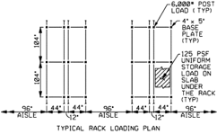

Fig. A7.1-Example design for typical rack loading plan.

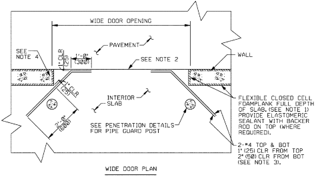

Wide door plan.

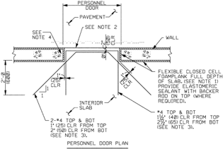

Personnel door plan.

Wide door or personnel door plan.

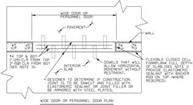

Personnel door plan.

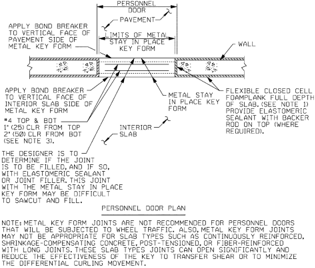

## A7.3.2 Slab penetrations

--''',,'',',',,''',,'''',',,,'''-'',,',,,,-'',,',,,,---

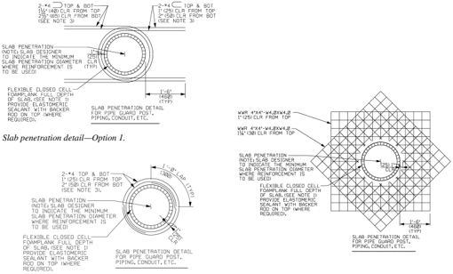

Slab penetration detail-Option 3.

Slab penetration detail-Option 2.

Floor drain and cleanout detail.

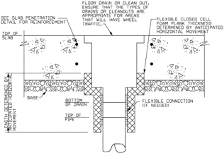

## A7.3.3 Reentrant corners and discontinuous joints

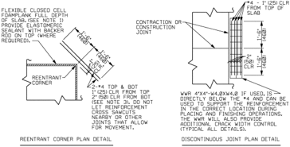

Reentrant corner and discontinuous joint detail.

A7.3.4 Lateral ties to slab-on-ground

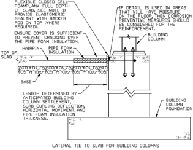

Lateral tie to slab for building columns.

## ACI COMMITTEE REPORT

Lateral tie to slab for walls.

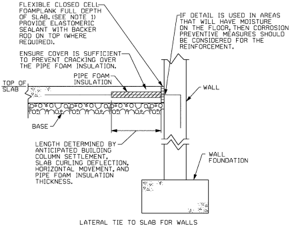

## Notes for Sections A7.3.1 to A7.3.4.

## CONVERSION FACTORS

## LENGTH

| 1 in. = 2.54 cm                                                                                            |
|------------------------------------------------------------------------------------------------------------|
| 1 cm = 0.39 in.                                                                                            |
| 1 ft = 0.305m                                                                                              |
| 1 m=3.28 ft                                                                                                |
| 1 mile = 1.61 km                                                                                           |
| 1 km = 0.62 miles                                                                                          |
| in. to m..................................................................................multiply by 2.5  |
| mto in ...................................................................................multiply by 0.4  |
| ft to m....................................................................................multiply by 2.5 |
| oz to g....................................................................................multiply by 3.3 |
| oz to g..................................................................................multiply by 28.3  |
| g to oz................................................................................multiply by 0.035   |
| lb to kg ................................................................................multiply by 0.45  |
| kg to lb ..................................................................................multiply by 2.2 |

## VOLUME

1 fl oz = 29.57 mL

10 mL = 0.34 fl. oz

1 qt (32 fl. oz) = 946.35 mL

1 L = 1.06 U.S. qt

1 gal. (128 fl. oz) = 3.79 L

3.79 L = 1 U.S. gal.

oz to mL................................................................................. multiply by 30

mL to oz.............................................................................. multiply by 0.03

qt to L.................................................................................. multiply by 0.95

L to qt.................................................................................. multiply by 1.06

1 in. 3 = 16.39 cm 3

--''',,'',',',,''',,'''',',,,'''-'',,',,,,-'',,',,,,---

1 ft 3 = 1,728 in. 3 = 7.481 gal. 1 yd 3 = 27 ft 3 = 0.7646 m 3

## WEIGHT

| 1 oz = 28.3 g                                                                                               |
|-------------------------------------------------------------------------------------------------------------|
| 10 g = 0.35 oz                                                                                              |
| 1 lb = 0.45 kg                                                                                              |
| 1 kg = 2.20 lb                                                                                              |
| oz to g.................................................................................. multiply by 28.3  |
| g to oz................................................................................ multiply by 0.035   |
| lb to kg ................................................................................ multiply by 0.45  |
| kg to lb .................................................................................. multiply by 2.2 |

## TEMPERATURE

°C = (°F - 32)/1.8 °F = (1.8 × °C) + 32 1 °F/in. = 0.22 °C/cm

## SPECIFIC WEIGHT

1 lb water = 27.7 in. 3 = 0.1198 gal.

1 ft 3 water = 62.43 lb

1 gal. water = 8.345 lb

## WATER-CEMENT RATIO

Multiply w / c by 11.3 to obtain gallons per bag

## AREA

1 in. 2 = 6.452 cm 2

--''',,'',',',,''',,'''',',,,'''-'',,',,,,-'',,',,,,---

As  ACI  begins  its  second  century  of  advancing  concrete  knowledge,  its  original  chartered  purpose remains  'to  provide  a  comradeship  in  finding  the  best  ways  to  do  concrete  work  of  all  kinds  and  in spreading knowledge.' In keeping with this purpose, ACI supports the following activities:

- Technical committees that produce consensus reports, guides, specifications, and codes.
- Spring and fall conventions to facilitate the work of its committees.
- Educational seminars that disseminate reliable information on concrete.
- Certification programs for personnel employed within the concrete industry.
- Student programs such as scholarships, internships, and competitions.
- Sponsoring and co-sponsoring international conferences and symposia.
- Formal coordination with several international concrete related societies.
- Periodicals: the ACI Structural Journal and the ACI Materials Journal , and Concrete International .

Benefits  of  membership  include  a  subscription  to Concrete International and  to  an  ACI  Journal.  ACI members receive discounts of up to 40% on all ACI products and services, including documents, seminars and convention registration fees.

As a member of ACI, you join thousands of practitioners and professionals worldwide who share a commitment  to  maintain  the  highest  industry  standards  for  concrete  technology,  construction,  and practices. In addition, ACI chapters provide opportunities for interaction of professionals and practitioners at a local level.

American Concrete Institute 38800 Country Club Drive Farmington Hills, MI 48331

U.S.A.

Phone:

248-848-3700

Fax:

248-848-3701

www.concrete.org

## Guide to Design of Slabs-on-Ground

## The AMERICAN CONCRETE INSTITUTE

was founded in 1904 as a nonprofit membership organization dedicated to public service and representing the user interest in the field of concrete. ACI gathers and distributes information on the improvement of design, construction and maintenance of concrete products and structures. The work of ACI is conducted by individual  ACI  members  and  through  volunteer  committees  composed  of  both members and non-members.

The committees, as well as ACI as a whole, operate under a consensus format, which assures all participants the right to have their views considered. Committee activities include the development of building codes and specifications; analysis of research  and  development  results;  presentation  of  construction  and  repair techniques; and education.

--''',,'',',',,''',,'''',',,,'''-'',,',,,,-'',,',,,,---

Individuals interested in the activities of ACI are encouraged to become a member. There  are  no  educational  or  employment  requirements.  ACI's  membership  is composed  of engineers, architects, scientists, contractors, educators,  and representatives from a variety of companies and organizations.

Members are encouraged to participate in committee activities that relate to their specific areas of interest. For more information, contact ACI.

## www.concrete.org

