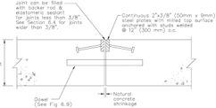
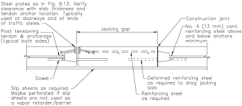

# M/R = manufacturers' recommendations. Because of the various plate dowel geometries and installation devices available from different manufacturers, the manufacturers should be consulted for their recommended plate dowel size.

- Source: ACI 360R-10.pdf
- Generated: 2026-03-04T22:38:09+00:00
- Chunk: 22/31
- Estimated tokens: ~4,995
- Total pages: 76
- Type: chapter

# M/R = manufacturers' recommendations. Because of the various plate dowel geometries and installation devices available from different manufacturers, the manufacturers should be consulted for their recommended plate dowel size.

- The joint effectiveness relates to factors other than the opening  width.  These  include  load  magnitude,  slab thickness, soil support system  stiffness,  degree  of curling, aggregate size and angularity.

A  more  reliable  and  definable  method  to  evaluate  the performance of a joint having a load-transfer mechanism, a joint using aggregate interlock, or a crack that has developed, is by measuring the joint or crack stability. The joint or crack stability  is  the  differential  deflection  of  the  adjacent  slab panel or crack edges when a service load crosses the joint or crack. Joint or crack stability can be easily measured. It is commonly done by using a leveled straightedge and gaugefor example, a tri-square or dial indicator-to measure the vertical distance from the upper straightedge to slab surface at 12 in. (300 mm) spacing (6 in. [150 mm] each side of the joint) to determine the amount of vertical movement under the bottom of the straightedge as it occurs (Type I Apparatus, ASTM E1155) or by using a device with an inclinometer having 12 in. (300 mm) contact point spacing located 6 in. [150 mm] on each side of the joint that gives a visual readout of  the  vertical  movement  as  it  occurs  (Type  II  Apparatus, ASTM E1155). Joint or crack stability measurements below 0.010 in. (0.25 mm) for joints or cracks subjected to lift truck wheel traffic with small hard wheels will have good service life  (Tarr  2004;  Walker  and  Holland  2007a).  For  lift  truck traffic with large, cushioned rubber wheels, a joint or crack stability  measurement  of  0.020  in.  (0.51  mm)  should  have good service life (Walker and Holland 1999, 2007a). These joint  stability  values  assume  the  joint  is  properly  filled  full depth  with  semi-rigid  joint  filler  and  that  the  joint  filler  is properly maintained. For joint or crack stability values above 0.060 in. (1.5 mm), the joint or crack would be considered unstable (Tarr 2004), have a much reduced service life, and most likely should be repaired.

Another load-transfer mechanism is enhanced aggregate interlock. Enhanced aggregate interlock depends on a combination of the effect of a small amount of deformed reinforcement continued through the joint and the irregular face of the cracked concrete at joints for load transfer. The continuation of a small percentage of deformed reinforcement (0.1% of the slab cross- sectional area) through sawcut contraction joints in combination with joint spacings (Fig. 6.6), has been used successfully by some designers to provide load-transfer capability without using dowels. A slab design that uses this small amount of deformed reinforcement to  enhance  aggregate  interlock  at the joints should conform to the following:

- Space joints as shown in Fig. 6.6;
- Place  the  reinforcement  above  mid-depth  but  low enough that the sawcut will not cut the reinforcement;
- Place a construction or sawcut contraction joint with a load-transfer  device  at  a  maximum  of  125  ft  (38  m). This  forces  activation  at  these  joints  when  the  other joints with the deformed reinforcement do not activate;
- Use  an  early-entry  saw  to  cut  all  sawcut  contraction joints; and
- The slab should be a uniform thickness.

As a general rule, the continuation of larger percentages of deformed reinforcing bars should not be used across sawcut contraction joints or construction joints because they restrain joints from opening as the slab shrinks during drying, and this increases the probability of out-of-joint random cracking. The restraint provided by the reinforcement varies with the quantity of reinforcement in the slab, expressed as a percentage of the cross-sectional area of the slab. Park and Paulay (1975) offer a method of calculating the reduction in unrestrained internal shrinkage strain that can be attributed to  the  presence  of  reinforcement.  Table  6.2  provides  the calculated  reduction  in  strain  that  can  be  attributed  to  the presence of various percentages of reinforcement located at midheight of a slab using the following values: --''',,'',',',,''',,'''',',,,'''-'',,',,,,-'',,',,,,---

- E s = modulus  of  elasticity  of  steel:  29,000,000  psi (2,000,000 MPa);

E c = modulus of elasticity of concrete: 2,900,000 psi (20,000 MPa);

Ct = creep coefficient: 2.0; and e sh = unrestrained shrinkage strain: 0.000500.

This table suggests that the reduction in strain that could be anticipated from 0.1% reinforcement at midheight of the slab  is  less  than  3%.  This  percentage  is  relatively  minor when compared with the potential impact of variations in the

Table 6.2-Reduction in strain due to reinforcing concrete

|   Steel ratio, % |   Concrete stress, psi (tension) | Steel stress, psi (compression)   |   Restrained shrinkage strain |   Reduction in unrestrained shrinkage strain,% |
|------------------|----------------------------------|-----------------------------------|-------------------------------|------------------------------------------------|
|              0.1 |                               14 | 14,078                            |                      0.000485 |                                           2.91 |
|              0.2 |                               27 | 13,679                            |                      0.000472 |                                           5.66 |
|              0.3 |                               40 | 13,303                            |                      0.000459 |                                           8.26 |
|              0.4 |                               52 | 12,946                            |                      0.000446 |                                          10.71 |
|              0.5 |                               63 | 12,609                            |                      0.000435 |                                          13.04 |
|              0.6 |                               74 | 12,288                            |                      0.000424 |                                          15.25 |
|              0.7 |                               84 | 11,983                            |                      0.000413 |                                          17.36 |
|              0.8 |                               94 | 11,694                            |                      0.000403 |                                          19.35 |
|              0.9 |                              103 | 11,417                            |                      0.000394 |                                          21.26 |
|              1   |                              112 | 11,154                            |                      0.000385 |                                          23.08 |
|              3   |                              229 | 7632                              |                      0.000263 |                                          47.37 |

Note: 1 psi = 0.00690 MPa.

restraint stresses due to the different coefficients of subgrade friction (Fig. 14.3) and curling stresses.

Plate,  square,  and  round  smooth  dowels  for  slab-onground installation should meet the requirements of ASTM A36/A36M or A615/A615M. The designer should specify the diameter or cross-sectional area, length, shape, treatment for corrosion resistance, and specific location of dowels, as well as the method of installation, support, and debonding. Refer to Table 6.1, Fig. 6.5, and Fig. 6.9 through 6.12.

For  long  post-tensioned  floor  strips  and  floors  using shrinkage-compensating  concrete  with  long  joint  spacing, take  care  to  accommodate  significant  slab  movements.  In most instances, post-tensioned slab joints are associated with a  jacking  gap.  Delay  the  filling  of  jacking  gaps  as  long  as possible to accommodate shrinkage and creep. In traffic areas, armor plating of the joint edges is recommended (Fig 6.13). Figure 6.14 shows a doweled joint detail at a jacking gap in a post-tensioned slab (PTI 1996, 2004).

## 6.3-Sawcut contraction joints

Three types of tools are commonly used for sawcutting joints: conventional wet-cut (water-injection) saws; conventional  dry-cut  saws;  and  early-entry  dry-cut  saws. Timing of the sawing operations varies with manufacturer and equipment. The goal of sawcutting is to create a weakened plane as soon as the joint can be cut, preferably without creating spalling at the joint, so the floor slab will crack at the  sawcut  instead  of  randomly  and  create  the  desired visual effect.

Fig. 6.13-Typical armored construction joint detail.

Fig. 6.14-Typical doweled joint detail for post-tensioned slab.

notched by the saw to ensure proper function of the sawcut contraction joint.

Early-entry dry-cut saws use a skid plate that helps prevent spalling. Timely changing of skid plates in accordance with manufacturer's recommendations is necessary to effectively control  spalling.  Typically,  joints  produced  using  conventional processes are made within 4 to 12 hours after the slab has been finished in an area-4 hours in hot weather to 12 hours in  cold  weather.  For  early-entry  dry-cut  saws,  the  waiting period will typically vary from 1 hour in hot weather to 4 hours in cold weather after completing the finishing of the slab in that joint location. Longer waiting periods may be necessary for all types of sawing for floors reinforced with steel fiber or where embedded mineral-aggregate hardeners with longslivered particles are used. In all instances, sawing should be completed before slab concrete cooling occurs subsequent to the peak heat of hydration. --''',,'',',',,''',,'''',',,,'''-'',,',,,,-'',,',,,,---

Conventional  wet-cut  saws  are  gasoline-powered.  With the appropriate blades, they are capable of cutting joints up to 12 in. (300 mm) depth or more. Dry-cut tools can use electrical or gasoline power. They provide the benefit of being generally lighter than wet-cut equipment. Most early-entry drycut saws cut to a maximum depth of 1-1/4 in. (32 mm), but some cut to a maximum depth of 4 in. (100 mm). Timing of the  early-entry  process  allows  joint  sawcutting  before significant concrete tensile stresses develop. This increases the probability of cracks forming at the joint when sufficient concrete  stresses  develop.  Care  should  be  taken  to  ensure that the early-entry saw does not ride up over hard or large coarse  aggregate.  The  highest  coarse  aggregate  should  be

The minimum depth of sawcut using a wet conventional saw should be the greater of at least 1/4 of the slab depth or 1 in. (25 mm). The minimum depth of sawcut using an earlyentry dry-cut saw should be 1 in. (25 mm) for slab depths up to 9 in. (230 mm). This recommendation assumes that the early-entry dry-cut saw is used within the time constraints noted  previously.  Some  slab  designers  require  cutting  the slab the following day to 1/4 of the slab depth to deepen the 1 in. (25 mm) early-entry sawcut and ensure the joint activates. Restricted joint activation using a 1 in. (25 mm) sawcut is a particular concern with doweled joints because dowels may restrain  slab  movement. For this situation, plate or square dowels  cushioned  on  the  vertical  sides  by  compressible material  or  tapered  plate  dowels  are  available  in  dowel basket assemblies and can reduce this restraint (Fig. 6.12).

For slabs containing steel fibers, the sawcut using a wet conventional  saw  should  be  1/3  of  the  slab  depth.  When timely cutting is done with an early-entry saw, the depth can be the same as for unreinforced (plain) concrete for lower fiber  concentrations  and  preferably  1-1/4  in.  (32  mm) minimum for higher fiber concentrations up to a 9 in. (230 mm) thick slab. The sawing should be done shortly after the final set, but timing of the sawing is critical so as not to pull up the steel fiber. New, clean saw blades are recommended for crisp sawcuts. Attempt a 5 ft (1.5 m) long cut and evaluate it for spalling  or  raveling  before  cutting  the  entire  slab  section. When fibers are pulled up, delay the sawing and repeat the procedure until sawing reveals no fibers. Regardless of the process  chosen,  sawcutting  should  be  performed  before concrete starts to cool, as soon as the concrete surface is firm enough not to permit dislodging or spalling of steel fibers close to the floor surface to be torn or damaged by the blade, and before random drying-shrinkage cracks can form in the concrete slab. Shrinkage stresses build in the concrete as it sets and cools. When sawing is unduly delayed, the concrete can crack randomly before it is sawed. Additionally, delays can generate cracks that run off from the saw blade toward the edge of the slab at an obtuse or skewed angle to the sawcut.

## 6.4-Joint protection

Joints  should  be  protected  to  ensure  long-term  performance. Regardless of the materials chosen for protection, the joint needs to have adequate load transfer and the surfaces of adjacent slabs should remain in the same plane.

For wheel traffic, there are two ways to protect a joint: fill the  joint  with  a  material  to  restore  surface  continuity  or armor the edges with steel plates (Fig. 6.13). Certain types of semirigid epoxy or polyurea are the only materials known to the  committee  that  can  fill  joints  and  provide  sufficient shoulder support to the edges of the concrete and prevent joint breakdown. Such joint materials should be 100% solids and have a minimum Shore A hardness of 80 when measured in accordance with ASTM D2240. Refer to Section 6.5 for more details on joint filling and sealing.

For large slab placements where sawcut contraction joints are not used and the joint width at the construction joints may open significantly, such as post-tensioned slabs, steel-fiber joint-free slabs, or slabs cast with shrinkage-compensating concrete, it is recommended that the joints be protected with back-to-back steel bars (Fig. 6.13 and 6.14). It is critical that the top surfaces of the bars used to armor the joint are horizontally  level  with  the  top  of  the  slab.  Milling  may  be required to produce a flat surface when conventional bar stock  material  is  used.  Angles  have  been  used  to  armor joints with limited success. Milling the top surface of the angle  to  correct  camber,  sweep,  and  out-of-square  is  not practical. Installing and maintaining the top angle leg horizontal during concrete placing and finishing operations is difficult while consolidating the concrete under the angle leg bearing area. Steel-armored joints less than 3/8 in. (9 mm) wide can be sealed with an elastomeric sealant as described in ACI 504R.

Armored joints equal or greater than 3/8 in. (9 mm) wide should be filled full depth with semi-rigid epoxy or polyurea joint  filler  or  joint  filler  that  contains  an  integral  sand extender. This should provide a smooth transition for wheel traffic and minimize damage to tire tread.

Unstable construction and sawcut contraction joints will not retain any type of joint filler. Joints are unstable when there is horizontal movement due to continued shrinkage or temperature changes, or vertical movement due to inadequate load transfer. Regardless of the integrity of initial construction, the continued movement of a filled, curled, undoweled joint under traffic may prematurely fatigue the filler and concrete interface and cause failure. Joint edge protection provided by supportive filler increases when load-transfer provisions are incorporated in the joint design. --''',,'',',',,''',,'''',',,,'''-'',,',,,,-'',,',,,,---

## 6.5-Joint filling and sealing

Where there are wet conditions, hygienic and dust control requirements, and the slab is not exposed to wheel traffic, contraction and construction joints can be filled with joint filler or an elastomeric joint sealant. Joints exposed to wheel traffic should be treated as discussed in Section 6.4.

Isolation or other joints are sometimes sealed with an elastomeric  sealant  to  minimize  moisture,  dirt,  or  debris accumulation.  Elastomeric  sealants  should  not  be  used  in interior joints subjected to vehicular traffic unless protected with  steel  armored  edges.  Refer  to  ACI  504R  for  more information on elastomeric sealants.

6.5.1 Time of filling and sealingConcrete slabs-on-ground continue  to  shrink  for  years;  most  shrinkage  takes  place within the first year. It is advisable to defer joint filling and sealing  as  long  as  possible  to  minimize  the  effects  of shrinkage-related  joint  opening  on  the  filler  or  sealant. Ideally,  when  the  building  is  equipped  with  an  HVAC system, it should be run for two weeks before joint filling. This is especially important where using joint filler in trafficbearing  joints  because  such  materials  have  minimal extensibility.  When  the  joint  is  filled  before  most  of  the shrinkage has occurred, expect separation between the joint edge and the joint filler or within the joint filler itself. These slight  openings  can  subsequently  be  filled  with  a  lowviscosity compatible material.

When construction schedule dictates that joints be filled early or when it is decided to fill the joints early to minimize the damage to the joints due to construction traffic, then the construction  documents  should  have  provisions  to  require that the contractor return at a pre-established date, typically between  6  months  and  1  year,  to  repair  the  joint  filler separations  using  the  same  manufacturer's  product.  Early filling results in  greater  separation  and  requires  more substantial  correction.  This  separation  does  not  indicate  a failure of the filler or installation. The construction documents should  identify  the  parties  responsible  for  this  repair  and address payment requirements.

For  cold-storage  and  freezer-room  floors,  joint  fillers specifically  developed  for  cold  temperature  applications should be installed only after the room has been held at its planned  operating  temperature  for  at  least  48  hours.  For

freezer rooms with operating temperatures below 0°F (-18°C), the operating temperature should be maintained for 14 days before starting filling joints.

There should be an understanding among all parties as to when the joints will be filled and whether provisions should be made for refilling the joints at a later time when additional concrete shrinkage has taken place.

6.5.2 InstallationElastomeric sealants should be installed over a preformed joint filler, backer rod, or other bond breaker as described in ACI 504R. Semirigid epoxy and  polyurea  joint  fillers  should  be  installed  full  sawcut depth to bottom of sawcut so that the sawcut ledge provides support  for  the  filler  material.  Joints  should  be  suitably cleaned  to  provide  optimum  contact  between  the  filler  or sealant and bare concrete. Remove dirt, debris, saw cuttings, curing compounds, and sealers. Vacuuming is recommended rather than blowing the joint out with compressed air. Cured epoxy  and  polyurea  fillers  should  be  flush  with  the  floor surface to protect the joint edges and recreate an interruptionfree floor surface. Installing the joint filler flush with the top of the slab can best be achieved by overfilling the joint and shaving the top of the filler level with the slab surface after the material has hardened.
